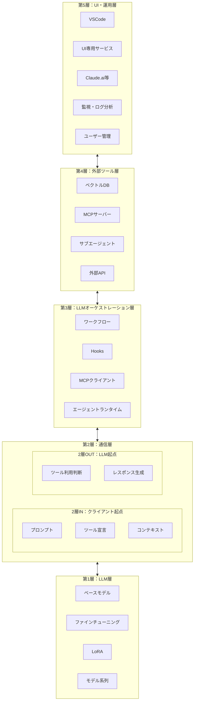

# 5層モデルで理解するAIエージェントの概念マップ

## この記事の目的

> 生成AIに関する様々な概念が**どの層に位置するか**を明らかにし、知識を整理する地図。
> 新しい技術の本質を理解し、**なぜその技術が革新的なのか**を構造で捉える。

**具体例:**
- **従来RAGとツール型RAG**では、仕組みが異なるので精度が全然変わる
- 同じマルチエージェントでも、**3層のプログラムがオーケストレートするAgent**と、**1層のLLM自身が2層OUTを通して呼ぶ**のでは全然違う
- MCPは**3層と4層間**のやりとりを定義しているが、**1層・2層にも影響がある**

このような構造で理解することが目標です。

---

## 5層モデル全体図



---

## 各層の1行サマリー

| 層 | 名称 | 役割 |
|----|------|------|
| **第1層** | LLM層 | ベースモデル、ファインチューニング、LoRA。モデルの能力そのもの |
| **第2層IN** | 通信層（クライアント起点） | プロンプト、ツール宣言、コンテキスト。クライアントがLLMに送る |
| **第2層OUT** | 通信層（LLM起点） | ツール利用判断、レスポンス生成。LLMがクライアントに返す |
| **第3層** | LLMオーケストレーション層 | **直接LLMとやり取りする層**。ワークフロー、Hooks、MCPクライアント、エージェントランタイム |
| **第4層** | 外部ツール層 | ベクトルDB、MCPサーバー、サブエージェント。実際のツール実装 |
| **第5層** | UI・運用層 | **UIとLLMに直接関係しない周辺機能**。VSCode、Claude.ai、監視、ログ分析、ユーザー管理 |

---

## 層の判定フロー

新しい技術が出てきたとき、どの層に属するかを判定するフロー：

```
Q1. LLMへのリクエスト/レスポンスJSONのフィールド構造か？
    → YES: 第1層

Q2. クライアントがLLMに送る通信か？（プロンプト、ツール結果等）
    → YES: 第2層IN

Q3. LLMが出力として返す呼び出し要求か？（tool_use等）
    → YES: 第2層OUT

Q4. 直接LLMを操作するランタイム・フレームワークか？（ワークフロー、Hooks、MCPクライアント等）
    → YES: 第3層（LLMオーケストレーション層）

Q5. 外部サービス・データベース・ツール実装か？
    → YES: 第4層

Q6. ユーザーが直接触るUI、またはLLMに直接関係しない周辺機能か？（監視、ログ分析、ユーザー管理等）
    → YES: 第5層（UI・運用層）
    ※ただし、権限制御でLLM操作に波及する場合は第3層扱い

※ 複数のYES → 複数層にまたがる（Tool Use、MCP、Subagent等）
```

---

## 記事の構成

| 章 | タイトル | 内容 |
|----|----------|------|
| 01 | LLM層 | ファインチューニング、LoRA、モデル系列、各社の方針 |
| 02 | 通信層 | API形式、2層IN/B、プロトコル差分、ストリーミング |
| 03 | LLMオーケストレーション層 | ワークフロー、Hooks、MCPクライアント、エージェントランタイム、従来RAG |
| 04 | 外部ツール層 | MCP、ベクトルDB、サブエージェント、位置・内容・影響分類 |
| 05 | UI・運用層 | UI、ユーザー認証・管理、監視、ログ分析 |
| 06 | 早見表 | 技術と層の対応表（定義と影響を区別） |
| 07 | Claude Cowork | デスクトップ操作・ブラウザ操作の仕組み |
| 08 | 相性問題 | どの層間で問題が発生するか |
| 09 | 付録 | ディレクトリ構造比較、公式ドキュメント、書籍 |

---

## 凡例・読み方ガイド

### マーク凡例

| マーク | 意味 |
|--------|------|
| ✅ | その技術の主体（定義・実装の中心） |
| 🔧 | 利用する機能（依存・連携先） |
| 📘 | 公式ドキュメントへのリンク |
| 🔗 | 解説ブログ・外部記事へのリンク |

### 読み方

1. **まず第0章（この章）で全体像を把握**
2. **興味のある層の章を読む**（順番に読む必要なし）
3. **早見表（第6章）で特定技術の位置を確認**
4. **相性問題（第8章）でトラブルシューティング**

---

## 参考リンク

- 📘 [Anthropic API ドキュメント](https://docs.anthropic.com/)
- 📘 [OpenAI API ドキュメント](https://platform.openai.com/docs)
- 📘 [Claude Code ドキュメント](https://code.claude.com/docs/en/)
- 📘 [MCP 公式サイト](https://modelcontextprotocol.io/)
- 🔗 [Anthropic "Building Effective Agents"](https://www.anthropic.com/research/building-effective-agents)
- 🔗 [Chip Huyen "Agents"](https://huyenchip.com/2025/01/07/agents.html)
