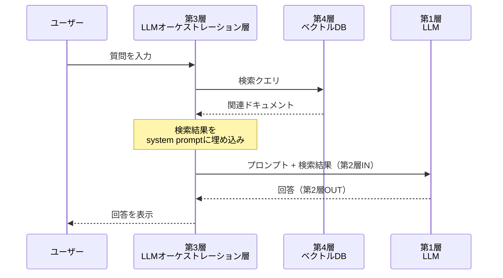
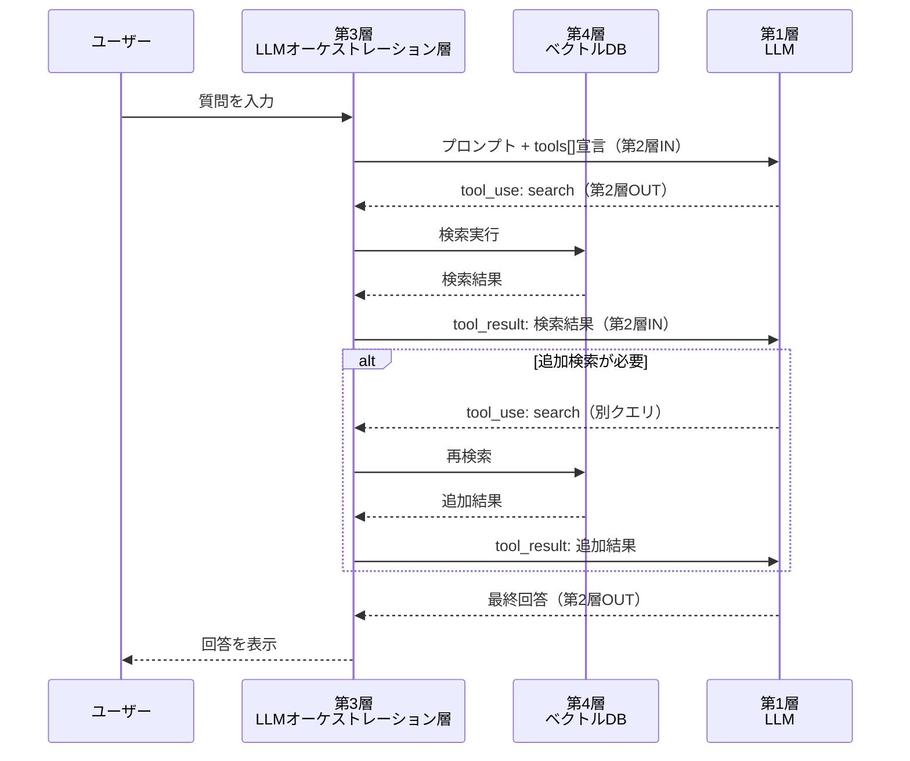
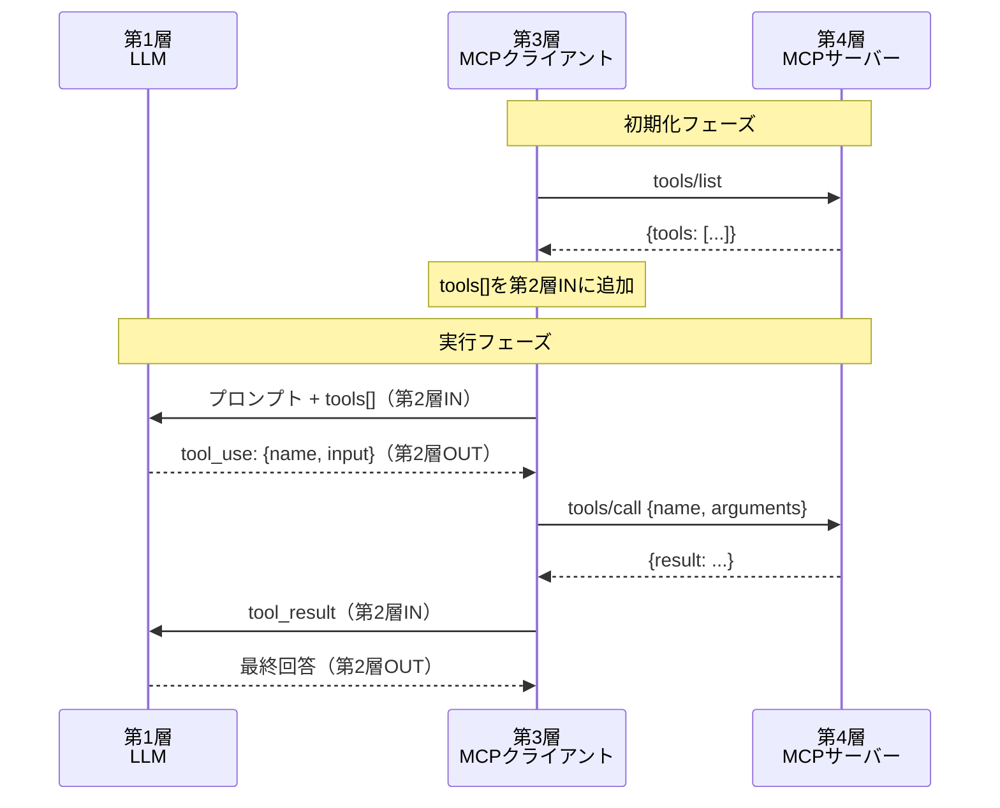
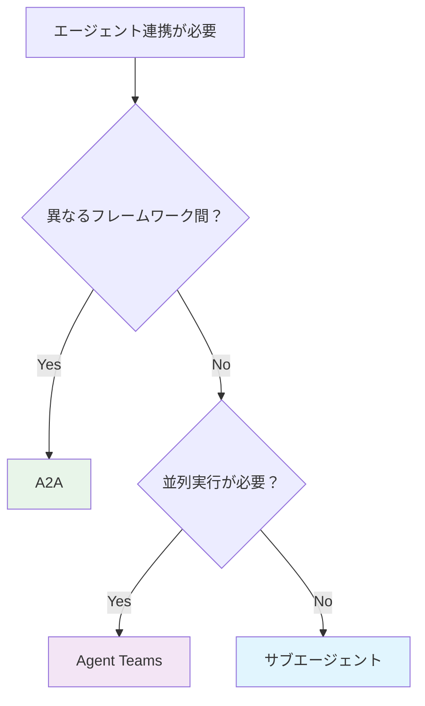

# 第4層「外部ツール層」概要

> **対象層**: 第4層（外部ツール層）
> **関連章**: 元記事 第3章（MCP）、[04_b_エージェント連携.md](./04-1-agent-collaboration.md)

---

## 1. 外部ツール層の概要

**概要**: LLMから見て「外部」にあるすべてのリソースとプログラムを指す。LLMは第1層でJSON（tool_use）を出力し、第3層（LLMオーケストレーション層）がそのJSONを解釈して第4層のツールを実行する。

### 1-1. 外部ツール層に含まれるもの

```
第4層 外部ツール層
├── RAGのベクトルDB        ← 知識を格納するデータベース
├── リモートMCPサーバー     ← クラウド上のツール群
├── サブエージェント        ← 別セッションで動くLLM
├── ローカルファイルシステム ← Read/Write対象
├── 外部API                ← REST/GraphQL等のWebサービス
└── その他の実行環境        ← Docker、VM、ブラウザ等
```

### 1-2. 5層モデルにおける位置づけ

```
第5層 UI・運用層            ← ユーザーとの接点 + LLMに直接関係しない周辺機能
      ↑
第4層 外部ツール層          ← 今回の解説対象
      ↑
第3層 LLMオーケストレーション層  ← 第4層を呼び出す責任を持つ
      ↑
第2層 通信層                ← A:クライアント起点 / B:LLM起点
      ↑
第1層 LLM層                 ← モデル、パラメータ、JSON構造
```

**重要**: LLMは第4層を直接操作しない。常に第3層（LLMオーケストレーション層）を経由する。この「間接性」がセキュリティと制御の基盤となる。

---

## 2. ツールの位置分類（実行環境）

外部ツールは「どこで実行されるか」によって3つに分類される。

### 2-a. クライアントのローカル環境

**概要**: ユーザーのマシン上で直接実行されるツール。最もリスクが高い。

| ツール例 | 説明 | リスクレベル |
|--|--|--|
| ローカルファイルRead/Write | ファイルシステムへの直接アクセス | 高 |
| Bashコマンド実行 | シェルコマンドの実行 | 最高 |
| ローカルMCPサーバー | stdio経由でローカルプロセスと通信 | 高 |
| Git操作 | リポジトリの変更 | 中〜高 |

**設定例（.mcp.json）**:
```json
{
  "mcpServers": {
    "filesystem": {
      "command": "npx",
      "args": ["-y", "@modelcontextprotocol/server-filesystem", "/home/user/projects"]
    }
  }
}
```

### 2-b. クライアントのサンドボックス環境

**概要**: 隔離された環境で実行されるツール。ローカルへの影響を制限する。

| ツール例 | 説明 | 隔離方法 |
|--|--|--|
| Dockerコンテナ内実行 | コンテナ内でコマンド実行 | namespace隔離 |
| VM内のツール | 仮想マシン内で実行 | ハードウェア仮想化 |
| WebContainers | ブラウザ内のNode.js環境 | ブラウザサンドボックス |
| OpenAI Codex | サンドボックス内での実行 | 専用隔離環境 |

**サンドボックスの利点**:
- ローカルファイルシステムへの直接アクセス不可
- ネットワークアクセスの制限が可能
- 実行結果の検証後にローカルへ反映

### 2-c. クラウド環境

**概要**: リモートサーバー上で実行されるツール。ネットワーク経由でアクセス。

| ツール例 | 説明 | 通信方式 |
|--|--|--|
| リモートMCPサーバー | HTTPSでMCPプロトコル | Streamable HTTP |
| 外部API（REST） | 従来型Webサービス | HTTP/JSON |
| クラウドDB | マネージドデータベース | DB専用プロトコル |
| SaaSツール | Slack, GitHub, Jira等 | 各社API |

**設定例（リモートMCP）**:
```json
{
  "mcpServers": {
    "remote-crm": {
      "url": "https://crm.example.com/mcp",
      "transport": "streamable-http"
    }
  }
}
```

---

## 3. ツールの内容分類（性質）

外部ツールは「何を提供するか」によって3つに分類される。

### 3-α. ファイルの集合体（知識）

**概要**: 静的または準静的なデータの塊。LLMの知識を拡張する。

| 種別 | 例 | 用途 |
|--|--|--|
| ベクトルDB | Pinecone, Chroma, Qdrant, Amazon Bedrock Knowledge Bases | RAG用の意味検索 |
| ドキュメントストア | Elasticsearch, MongoDB | 全文検索・構造化検索 |
| ファイルシステム | ローカルファイル群 | コードベース参照 |
| ナレッジベース | Notion, Confluence | 社内知識の参照 |

**RAGにおける位置づけ**:

#### 従来型RAG（第2層INへ注入）



**特徴**: アプリ層が検索を制御。LLMは検索結果を「与えられた文脈」として受け取る。

#### Tool型RAG（LLM主導で検索）



**特徴**: LLMが検索タイミングとクエリを決定。必要に応じて再検索可能。

### 3-β. プログラム

**概要**: 実行可能なロジック。入力を受けて処理を行い、結果を返す。

| 種別 | 例 | 特徴 |
|--|--|--|
| MCPサーバー | filesystem, git, slack | 標準化されたツール定義 |
| Bashスクリプト | コマンドライン実行 | 最も柔軟・最もリスク |
| 外部API | GitHub API, Stripe API | 認証が必要 |
| 計算エンジン | Python実行、数式処理 | 決定論的な計算 |

**MCPサーバーの利点**:
- `tools/list`でツール定義を自動公開
- `tools/call`で統一的な呼び出し
- スキーマ（JSON Schema）による入力検証

### 3-γ. AI（サブエージェント等）

**概要**: 別のLLMセッション。タスクを委譲して並列処理や専門化を実現する。

| 種別 | 例 | 通信方式 |
|--|--|--|
| SubAgent | Claude Code Task | tool_use/tool_result |
| A2Aエージェント | AgentCore対応エージェント | JSON-RPC 2.0 |
| Agent Teams | Claude Code Teammates | 内部タスクボード |

**サブエージェントの層構造**:
```
親エージェント（第1〜3層が稼働中）
  └─ tool_use: Task（第2層OUTで出力）
        └─ 第3層がサブエージェントを起動
              └─ サブエージェント内で第1〜3層が独立稼働
              └─ 完了後、tool_resultで親に返却（第2層IN）
```

---

## 4. ツールの影響分類（CRUD）

外部ツールは「何をするか」によってCRUDで分類される。

### 4-1. CRUD分類表

| 操作 | 説明 | リスク | 例 |
|--|--|--|--|
| **C**reate | 新規作成 | 中〜高 | ファイル作成、DB挿入、メール送信 |
| **R**ead | 読み取り | 低 | ファイル読み込み、DB検索、API取得 |
| **U**pdate | 更新 | 高 | ファイル編集、DBレコード更新 |
| **D**elete | 削除 | 最高 | ファイル削除、DBレコード削除 |

### 4-2. ローカル環境へのCUD操作の危険性

**概要**: ローカル環境への Create/Update/Delete は取り消し不能な場合が多く、最も慎重な制御が必要。

```
危険度マトリクス:

                    ローカル    サンドボックス    クラウド
Read (R)              低           最低            低
Create (C)            中           低              中
Update (U)            高           中              中
Delete (D)            最高         中              高
```

**実際の事例（Descope調査より引用）**:
> Replit 事例（2025年7月）: 本番DBの1,200件以上のレコード削除。外部OAuthスコープで権限管理していれば防げた。

- 🔗 [Descope "What Is MCP?"](https://www.descope.com/learn/post/mcp)

### 4-3. 権限制御の重要性

**第3層（LLMオーケストレーション層）での制御手段**:

| 手段 | 層 | 説明 |
|--|--|--|
| Hooks（PreToolUse） | 第3層 | tool_use受け取り直後にブロック可能 |
| permissionMode | 第3層 | default/bypassPermissions/acceptEdits |
| allowedTools / disallowedTools | 第3層 | ツール単位の許可・禁止 |
| MCPサーバーのOAuth | 第4層 | リモートMCPの認証スコープ |

**Claude Code settings.json での設定例**:
```json
{
  "permissionMode": "default",
  "disallowedTools": ["Bash", "Write"],
  "hooks": {
    "PreToolUse": [
      {
        "matcher": "Write",
        "command": "/path/to/validate-write.sh"
      }
    ]
  }
}
```

---

## 5. MCPの詳細

### 5-1. MCPとは

**概要**: Model Context Protocol。ツール定義を標準化・外部化するプロトコル。**LLMが受け取るJSONは変わらない**。MCPはあくまで「どうやってtools[]を用意するか」の話。

### 5-2. ローカルMCP vs リモートMCP

| 観点 | ローカルMCP | リモートMCP |
|--|--|--|
| トランスポート | stdio（プロセス間通信） | HTTP/SSE（Streamable HTTP） |
| 起動方法 | `.mcp.json`に`command`を記述 | `.mcp.json`に`url`を記述 |
| 認証 | 不要（同一マシン） | OAuth 2.0 必須 |
| 用途 | 個人・ローカル開発 | Enterprise・クラウド |
| セキュリティ | ローカル権限に依存 | スコープで制限可能 |

### 5-3. 第3層と第4層間のやりとり



**ポイント**: MCPはあくまで第3層↔第4層の通信プロトコル。LLMが受け取るtools[]のJSON形式は変わらない。

### 5-4. MCPサーバーの実装例

**公式サーバー一覧**:
- 📘 [MCP Servers (GitHub)](https://github.com/modelcontextprotocol/servers)

**主要なMCPサーバー**:

| サーバー | 機能 | CRUD |
|--|--|--|
| filesystem | ファイル読み書き | CRUD |
| git | Gitリポジトリ操作 | CRUD |
| slack | Slackメッセージ送受信 | CR |
| brave-search | Web検索 | R |
| postgres | PostgreSQL操作 | CRUD |

### 5-5. MCPの各ツール対応状況

| ツール | 設定ファイル | ドキュメント |
|--|--|--|
| Claude Code | `.mcp.json` (プロジェクト) / `~/.claude/` | [Claude Code MCP設定](https://code.claude.com/docs/en/mcp) |
| Cursor | `.cursor/mcp.json` | [Cursor MCP](https://docs.cursor.com/context/model-context-protocol) |
| Amazon Q CLI | `~/.aws/amazonq/mcp.json` | [Amazon Q MCP](https://docs.aws.amazon.com/amazonq/latest/qdeveloper-ug/mcp.html) |

---

## 6. エージェント連携（概要）

エージェント連携には3つの方式がある。詳細は **[04_b_エージェント連携.md](./04_b_エージェント連携.md)** を参照。

### 6-1. 3方式の比較

| 方式 | 通信方式 | 並列性 | 適用場面 |
|------|----------|--------|----------|
| **サブエージェント** | tool_use/tool_result | 不可（同期） | シンプルなタスク委譲 |
| **Agent Teams** | 内部タスクボード | 可能（非同期） | 複雑なプロジェクト、人間との協働 |
| **A2A** | JSON-RPC 2.0 | 可能 | 異種フレームワーク間連携 |

### 6-2. 方式選択の指針



詳細なフロー図・実装パターン・セキュリティについては **[04_b_エージェント連携.md](./04_b_エージェント連携.md)** を参照。

---

## 7. 相性問題と注意点

### 7-1. よくある相性問題

| 問題 | 原因 | 対策 |
|--|--|--|
| MCPサーバーのスキーマ不正 | JSON Schemaの記述ミス | 公式スキーマバリデータで検証 |
| リモートMCPの認証失敗 | OAuth設定の不備 | スコープの確認 |
| tool descriptionが貧弱 | LLMがツールを呼ばない | 詳細な説明を追加 |
| ローカル環境の破壊 | CUD操作の権限不備 | PreToolUseフックでブロック |

### 7-2. セキュリティベストプラクティス

1. **最小権限の原則**: 必要なツールのみを有効化
2. **サンドボックス優先**: 可能な限りサンドボックス環境で実行
3. **PreToolUseフック**: 危険な操作はフックでブロック
4. **リモートMCPのOAuth**: スコープを最小限に設定
5. **監査ログ**: PostToolUseフックで全操作を記録

---

## 8. 参考リンク

### 関連章
- 📄 [04_b_エージェント連携.md](./04_b_エージェント連携.md) — サブエージェント、Agent Teams、A2Aの詳細

### 公式ドキュメント
- 📘 [MCP 公式サイト](https://modelcontextprotocol.io/)
- 📘 [Anthropic MCP発表ブログ](https://www.anthropic.com/news/model-context-protocol)

### 解説ブログ
- 🔗 [Cloudflare "Code Mode: the better way to use MCP"](https://blog.cloudflare.com/code-mode/) — LLMがJSON出力→クライアントが実行の図解
- 🔗 [Akamai AI Explainer: What Is Model Context Protocol?](https://www.akamai.com/blog/trends/2025/nov/ai-explainer-what-is-model-context-protocol)
- 🔗 [Anthropic "Building Effective Agents"](https://www.anthropic.com/research/building-effective-agents) — Orchestrator-Workers パターン
- 🔗 [Chip Huyen "Agents"](https://huyenchip.com/2025/01/07/agents.html) — Tool Use・Planning・Failure Modes
- 🔗 [Descope "What Is MCP?" — セキュリティと認証](https://www.descope.com/learn/post/mcp) — Replit事例

### 日本語解説
- 🔗 [AI Shift「AIエージェントの設計とその勘所」](https://www.ai-shift.co.jp/techblog/5252) — MCPの価値は関心の集約
- 🔗 [Elastic「モデルコンテキストプロトコル（MCP）とは？」日本語版](https://www.elastic.co/jp/what-is/mcp)

