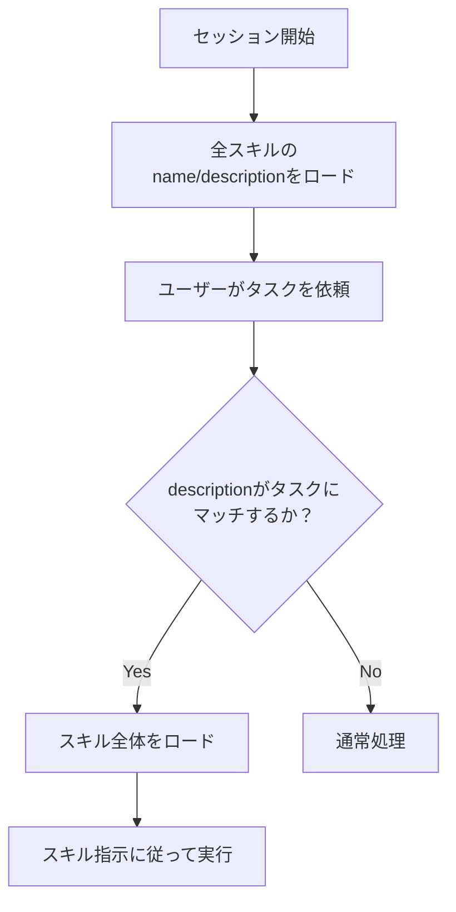
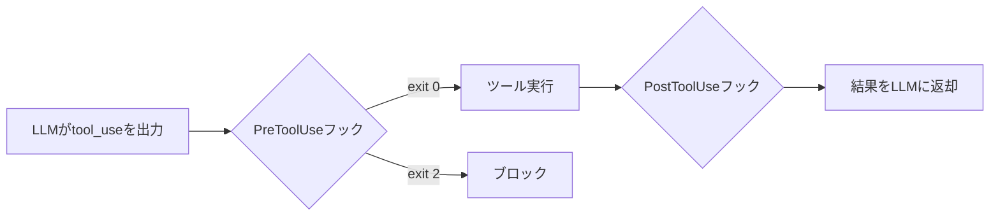
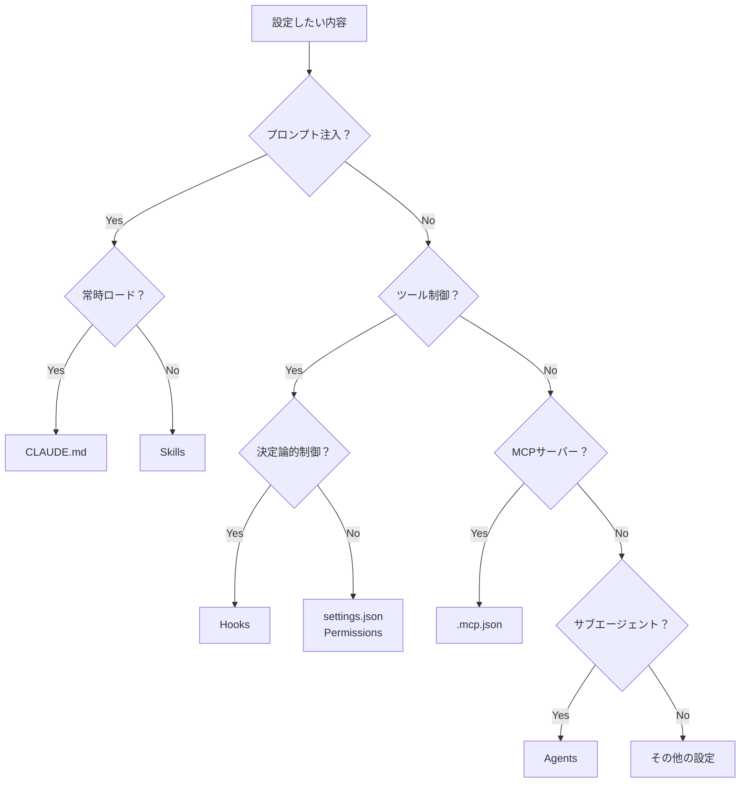

# 第4層「外部ツール層」詳細解説 (c) Claude Code設定ファイル

> **シリーズ**: AIエージェント概念マップ詳細解説
> **対象**: .claude配下の設定ファイル群
> **関連章**: [03_LLMオーケストレーション層.md](./03_LLMオーケストレーション層.md)、[04_外部ツール層.md](./04_外部ツール層.md)

---

## 1. 概要：.claudeディレクトリの構造と役割

**概要**: `.claude`ディレクトリはClaude Codeの設定・カスタマイズの中心。プロンプト注入、ツール制御、エージェント定義、フック処理など、5層モデルの複数層にまたがる設定を一元管理する。

### 1-1. ディレクトリ構造

```
プロジェクトルート/
├── CLAUDE.md                    # プロジェクトメモリ（第2層IN）
├── CLAUDE.local.md              # ローカル専用メモリ（gitignore）
├── .claude/
│   ├── CLAUDE.md                # 代替の配置場所
│   ├── settings.json            # プロジェクト設定（第3層）
│   ├── settings.local.json      # ローカル設定（gitignore）
│   ├── skills/                  # スキル定義（第2層IN / 第3層）
│   │   └── <skill-name>/
│   │       ├── SKILL.md
│   │       └── (supporting files)
│   ├── agents/                  # サブエージェント定義（第4層）
│   │   └── <agent-name>.md
│   ├── rules/                   # 条件付きルール
│   │   └── *.md
│   └── hooks/                   # フックスクリプト（第3層）
│       └── *.sh
├── .mcp.json                    # MCPサーバー設定（第3層↔第4層）
│
~/.claude/                       # ユーザーレベル設定
├── settings.json                # ユーザー設定
├── CLAUDE.md                    # ユーザーメモリ
├── skills/                      # ユーザースキル
├── agents/                      # ユーザーエージェント
└── projects/<project>/
    └── memory/                  # 自動メモリ
        └── MEMORY.md
```

### 1-2. 設定の優先順位

```
高い優先順位
│
├── Managed（システム管理者）     # /Library/Application Support/ClaudeCode/
│       ※ 上書き不可
├── コマンドライン引数           # --allowedTools等
├── Local project                # .claude/settings.local.json
├── Shared project               # .claude/settings.json
├── User                         # ~/.claude/settings.json
│
低い優先順位
```

**重要**: Managed設定は上書き不可。企業ポリシーの強制に使用される。

---

## 2. CLAUDE.md（第2層IN）

**概要**: セッション開始時にsystem promptへ自動注入されるMarkdownファイル。プロジェクトの文脈、コーディング規約、頻出コマンドなどを記述する。

### 2-1. 役割と配置場所

| 種類 | 場所 | 用途 | 共有範囲 |
|--|--|--|--|
| Managed | システムディレクトリ | 組織全体の指示 | 全ユーザー |
| User | `~/.claude/CLAUDE.md` | 個人の好み | 全プロジェクト |
| Project | `./CLAUDE.md` または `./.claude/CLAUDE.md` | チーム共有指示 | リポジトリ経由 |
| Local | `./CLAUDE.local.md` | 個人のプロジェクト設定 | 自分のみ |

### 2-2. 記述のベストプラクティス

```markdown
# プロジェクト概要
このプロジェクトはReact + TypeScriptで構築されたWebアプリケーションです。

# よく使うコマンド
- ビルド: `npm run build`
- テスト: `npm run test`
- リント: `npm run lint`

# コーディング規約
- 2スペースインデント
- 関数はアロー関数で記述
- コンポーネントは関数コンポーネントで記述

# 重要なアーキテクチャ
- `src/api/` - APIクライアント
- `src/components/` - UIコンポーネント
- `src/hooks/` - カスタムフック
```

**ポイント**:
- 具体的に記述する（「コードを綺麗に」ではなく「2スペースインデント」）
- 頻出コマンドを明記（Claudeが毎回調べる必要がなくなる）
- 構造化してMarkdownの見出しを活用

### 2-3. @importディレクティブ

他のファイルをインポートして参照できる。

```markdown
プロジェクト概要は @README を参照してください。
パッケージ情報は @package.json を確認してください。

# 追加の指示
- gitワークフロー @docs/git-instructions.md
```

**パス解決**:
- 相対パス: インポート元ファイルからの相対位置
- 絶対パス: ファイルシステムのルートから
- `~`プレフィックス: ホームディレクトリから

**制限**:
- 最大5段階のネスト
- コードブロック内の`@`は評価されない
- 初回読み込み時に承認ダイアログが表示される

### 2-4. Auto Memory

Claudeが自動的に学習内容を保存する機能。

```
~/.claude/projects/<project>/memory/
├── MEMORY.md          # エントリーポイント（最初の200行がロード）
├── debugging.md       # デバッグパターン
├── api-conventions.md # API設計の決定事項
└── ...
```

**特徴**:
- セッション開始時に`MEMORY.md`の先頭200行が自動ロード
- トピックファイルは必要時にオンデマンド読み込み
- `CLAUDE_CODE_DISABLE_AUTO_MEMORY=0`で強制有効化

---

## 3. Skills（第2層IN / 第3層）

**概要**: 使用時だけロードされるプロンプトのモジュール。起動時は`name`と`description`だけ読み、タスクが来たとき初めて全体をロード（遅延ロード / Progressive Disclosure）。

### 3-1. ディレクトリ構造

```
.claude/skills/<skill-name>/
├── SKILL.md           # メイン指示（必須）
├── template.md        # テンプレート
├── examples/
│   └── sample.md      # 出力例
└── scripts/
    └── validate.sh    # 実行可能スクリプト
```

### 3-2. SKILL.mdの構成

```yaml
---
name: code-reviewer
description: コード品質とベストプラクティスをレビュー。コード変更後に積極的に使用。
tools: Read, Glob, Grep
model: sonnet
disable-model-invocation: false
user-invocable: true
context: inline
---

# コードレビュー指示

レビュー時には以下を確認してください：

1. コードの可読性
2. セキュリティの脆弱性
3. パフォーマンスの考慮
4. テストカバレッジ
```

### 3-3. フロントマターフィールド

| フィールド | 必須 | 説明 |
|--|--|--|
| `name` | No | スキル名（省略時はディレクトリ名） |
| `description` | 推奨 | 何をするか、いつ使うか |
| `tools` | No | 使用可能なツール |
| `model` | No | 使用モデル（sonnet, opus, haiku, inherit） |
| `disable-model-invocation` | No | `true`でClaude自動呼び出し禁止 |
| `user-invocable` | No | `false`で`/`メニューから非表示 |
| `context` | No | `fork`でサブエージェントとして実行 |
| `hooks` | No | スキル固有のフック |

### 3-4. 自動マッチングの仕組み



**マッチング精度向上のコツ**:
- descriptionに具体的なキーワードを含める
- 「use when...」形式で使用場面を明示
- `disable-model-invocation: true`で手動のみに制限

### 3-5. 呼び出し制御

| 設定 | ユーザー呼び出し | Claude自動呼び出し |
|--|--|--|
| デフォルト | 可能 | 可能 |
| `disable-model-invocation: true` | 可能 | 不可 |
| `user-invocable: false` | 不可 | 可能 |

---

## 4. Agents（第4層）

**概要**: サブエージェントの定義ファイル。特定タスクに特化したAIアシスタントを定義し、独自のコンテキスト、ツールアクセス、権限を持たせる。

### 4-1. ディレクトリ構造

```
.claude/agents/
└── code-reviewer.md    # プロジェクトエージェント

~/.claude/agents/
└── debugger.md         # ユーザーエージェント
```

### 4-2. エージェント定義ファイル

```yaml
---
name: code-reviewer
description: セキュリティ脆弱性に特化したコードレビュアー
tools: Read, Glob, Grep
disallowedTools: Write, Bash
model: claude-haiku-4-5
permissionMode: default
hooks:
  PreToolUse:
    - matcher: "Bash"
      hooks:
        - type: command
          command: "./scripts/validate-command.sh"
skills:
  - security-patterns
memory: user
---

# system prompt本文

あなたはセキュリティに特化したコードレビュアーです。
常に以下を確認してください：
- SQLインジェクション
- XSS
- 認証バイパス
```

### 4-3. YAML フロントマターフィールド

| フィールド | 必須 | 説明 |
|--|--|--|
| `name` | Yes | 一意の識別子（小文字とハイフン） |
| `description` | Yes | いつ委譲するかの説明 |
| `tools` | No | 使用可能なツール（省略時は親から継承） |
| `disallowedTools` | No | 禁止するツール |
| `model` | No | `sonnet`, `opus`, `haiku`, `inherit` |
| `permissionMode` | No | `default`, `acceptEdits`, `dontAsk`, `bypassPermissions`, `plan` |
| `maxTurns` | No | 最大ターン数 |
| `skills` | No | プリロードするスキル |
| `mcpServers` | No | 使用可能なMCPサーバー |
| `hooks` | No | エージェント固有フック |
| `memory` | No | `user`, `project`, `local`（永続メモリ） |
| `background` | No | `true`でバックグラウンド実行 |
| `isolation` | No | `worktree`で独立したgit worktreeで実行 |

### 4-4. ビルトインエージェント

| エージェント | モデル | ツール | 用途 |
|--|--|--|--|
| **Explore** | Haiku | 読み取り専用 | コードベース探索 |
| **Plan** | 継承 | 読み取り専用 | 計画立案のリサーチ |
| **general-purpose** | 継承 | 全ツール | 複雑なマルチステップタスク |
| **Bash** | 継承 | Bash | ターミナルコマンド実行 |

### 4-5. 権限の継承と制限

```yaml
# 親の設定
disallowedTools: ["Bash", "Write"]

# → サブエージェントも自動的に Bash, Write が禁止される
```

---

## 5. Hooks（第3層）

**概要**: LLMの確率的判断を介さず、シェルスクリプトを確実に実行する決定論的制御。特定のイベント発生時にカスタムコマンドを実行する。

### 5-1. フックイベント一覧

| イベント | タイミング | ブロック可否 |
|--|--|--|
| `SessionStart` | セッション開始/再開時 | 不可 |
| `UserPromptSubmit` | プロンプト送信時 | 可能 |
| `PreToolUse` | ツール実行前 | 可能（exit 2） |
| `PermissionRequest` | 権限ダイアログ表示時 | 可能 |
| `PostToolUse` | ツール実行成功後 | 不可 |
| `PostToolUseFailure` | ツール実行失敗後 | 不可 |
| `SubagentStart` | サブエージェント起動時 | 不可 |
| `SubagentStop` | サブエージェント終了時 | 可能 |
| `Stop` | Claude応答完了時 | 可能 |
| `TeammateIdle` | チームメイトがアイドル時 | 可能 |
| `TaskCompleted` | タスク完了時 | 可能 |
| `ConfigChange` | 設定ファイル変更時 | 可能 |
| `SessionEnd` | セッション終了時 | 不可 |

### 5-2. 設定例

```json
{
  "hooks": {
    "PreToolUse": [
      {
        "matcher": "Bash",
        "hooks": [
          {
            "type": "command",
            "command": ".claude/hooks/block-rm.sh"
          }
        ]
      }
    ],
    "PostToolUse": [
      {
        "matcher": "Write|Edit",
        "hooks": [
          {
            "type": "command",
            "command": ".claude/hooks/run-linter.sh"
          }
        ]
      }
    ]
  }
}
```

### 5-3. フックスクリプト例

```bash
#!/bin/bash
# .claude/hooks/block-rm.sh

# 標準入力からJSON読み取り
COMMAND=$(jq -r '.tool_input.command')

# rm -rf を含むコマンドをブロック
if echo "$COMMAND" | grep -q 'rm -rf'; then
  jq -n '{
    hookSpecificOutput: {
      hookEventName: "PreToolUse",
      permissionDecision: "deny",
      permissionDecisionReason: "危険なコマンドがフックによりブロックされました"
    }
  }'
else
  exit 0  # コマンドを許可
fi
```

### 5-4. 決定論的制御の意味



**なぜ「決定論的」か**:
- LLMの判断を介さない
- シェルスクリプトの条件分岐で100%制御可能
- プロンプトインジェクション攻撃への防御

---

## 6. settings.json（第3層）

**概要**: Claude Codeの動作を制御する設定ファイル。権限モード、ツール制限、モデル設定などを定義する。

### 6-1. 設定ファイルの階層

| スコープ | 場所 | 影響範囲 | 共有 |
|--|--|--|--|
| Managed | システムディレクトリ | 全ユーザー | Yes（IT配布） |
| User | `~/.claude/settings.json` | 全プロジェクト | No |
| Project | `.claude/settings.json` | 全コラボレーター | Yes（git） |
| Local | `.claude/settings.local.json` | 自分のみ | No（gitignore） |

### 6-2. 主要な設定項目

```json
{
  "permissions": {
    "allow": [
      "Bash(npm run lint)",
      "Bash(npm run test *)",
      "Read(~/.zshrc)"
    ],
    "deny": [
      "Bash(curl *)",
      "Read(./.env)",
      "Read(./.env.*)",
      "Read(./secrets/**)"
    ],
    "ask": [
      "Bash(git push *)"
    ],
    "defaultMode": "acceptEdits",
    "additionalDirectories": ["../docs/"]
  },
  "model": "claude-sonnet-4-6",
  "env": {
    "CLAUDE_CODE_ENABLE_TELEMETRY": "1"
  },
  "hooks": { ... }
}
```

### 6-3. 権限ルールの書式

| パターン | 効果 |
|--|--|
| `Bash` | 全てのBashコマンド |
| `Bash(npm run *)` | npm run で始まるコマンド |
| `Read(./.env)` | 特定ファイルの読み取り |
| `Read(./secrets/**)` | ディレクトリ再帰的に |
| `mcp__puppeteer__*` | MCPツール全体 |
| `Task(Explore)` | 特定のサブエージェント |

---

## 7. Permissions（第3層）

**概要**: ツールごとの権限を制御する仕組み。allow / ask / deny の3段階で細かく設定可能。

### 7-1. 権限モード

| モード | 説明 |
|--|--|
| `default` | 標準動作：初回使用時に確認 |
| `acceptEdits` | ファイル編集を自動承認 |
| `plan` | 読み取り専用（計画モード） |
| `dontAsk` | 事前許可されていないツールを自動拒否 |
| `bypassPermissions` | 全ての権限チェックをスキップ（危険） |

### 7-2. 権限評価の順序

```
deny → ask → allow
（最初にマッチしたルールが適用）
```

### 7-3. 設定例

```json
{
  "permissions": {
    "allow": [
      "Bash(npm run *)",
      "Read(./src/**)"
    ],
    "ask": [
      "Bash(git push *)"
    ],
    "deny": [
      "Bash(rm -rf *)",
      "Read(./.env)",
      "Task(Explore)"
    ],
    "defaultMode": "default"
  }
}
```

---

## 8. .mcp.json（第3層↔第4層）

**概要**: MCPサーバーの設定ファイル。ローカルMCPとリモートMCPの両方を定義できる。

### 8-1. 基本構造

```json
{
  "mcpServers": {
    "filesystem": {
      "command": "npx",
      "args": ["-y", "@modelcontextprotocol/server-filesystem", "/home/user/projects"]
    },
    "remote-crm": {
      "url": "https://crm.example.com/mcp",
      "transport": "streamable-http"
    }
  }
}
```

### 8-2. ローカルMCP vs リモートMCP

| 観点 | ローカルMCP | リモートMCP |
|--|--|--|
| トランスポート | stdio | HTTP/SSE |
| 起動方法 | `command`フィールド | `url`フィールド |
| 認証 | 不要 | OAuth 2.0 |
| 用途 | 個人開発 | Enterprise |

### 8-3. 配置場所

```
プロジェクトルート/.mcp.json   # プロジェクト用
~/.claude/.mcp.json             # ユーザー用
```

---

## 9. Goose（参考）

**概要**: Block Inc.が開発したオープンソースのコーディングエージェント。Claude Codeと同様に設定ファイルでカスタマイズ可能。

### 9-1. 主な特徴

| 観点 | Goose | Claude Code |
|--|--|--|
| 提供元 | Block Inc. | Anthropic |
| ライセンス | オープンソース | 商用 |
| 設定ディレクトリ | `.goose/` | `.claude/` |
| 拡張方式 | プラグイン（Go/Python） | Skills / MCP |
| メモリファイル | `goose.md` | `CLAUDE.md` |

### 9-2. Gooseの設定ファイル例

```yaml
# .goose/config.yaml
extensions:
  - name: code-analysis
    enabled: true
  - name: git-tools
    enabled: true

providers:
  default: anthropic

settings:
  model: claude-3-sonnet
  temperature: 0.7
```

### 9-3. 類似点と相違点

**類似点**:
- MCPサーバーをサポート
- メモリファイルでコンテキストを永続化
- ツール使用の権限制御

**相違点**:
- Gooseはプラグインシステムでネイティブ拡張可能
- Claude CodeはSkills/Agentsでプロンプトベースの拡張
- Gooseはオープンソース、Claude Codeは商用

---

## 10. 5層モデルでの位置づけ表

| 設定ファイル/機能 | 第5層(UI・運用) | 第4層(ツール) | 第3層(LLMオーケストレーション) | 第2層IN(Client) | 第2層OUT(LLM) | 第1層(LLM) | 説明 |
|:--|:--:|:--:|:--:|:--:|:--:|:--:|:--|
| **CLAUDE.md** | - | - | 🔧 | **✅** | - | - | 3層が読み込み、2層INに注入 |
| **Skills（定義）** | - | - | **✅** | 🔧 | - | - | 3層で管理、2層INにロード |
| **Skills（ロード後）** | - | - | - | **✅** | - | - | プロンプトとして展開 |
| **Agents** | - | **✅** | 🔧 | 🔧 | - | - | 4層で実行、3層が管理 |
| **Hooks** | - | - | **✅** | - | - | - | 決定論的制御 |
| **settings.json** | - | - | **✅** | - | - | - | 権限・モデル設定 |
| **Permissions** | - | - | **✅** | - | - | - | ツール許可/禁止 |
| **.mcp.json** | - | **✅** | **✅** | 🔧 | - | - | 3層-4層間の接続 |
| **Auto Memory** | - | - | 🔧 | **✅** | - | - | 自動学習コンテキスト |

### 凡例

| 記号 | 意味 |
|:--:|:--|
| **✅** | **主体（Define）** - 定義・実装の中心となる層 |
| **🔧** | **利用（Use）** - その機能を利用する、または影響を与える層 |
| `-` | 関係なし |

---

## 11. 設定ファイル選択ガイド



---

## 12. 参考リンク

### 公式ドキュメント
- [Claude Code Memory管理](https://code.claude.com/docs/en/memory)
- [Claude Code Skills](https://code.claude.com/docs/en/skills)
- [Claude Code Sub-agents](https://code.claude.com/docs/en/sub-agents)
- [Claude Code Hooks](https://code.claude.com/docs/en/hooks)
- [Claude Code Settings](https://code.claude.com/docs/en/settings)
- [Claude Code Permissions](https://code.claude.com/docs/en/permissions)
- [Claude Code MCP](https://code.claude.com/docs/en/mcp)

### 関連章
- [03_LLMオーケストレーション層.md](./03_LLMオーケストレーション層.md) - CLAUDE.md, Skills, Hooksの概要
- [04_外部ツール層.md](./04_外部ツール層.md) - MCP, ツール実行の詳細
- [04_b_エージェント連携.md](./04_b_エージェント連携.md) - サブエージェントの詳細

### 比較ツール
- [Goose (Block Inc.)](https://block.github.io/goose/)
- [OpenAI Codex / AGENTS.md](https://agents.md/)
- [Cursor Rules](https://docs.cursor.com/)

---

*作成日: 2026-02-22*
*シリーズ: AIエージェント概念マップ詳細解説*
