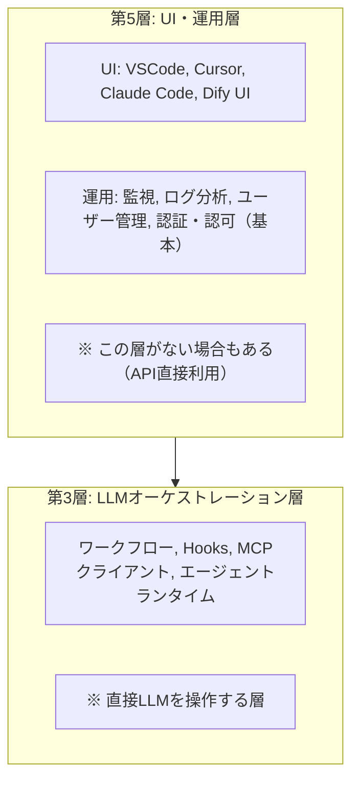

# 第5層：UI・運用層

> **この層の役割**: ユーザーとの接点（UI）に加え、LLMに直接関係しない周辺機能を提供する。

---

## 概要

UI・運用層は、AIエージェントシステムにおける「ユーザーとの接点」と「LLMに直接関係しない周辺機能」を担う層である。

```
第5層 UI・運用層
  ├── ユーザーが直接触れるUI/UX
  │     └── チャット画面、設定画面等
  ├── ユーザー認証・認可（基本部分）
  │     └── ※権限制御でLLM操作に波及する場合は第3層扱い
  ├── 監視・ログ分析
  ├── ユーザー管理
  └── 第3層（LLMオーケストレーション層）を呼び出す
        └── 第2層（通信層）を経由
              └── 第1層（LLM層）へ
```

### 第5層に含まれるもの

| コンポーネント | 説明 |
|--------------|------|
| **UI（チャット画面、設定画面等）** | ユーザーがシステムと対話するためのインターフェース |
| **ユーザ認証・認可（基本部分）** | ログイン、アクセス制御の基本機能 |
| **統合ログ分析** | システム全体のログを収集・分析 |
| **監視** | システムの稼働状況、パフォーマンスの監視 |
| **ユーザ管理** | ユーザーアカウントの管理 |

### 第5層に含まれないもの（第3層扱い）

| コンポーネント | 理由 |
|--------------|------|
| **権限制御でLLM操作に波及するもの** | LLMオーケストレーションにフィードバックを与えるため |
| **Hooks** | LLM操作に直接関与 |
| **MCPクライアント** | LLM操作に直接関与 |

### 特徴

1. **LLMオーケストレーション層との分離が重要**: 第3層は「LLMを操作する」、第5層は「LLMに直接関係しない」
2. **UI専用サービスの存在**: 特定のユースケースに特化したUIのみを提供するサービスもある
3. **この層がない場合もある**: API直接利用やバッチ処理では不要

---

## 代表的なサービス

### IDE統合型

コーディング作業の中でAIを利用するためのUI。

| サービス | 概要 | リンク |
|--|--|--|
| **VSCode + AI拡張** | GitHub Copilot、Cline等の拡張機能でAIを統合 | [VSCode Marketplace](https://marketplace.visualstudio.com/) |
| **Cursor** | AI機能をネイティブ統合したVSCodeフォーク | [Cursor公式](https://cursor.com/) |
| **Windsurf** | Codeium提供のAI統合IDE | [Windsurf公式](https://codeium.com/windsurf) |
| **Kiro** | AWS提供のAIコーディングIDE | [Kiro公式](https://kiro.ai/) |

#### VSCode + AI拡張の例

```
VSCode
├── GitHub Copilot        # コード補完・チャット
├── Cline                 # Claude連携エージェント
├── Continue              # オープンソースAI拡張
└── Amazon Q              # AWS連携AI
```

### ターミナル型

コマンドラインからAIエージェントを利用するUI。

| サービス | 概要 | リンク |
|--|--|--|
| **Claude Code** | Anthropic公式CLIエージェント | [Claude Code公式](https://code.claude.com/) |
| **OpenAI Codex CLI** | OpenAI公式CLIエージェント | [Codex公式](https://openai.com/index/openai-codex/) |
| **Goose** | Block Inc.提供のOSSエージェント | [Goose GitHub](https://github.com/block/goose) |
| **Aider** | OSSのAIペアプログラミングツール | [Aider公式](https://aider.chat/) |

### Web UI型

ブラウザベースでAIと対話するUI。

| サービス | 概要 | リンク |
|--|--|--|
| **ChatGPT** | OpenAI提供のWebチャットUI | [ChatGPT](https://chat.openai.com/) |
| **Claude.ai** | Anthropic提供のWebチャットUI | [Claude.ai](https://claude.ai/) |
| **Gemini** | Google提供のWebチャットUI | [Gemini](https://gemini.google.com/) |
| **Perplexity** | 検索特化のAI UI | [Perplexity](https://www.perplexity.ai/) |

---

## ローコードプラットフォーム

### Dify

ローコードでAIエージェントを構築できるプラットフォーム。**第5層（UI）と第3層（ワークフローエンジン）の両方を持つ**。

- **公式**: [Dify.ai](https://dify.ai/)
- **ドキュメント**: [Dify Docs](https://docs.dify.ai/)

#### Difyの層構成

| 層 | Difyの機能 |
|--|--|
| 第5層（UI・運用層） | WebUI、ダッシュボード、ユーザー管理 |
| 第3層（LLMオーケストレーション層） | ワークフローエンジン、エージェントモード |
| 第4層（外部ツール層） | ナレッジベース、ツール連携 |

#### Difyのワークフロー機能（第3層）

GUIでノードを接続してエージェントのフローを定義できる。

```
[開始] → [LLM] → [条件分岐] → [ツール呼び出し] → [終了]
                     │
                     └→ [別のLLM] → [終了]
```

| ノードタイプ | 説明 |
|--|--|
| LLMノード | LLMを呼び出す |
| 条件分岐 | 出力に応じて処理を分岐 |
| ツールノード | 外部APIやMCPツールを呼び出す |
| コードノード | PythonやJavaScriptを実行 |
| ナレッジベース | RAG検索を実行 |

#### 他のローコードプラットフォーム

| サービス | 概要 | 層構成 | リンク |
|--|--|--|--|
| **n8n** | ワークフロー自動化+AI統合 | 第5層+第3層 | [n8n公式](https://n8n.io/) |
| **Flowise** | LangChain/LlamaIndexのノーコードUI | 第5層+第3層 | [Flowise GitHub](https://github.com/FlowiseAI/Flowise) |
| **LangFlow** | LangChain公式のビジュアルエディタ | 第5層+第3層 | [LangFlow](https://www.langflow.org/) |

---

## UI・運用層がない場合

以下のケースではUI層が不要または簡略化される。

### API直接利用

```python
# UIなし: PythonからAPI直接呼び出し
import anthropic
client = anthropic.Anthropic()
response = client.messages.create(
    model="claude-sonnet-4-6",
    messages=[{"role": "user", "content": "Hello"}]
)
```

### バッチ処理

```python
# 大量データの一括処理: UIは不要
for document in documents:
    result = process_with_llm(document)
    save_to_database(result)
```

### 他システムへの組み込み

```
既存アプリ → API呼び出し → LLM
            （専用UIなし）
```

---

## 層の関係性



### 第3層と第5層の関係パターン

| パターン | 例 | 説明 |
|--|--|--|
| **一体型** | ChatGPT, Claude.ai | UI（第5層）+ LLMオーケストレーション（第3層）が同一サービス |
| **分離型** | VSCode + Copilot拡張 | UI（第5層）とオーケストレーション（第3層）が別 |
| **UI不要** | API直接利用 | 第5層なし、第3層のみ |

### 第5層と第3層の判定フロー

```
Q1. 直接LLMを操作する機能か？
    → YES: 第3層（LLMオーケストレーション層）

Q2. UIのみ、またはLLMに直接関係しない周辺機能か？
    → YES: 第5層（UI・運用層）

Q3. 権限制御でLLM操作に波及する場合は？
    → 第3層扱い
```

---

## まとめ

- **UI・運用層（第5層）は「ユーザーとの接点」と「LLMに直接関係しない周辺機能」を提供する**
- **第5層に含まれるもの**: UI、ユーザ認証・認可（基本部分）、監視、ログ分析、ユーザ管理
- **第3層（LLMオーケストレーション層）に含まれるもの**: ワークフロー、Hooks、MCPクライアント、エージェントランタイム
- 権限制御でLLM操作に波及する場合は第3層扱い
- Dify等のローコードツールは第5層（UI）と第3層（ワークフローエンジン）の両方を持つ
- API直接利用やバッチ処理では、第5層は不要

---

## 参考リンク

- [VSCode Marketplace](https://marketplace.visualstudio.com/)
- [Cursor公式](https://cursor.com/)
- [Dify公式ドキュメント](https://docs.dify.ai/)
- [Anthropic API](https://docs.anthropic.com/)
- [OpenAI API](https://platform.openai.com/docs/)
