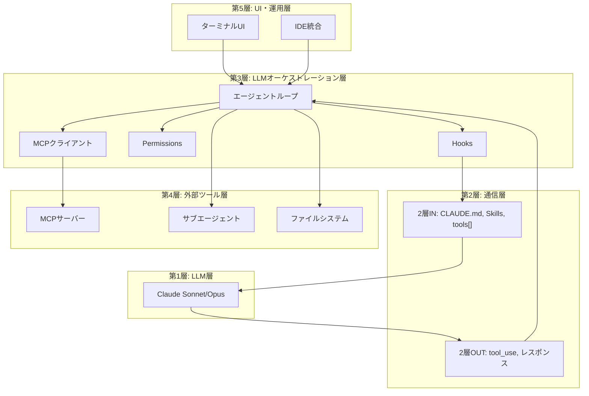
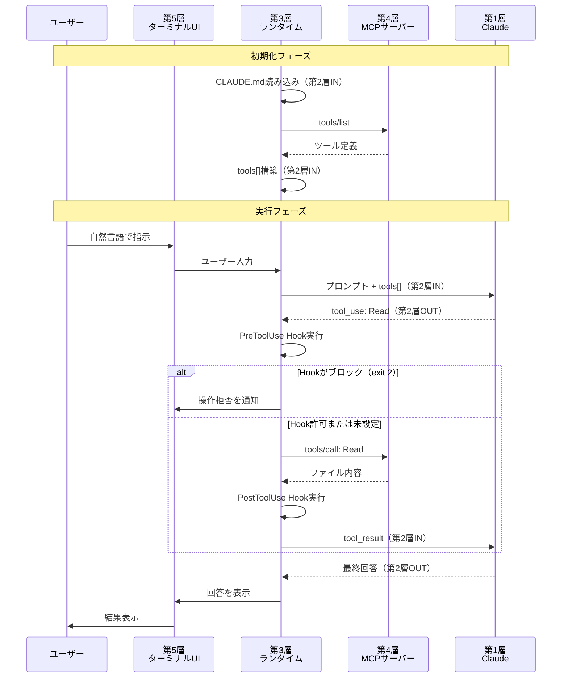

# Claude Code：AIコーディングエージェント

> **5層モデルでの位置**: 第5層（ターミナルUI）+ 第3層（LLMオーケストレーション層：ランタイム）+ 第2層（CLAUDE.md/Skills）+ 第1層（LLM）
> **概要**: Anthropic公式のCLIコーディングエージェント。ターミナルから直接LLMと対話し、コードベース全体を理解・編集する。

---

## 目次

1. [Claude Codeとは](#1-claude-codeとは)
2. [5層モデルでの位置づけ](#2-5層モデルでの位置づけ)
3. [通信フロー図](#3-通信フロー図)
4. [特徴的な機能](#4-特徴的な機能)
5. [関連章との関係](#5-関連章との関係)

---

## 1. Claude Codeとは

**概要**: Claude CodeはAnthropic公式のCLIベースAIコーディングエージェント。ターミナルでの対話を通じて、コードの読み書き・リファクタリング・デバッグ・Git操作などを自然言語で実行できる。

### 基本的な特徴

| 項目 | 内容 |
|------|------|
| **提供元** | Anthropic |
| **形態** | CLI（コマンドラインインターフェース） |
| **主要コマンド** | `claude` |
| **対象LLM** | Claude Sonnet / Opus |
| **ライセンス** | クローズドソース（API利用） |

### 他のコーディングエージェントとの比較

| ツール | 提供元 | 形態 | 主要LLM |
|--------|--------|------|---------|
| **Claude Code** | Anthropic | CLI | Claude Sonnet/Opus |
| Cursor | Cursor Inc | IDE (VS Code fork) | 複数LLM対応 |
| GitHub Copilot | GitHub/MS | IDE拡張 | GPT-4系 |
| OpenAI Codex | OpenAI | CLI | GPT-4o系 |
| Goose | Block Inc | CLI | 複数LLM対応 |

### 公式リファレンス

- [Claude Code ドキュメント](https://code.claude.com/docs/en/)
- [Anthropic API ドキュメント](https://docs.anthropic.com/)

---

## 2. 5層モデルでの位置づけ

Claude Codeは複数の層にまたがるアーキテクチャを持つ。

### 2-1. 各層への関与

```
第5層：UI・運用層
      ├── ターミナルUI（claude コマンド）
      └── IDE統合（VS Code拡張等）

第4層：外部ツール層
      ├── MCPサーバー（ファイルシステム、Git等）
      ├── サブエージェント
      └── 外部API

第3層：LLMオーケストレーション層 ← Claude Codeのランタイム
      ├── MCPクライアント（tools[]変換）
      ├── Hooks（PreToolUse / PostToolUse）
      ├── Permissions（permissionMode）
      └── エージェントループ

第2層：通信層
      ├── 2層IN（クライアント起点）
      │     ├── CLAUDE.md（system promptへ注入）
      │     ├── Skills（必要時にロード）
      │     └── tools[]（MCP経由で取得）
      └── 2層OUT（LLM起点）
            ├── tool_use（ツール呼び出し判断）
            └── レスポンス生成

第1層：LLM層
      └── Claude Sonnet / Opus
```

### 2-2. 各層での役割

| 層 | Claude Codeでの役割 | 具体例 |
|----|---------------------|--------|
| **第5層（UI・運用層）** | ユーザーとの接点 | ターミナルUI、VS Code統合 |
| **第4層** | 実行対象 | ファイルシステム、Git、MCPサーバー |
| **第3層（LLMオーケストレーション層）** | ランタイム・制御 | Hooks、Permissions、MCPクライアント |
| **第2層IN** | LLMへの入力構築 | CLAUDE.md、Skills、tools[] |
| **第2層OUT** | LLMからの出力解釈 | tool_use実行判断 |
| **第1層** | 推論エンジン | Claude Sonnet/Opus |

### 2-3. 層の境界と責務



---

## 3. 通信フロー図

### 3-1. ユーザー入力からLLM応答までの流れ



### 3-2. フロー上の重要ポイント

| フェーズ | 処理内容 | 層 |
|----------|----------|-----|
| **初期化** | CLAUDE.md読み込み、MCP接続、tools[]構築 | 第3層→第2層IN |
| **ユーザー入力受付** | ターミナルからの入力 | 第5層 |
| **LLM呼び出し** | プロンプト構築、API呼び出し | 第3層→第2層IN→第1層 |
| **tool_use判断** | LLMがツール呼び出しを決定 | 第1層→第2層OUT |
| **Hook実行** | PreToolUse/PostToolUseの制御 | 第3層 |
| **ツール実行** | MCP経由でツール呼び出し | 第3層→第4層 |
| **結果返却** | tool_resultをLLMに送信 | 第4層→第3層→第2層IN |

---

## 4. 特徴的な機能

### 4-1. Sub-agents（サブエージェント）

**概要**: 親エージェントが特定タスクを委譲するために起動する子エージェント。

```
親エージェント
  ├── tool_use: Task（サブエージェント呼び出し）
  │     └── サブエージェントが独立セッションで実行
  │     └── 独自のCLAUDE.md、ツール制限を持つ
  └── tool_result（完了後に結果を受け取る）
```

**主な特徴**:
- 同期実行（親は子の完了を待つ）
- 独立したコンテキスト
- ツール制限の継承

**定義ファイル**: `.claude/agents/<agent-name>.md`

詳細は [04_b_エージェント連携.md](./04_b_エージェント連携.md) を参照。

### 4-2. Agent Teams（チーム協働）

**概要**: 複数のエージェント（テイメイト）がタスクボードを共有し、非同期並列で協働する。

```
リードエージェント
  ├── タスクボード（共有状態）
  │     ├── テイメイト1（並列実行）
  │     ├── テイメイト2（並列実行）
  │     └── 人間（割り込み可能）
  └── 結果統合
```

**主な特徴**:
- 非同期並列実行
- タスクボードによる状態共有
- `SendMessage`によるテイメイト間通信
- 人間の割り込みが可能

**有効化**: `/teams`コマンド

詳細は [04_b_エージェント連携.md](./04_b_エージェント連携.md) を参照。

### 4-3. MCP対応

**概要**: Model Context Protocolにより、ツール定義を標準化・外部化。

```
第3層: Claude Code（MCPクライアント）
  │
  ├── ローカルMCP: stdio通信
  │     └── .mcp.json で command を指定
  │
  └── リモートMCP: HTTPS/SSE通信
        └── .mcp.json で url を指定
```

**設定ファイル**: `.mcp.json`（プロジェクト） / `~/.claude/`（グローバル）

設定詳細は [04_外部ツール層.md](./04_外部ツール層.md) のMCPセクションを参照。

### 4-4. Hooks

**概要**: LLMの確率的判断を介さず、シェルスクリプトを確実に実行する決定論的制御。

| イベント | タイミング | ブロック可否 |
|----------|------------|--------------|
| `PreToolUse` | tool_use受け取り直後 | exit 2でブロック可能 |
| `PostToolUse` | ツール実行後 | ブロック不可 |
| `SessionStart` | セッション開始時 | ブロック不可 |
| `SubagentStart` | サブエージェント起動時 | ブロック可能 |

**設定ファイル**: `settings.json`

設定詳細は [04_外部ツール層.md](./04_外部ツール層.md) の権限制御セクションを参照。

### 4-5. Skills

**概要**: 使用時だけロードされるプロンプトのモジュール（Progressive Disclosure）。

```
起動時: name と description だけ読み込み
  ↓
タスク到着時: 必要なSkillの全体をロード
  ↓
第2層IN: system promptに注入
```

**定義場所**: `.claude/skills/<skill-name>/SKILL.md`

**Progressive Disclosureの利点**:
- 起動時のコンテキスト消費を抑制
- 必要なときに必要な情報だけをロード
- 多数のSkillを登録しても初期コストが低い

### 4-6. 機能一覧表

| 機能 | 層 | 用途 |
|------|-----|------|
| **ターミナルUI** | 第5層 | ユーザーとの対話 |
| **MCPクライアント** | 第3層 | ツール定義の取得・変換 |
| **Hooks** | 第3層 | 決定論的制御 |
| **Permissions** | 第3層 | ツール実行の許可・禁止 |
| **CLAUDE.md** | 第2層IN | system promptへの注入 |
| **Skills** | 第2層IN | 必要時のプロンプトロード |
| **Sub-agents** | 第4層 | タスク委譲 |
| **Agent Teams** | 第4層 | 並列協働 |

---

## 5. 関連章との関係

### 5-1. 設定ファイルの詳細

Claude Codeの設定ファイル（`.mcp.json`、`settings.json`、`CLAUDE.md`等）の詳細な構文・設定例については、以下を参照してください。

| 設定ファイル | 解説場所 |
|--------------|----------|
| `.mcp.json` | [04_外部ツール層.md](./04_外部ツール層.md) セクション5（MCPの詳細） |
| `settings.json`（Hooks） | [04_外部ツール層.md](./04_外部ツール層.md) セクション4-3（権限制御） |
| `CLAUDE.md` / `Skills` | [03_LLMオーケストレーション層.md](./03_LLMオーケストレーション層.md) セクション（CLAUDE.md、Skill、Hooks） |

### 5-2. エージェント連携の詳細

サブエージェント、Agent Teams、A2Aプロトコルの詳細については以下を参照。

- [04_b_エージェント連携.md](./04_b_エージェント連携.md)

### 5-3. 5層モデル全体像

5層モデルの全体像と各層の概要については以下を参照。

- [00_はじめに.md](./00_はじめに.md)

### 5-4. 関連するClaude機能

| 機能 | 解説場所 |
|------|----------|
| Claude Cowork（Computer Use） | [07_Claude_Cowork.md](./07_Claude_Cowork.md) |
| Extended Thinking | [01_LLM層.md](./01_LLM層.md) |
| tool_use / tool_result | [02_通信層.md](./02_通信層.md) |

---

## 参考リンク

### 公式ドキュメント

- [Claude Code ドキュメント](https://code.claude.com/docs/en/)
- [Claude Code Memory管理](https://code.claude.com/docs/en/memory)
- [Claude Code Skills](https://code.claude.com/docs/en/skills)
- [Claude Code Hooks](https://code.claude.com/docs/en/hooks)
- [Claude Code MCP設定](https://code.claude.com/docs/en/mcp)
- [Claude Code Sub-agents](https://code.claude.com/docs/en/sub-agents)
- [Claude Code Agent Teams](https://code.claude.com/docs/en/agent-teams)

### 関連ドキュメント

- [Anthropic API ドキュメント](https://docs.anthropic.com/)
- [MCP 公式サイト](https://modelcontextprotocol.io/)
- [Anthropic "Building Effective Agents"](https://www.anthropic.com/research/building-effective-agents)
