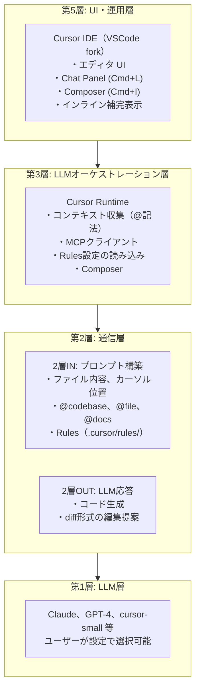
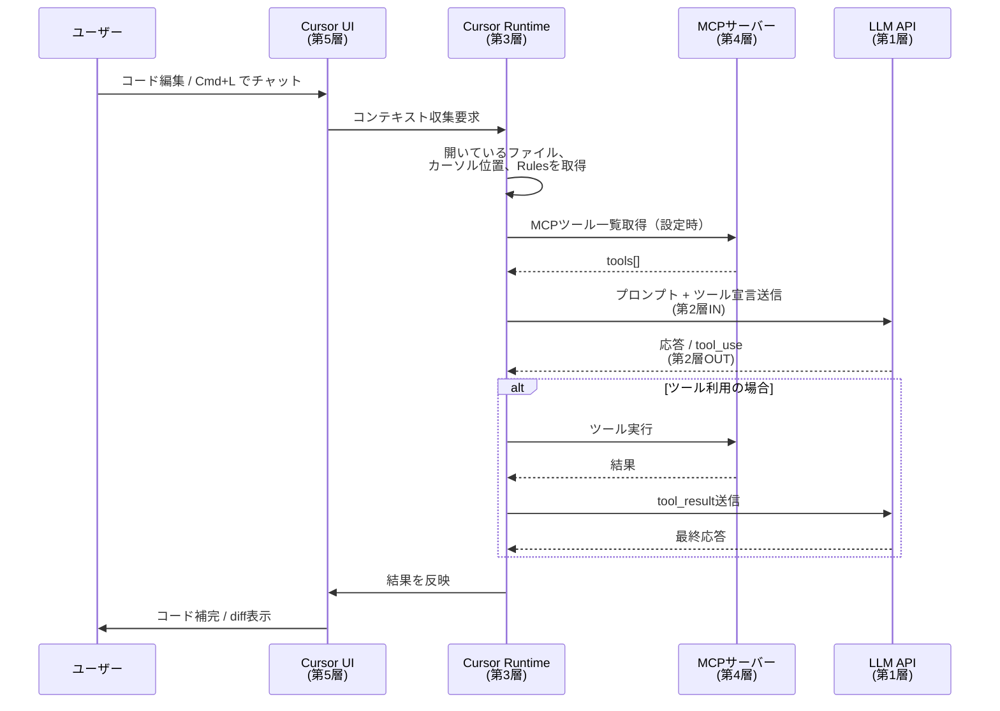
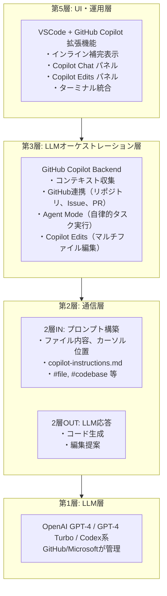
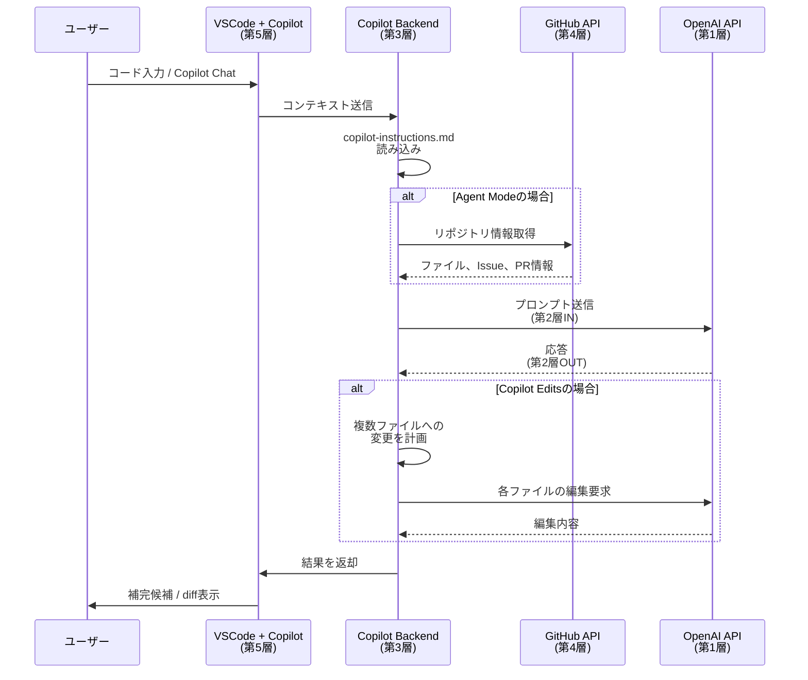
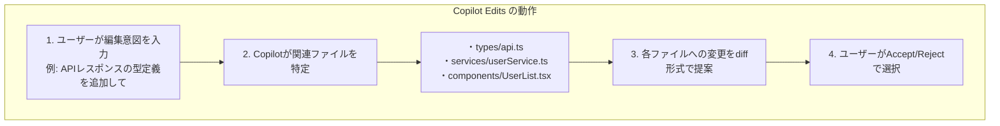
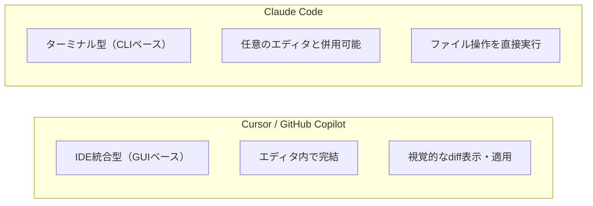
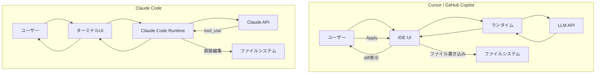

# IDE統合型AIアシスタント：5層モデルで理解する

> **5層モデルでの位置**: 第5層（UI・運用層）+ 第3層（LLMオーケストレーション層）
> **一言**: IDEに統合されたAIアシスタント。UIとランタイムを一体化し、開発者の作業フローに溶け込むAI体験を提供。

---

## 目次

1. [概要](#1-概要)
2. [製品比較表](#2-製品比較表)
3. [Cursor](#3-cursor)
4. [GitHub Copilot / VSCode Copilot](#4-github-copilot--vscode-copilot)
5. [Claude Codeとの比較](#5-claude-codeとの比較)

---

## 1. 概要

### IDE統合型AIアシスタントとは

IDE統合型AIアシスタントは、開発者がコードを書く環境（IDE）に直接組み込まれたAI機能を提供するツール群である。

**IDE統合型AIアシスタントの特徴**:
1. コードエディタ内でAIが動作
2. コンテキスト（開いているファイル等）を自動取得
3. コード補完・生成・編集を統合UIで提供
4. チャット形式での対話も可能

### 主要製品

| 製品 | 提供元 | ベースIDE | 特徴 |
|------|--------|-----------|------|
| **Cursor** | Cursor Inc. | VSCode fork | AIネイティブ設計、MCP対応 |
| **GitHub Copilot** | GitHub/Microsoft | VSCode拡張 | 最大のユーザーベース、Agent Mode |
| **Windsurf** | Codeium | VSCode fork | Cascade機能（マルチステップ） |
| **Kiro** | AWS | 独自IDE | Spec-driven development |

### 5層モデルにおける共通の位置づけ

```
第5層：UI・運用層
  └── IDE UI（エディタ、チャットパネル、インライン補完）
           │
           ↓
第3層：LLMオーケストレーション層
  └── AIランタイム（コンテキスト収集、LLM呼び出し、結果反映）
           │
           ↓
第2層：通信層
  ├── 2層IN: プロンプト構築（ファイル内容、カーソル位置等）
  └── 2層OUT: LLM応答（コード生成、ツール呼び出し）
           │
           ↓
第1層：LLM層
  └── GPT-4、Claude、独自モデル等
```

---

## 2. 製品比較表

### 5層モデルでの比較

| 製品 | 第5層（UI・運用） | 第3層（LLMオーケストレーション） | 第2層（通信） | 第1層（LLM） |
|------|-------------|-----------------|---------------|--------------|
| **Cursor** | VSCode fork UI | Cursor Runtime | 独自プロトコル | Claude, GPT-4, 独自モデル |
| **GitHub Copilot** | VSCode拡張 | Copilot Backend | GitHub API | OpenAI GPT系 |
| **VSCode Copilot** | VSCode拡張 | Copilot Backend | GitHub API | OpenAI GPT系 |

### 機能比較表

| 機能 | Cursor | GitHub Copilot | 備考 |
|------|--------|----------------|------|
| **インライン補完** | Tab補完 | Tab補完 | 両者とも対応 |
| **チャット** | Cmd+L | Copilot Chat | 対話形式 |
| **マルチファイル編集** | Composer | Copilot Edits | エージェント的動作 |
| **MCP対応** | あり | なし（2026年2月時点） | 外部ツール連携 |
| **カスタムルール** | Rules | copilot-instructions.md | プロジェクト設定 |
| **ターミナル統合** | あり | あり | CLI操作支援 |
| **Agent Mode** | Composer | Agent Mode | 自律的タスク実行 |

### 共通点

1. **コードコンテキストの自動取得**: 開いているファイル、カーソル位置、プロジェクト構造
2. **インライン補完**: タイピング中にリアルタイムで候補を表示
3. **チャットインターフェース**: 自然言語での質問・指示
4. **マルチファイル編集**: 複数ファイルにまたがる変更を一括提案

### 差分

| 観点 | Cursor | GitHub Copilot |
|------|--------|----------------|
| **アーキテクチャ** | IDEごとフォーク | 拡張機能として提供 |
| **LLM選択** | 複数モデルから選択可 | OpenAI系に限定 |
| **外部ツール** | MCP対応 | GitHub連携特化 |
| **料金体系** | サブスクリプション | サブスクリプション |
| **オフライン** | 不可 | 不可 |

---

## 3. Cursor

### 3-1. 概要

CursorはVSCodeをフォークして構築されたAIネイティブIDE。VSCodeの拡張機能エコシステムを継承しつつ、AI機能をコアに統合している。

- **公式**: [Cursor](https://cursor.com/)
- **ドキュメント**: [Cursor Docs](https://docs.cursor.com/)

### 3-2. 5層での位置づけ



### 3-3. 通信フロー図



### 3-4. MCP対応

CursorはMCP（Model Context Protocol）をサポートしており、外部ツールとの連携が可能。

#### MCP設定ファイル

```
.cursor/
└── mcp.json          # プロジェクトレベルのMCP設定
```

```json
// .cursor/mcp.json の例
{
  "mcpServers": {
    "filesystem": {
      "command": "npx",
      "args": ["-y", "@anthropic-ai/mcp-server-filesystem", "/path/to/allowed/dir"]
    },
    "github": {
      "command": "npx",
      "args": ["-y", "@anthropic-ai/mcp-server-github"],
      "env": {
        "GITHUB_TOKEN": "your-token"
      }
    }
  }
}
```

### 3-5. Rules設定

CursorのRulesは、プロジェクト固有の指示をLLMに伝える仕組み。Claude CodeのCLAUDE.mdに相当。

#### 設定ファイルの場所

```
.cursor/
└── rules/
    ├── general.md       # 全般的なルール
    ├── typescript.md    # TypeScript固有のルール
    └── testing.md       # テスト関連のルール
```

#### Rules例

```markdown
# .cursor/rules/general.md

## プロジェクト概要
このプロジェクトはReact + TypeScriptで構築されたWebアプリケーションです。

## コーディング規約
- 関数コンポーネントを使用
- Hooksパターンを優先
- 型定義は明示的に記述

## 禁止事項
- any型の使用
- console.logの残存
```

### 3-6. Cursorの主要機能

| 機能 | 説明 | 起動方法 |
|------|------|----------|
| **Tab補完** | インラインでのコード補完 | 自動 / Tab |
| **Chat** | サイドパネルでの対話 | Cmd+L |
| **Composer** | マルチファイル編集エージェント | Cmd+I |
| **@記法** | コンテキスト指定 | @file, @codebase, @docs |
| **Apply** | 提案されたdiffを適用 | Apply ボタン |

---

## 4. GitHub Copilot / VSCode Copilot

### 4-1. 概要

GitHub CopilotはGitHub/Microsoftが提供するAIコーディングアシスタント。VSCodeの拡張機能として提供され、最も広く使われているAIコーディングツールの一つ。

- **公式**: [GitHub Copilot](https://github.com/features/copilot)
- **ドキュメント**: [Copilot Docs](https://docs.github.com/en/copilot)

### 4-2. GitHub Copilot と VSCode Copilot の関係

```
GitHub Copilot（サービス全体）
├── VSCode Copilot 拡張機能    ← 最も一般的な利用形態
├── JetBrains Copilot プラグイン
├── Visual Studio Copilot
├── Neovim Copilot
└── GitHub.com Copilot         ← Web上での利用
```

**補足**: 「VSCode Copilot」は正式名称ではなく、「GitHub Copilot extension for VS Code」が正式名。本記事では便宜上「VSCode Copilot」と表記。

### 4-3. 5層での位置づけ



### 4-4. 通信フロー図



### 4-5. Copilot Chat

Copilot Chatは、サイドパネルでの対話形式のAIアシスタント機能。

#### 主要コマンド

| コマンド | 説明 |
|----------|------|
| `/explain` | コードの説明 |
| `/fix` | エラーの修正 |
| `/tests` | テストコード生成 |
| `/doc` | ドキュメント生成 |
| `@workspace` | ワークスペース全体を参照 |
| `@terminal` | ターミナル出力を参照 |

### 4-6. Copilot Edits

Copilot Editsは、マルチファイルにまたがる編集を一括で提案・適用する機能。CursorのComposerに相当。



### 4-7. copilot-instructions.md

GitHub Copilotのプロジェクト固有設定。Claude CodeのCLAUDE.md、CursorのRulesに相当。

#### 設定ファイルの場所

```
.github/
└── copilot-instructions.md
```

#### 設定例

```markdown
# Copilot Instructions

## プロジェクト概要
このプロジェクトはNode.js + Express + TypeScriptで構築されたAPIサーバーです。

## コーディング規約
- ESLint/Prettierの設定に従う
- 非同期処理はasync/awaitを使用
- エラーハンドリングは必ず実装

## 使用ライブラリ
- ORM: Prisma
- バリデーション: Zod
- テスト: Jest
```

### 4-8. Agent Mode

GitHub Copilot Agent Modeは、より自律的にタスクを実行する機能。

| 従来のCopilot | Agent Mode |
|---------------|------------|
| 単発の補完・応答 | マルチステップの計画・実行 |
| ユーザーが主導 | AIが計画を立案 |
| ファイル単位 | プロジェクト横断 |

---

## 5. Claude Codeとの比較

### 5-1. アーキテクチャの違い



### 5-2. 機能比較表

| 機能 | Cursor | GitHub Copilot | Claude Code |
|------|--------|----------------|-------------|
| **UI** | GUI（IDE） | GUI（IDE拡張） | CLI |
| **ファイル編集** | diff提案→Apply | diff提案→Accept | 直接編集 |
| **コンテキスト** | @記法 | #記法 | 自動収集 |
| **MCP** | 対応 | 非対応 | 対応 |
| **カスタム設定** | Rules | copilot-instructions.md | CLAUDE.md |
| **Hooks** | なし | なし | あり |
| **Skills** | なし | なし | あり |
| **サブエージェント** | 限定的 | Agent Mode | Task tool |
| **bash実行** | ターミナル連携 | ターミナル連携 | 直接実行 |

### 5-3. 5層モデルでの比較

| 層 | Cursor | GitHub Copilot | Claude Code |
|----|--------|----------------|-------------|
| **第5層** | IDE UI | VSCode拡張UI | ターミナルUI |
| **第4層** | MCPサーバー | GitHub API | MCPサーバー |
| **第3層** | Cursor Runtime | Copilot Backend | Claude Code Runtime |
| **第2層IN** | Rules | copilot-instructions.md | CLAUDE.md, Skills |
| **第2層OUT** | tool_use | tool_use | tool_use |
| **第1層** | Claude/GPT-4 | GPT-4 | Claude |

### 5-4. 使い分けの指針

| ユースケース | 推奨ツール | 理由 |
|-------------|-----------|------|
| **GUI重視、視覚的に確認しながら編集** | Cursor / Copilot | diff表示、Apply/Reject |
| **大規模リファクタリング、自動実行** | Claude Code | 直接編集、Hooks |
| **GitHub連携重視** | GitHub Copilot | Issue、PR連携 |
| **外部ツール連携（MCP）** | Cursor / Claude Code | MCP対応 |
| **プロンプトのカスタマイズ** | Claude Code | Skills、詳細な設定 |
| **ターミナル操作が主体** | Claude Code | CLIネイティブ |

### 5-5. 通信フローの違い



**ポイント**:
- Cursor/Copilot: LLM応答をdiffとして表示→ユーザーがApply→ファイル書き込み
- Claude Code: tool_useでファイル操作を直接実行（許可設定に応じて）

---

## 参考リンク

### 公式ドキュメント

- [Cursor Docs](https://docs.cursor.com/)
- [GitHub Copilot Docs](https://docs.github.com/en/copilot)
- [Claude Code Docs](https://code.claude.com/docs/en/)

### Cursor

- [Cursor公式](https://cursor.com/)
- [Cursor Rules](https://docs.cursor.com/context/rules)
- [Cursor MCP](https://docs.cursor.com/context/mcp)

### GitHub Copilot

- [Copilot Chat](https://docs.github.com/en/copilot/using-github-copilot/using-github-copilot-chat-in-your-ide)
- [Copilot Edits](https://docs.github.com/en/copilot/using-github-copilot/code-review-with-copilot)
- [Copilot Instructions](https://docs.github.com/en/copilot/customizing-copilot/adding-repository-instructions-for-github-copilot)

---

*作成日: 2026-02-22*
*対象: 5層モデル 第5層（UI・運用層）+ 第3層（LLMオーケストレーション層）*
