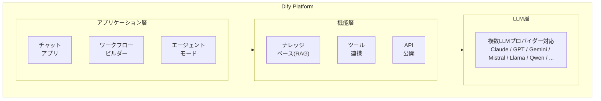
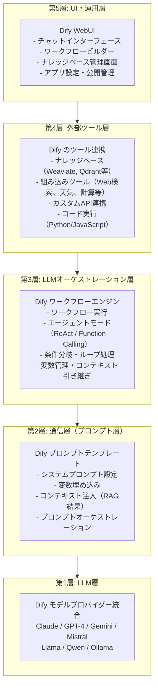
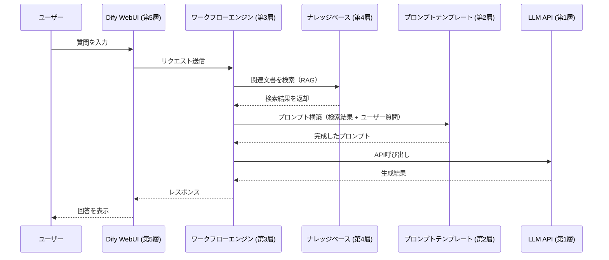
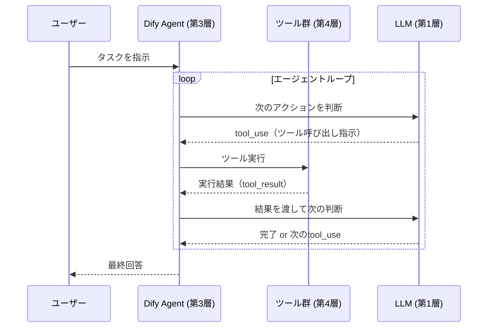
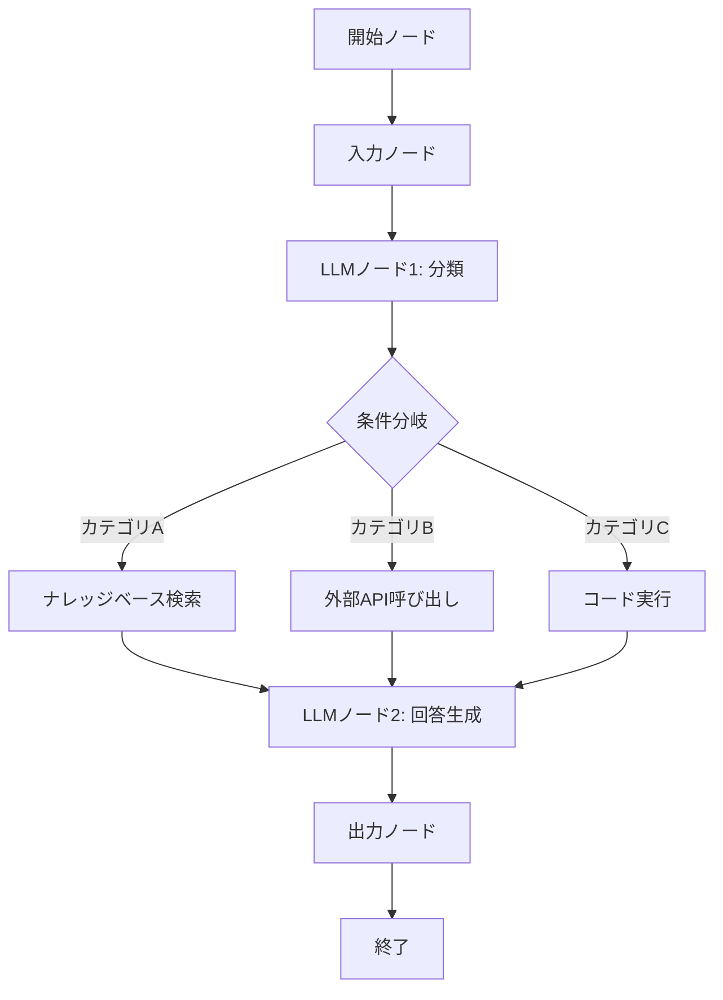
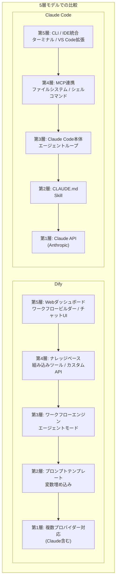

# Dify：ノーコード/ローコードLLMアプリ開発プラットフォーム

> **5層モデルでの位置**: 第3層（LLMオーケストレーション層）を中心に、全5層を統合的にカバー
> **一言**: GUIでワークフローを構築し、RAG・エージェント・API公開まで一気通貫で実現するオープンソースプラットフォーム。

*作成日: 2026-02-22*

---

## 目次

```
1. Difyの概要
2. 5層モデルでの位置づけ
3. 通信フロー図
4. 特徴的な機能
5. Claude Codeとの比較
```

---

## 1. Difyの概要

### 1-1. Difyとは

Difyは、**ノーコード/ローコードでLLMアプリケーションを構築できるオープンソースプラットフォーム**。チャットボット、RAGアプリ、AIエージェント、ワークフロー自動化などを、プログラミング不要でGUIから構築・運用できる。

```
Difyの位置づけ:

[従来のLLM開発]
  コード記述 → API呼び出し → RAG実装 → デプロイ → 運用
  （LangChain、LlamaIndex等を使ってすべてコードで実装）

[Difyでの開発]
  GUIでドラッグ＆ドロップ → 設定 → 即座に公開・API化
  （ノーコード/ローコードで同等の機能を実現）
```

### 1-2. 基本アーキテクチャ



### 1-3. 公式リファレンス

- [Dify 公式サイト](https://dify.ai/)
- [Dify ドキュメント](https://docs.dify.ai/)
- [Dify GitHub](https://github.com/langgenius/dify)
- [Dify Cloud（SaaS版）](https://cloud.dify.ai/)

---

## 2. 5層モデルでの位置づけ

Difyは5層モデルのすべての層に関与する統合プラットフォームとして機能する。

### 2-1. 各層でのDifyの役割



### 2-2. 層ごとの詳細

| 層 | Difyでの実現 | 具体的な機能 |
|---|---|---|
| **第5層（UI・運用）** | WebUIダッシュボード | チャット画面、ワークフロービルダー、ナレッジ管理 |
| **第4層（ツール）** | ナレッジベース + ツール | RAG検索、API連携、コード実行 |
| **第3層（LLMオーケストレーション）** | ワークフローエンジン | ノード実行、条件分岐、エージェントループ |
| **第2層（プロンプト）** | プロンプトテンプレート | 変数埋め込み、コンテキスト注入 |
| **第1層（LLM）** | モデルプロバイダー | 複数LLMの統一インターフェース |

---

## 3. 通信フロー図

### 3-1. 基本的なチャットアプリの通信フロー



### 3-2. エージェントモードの通信フロー



### 3-3. ワークフローの通信フロー



---

## 4. 特徴的な機能

### 4-1. ワークフロービルダー

**一言**: ビジュアルエディタでノードをつなげてLLMアプリのロジックを構築。コード不要で複雑な処理フローを設計できる。

```
ワークフローの構成要素:

[ノードの種類]
├── 開始/終了ノード: フロー入口・出口
├── LLMノード: プロンプトを設定してLLM呼び出し
├── ナレッジ検索ノード: ベクトルDBから関連文書を取得
├── コード実行ノード: Python/JavaScriptを実行
├── 条件分岐ノード: IF/ELSE の分岐処理
├── ループノード: 繰り返し処理
├── HTTPリクエストノード: 外部API呼び出し
├── テンプレートノード: テキスト組み立て
└── 変数代入ノード: 変数の操作
```

**GUIでの設定例**:

```
[入力] → [ナレッジ検索] → [LLM] → [出力]
           │                │
           └─検索結果────────┘（コンテキストとして注入）
```

### 4-2. RAG（ナレッジベース）

**一言**: ドキュメントをアップロードするだけで、自動的にチャンク分割・埋め込み生成・ベクトルDB保存を行い、検索可能な知識ベースを構築。

```
ナレッジベース構築の流れ:

1. ドキュメントアップロード
   └── PDF, Word, Markdown, テキスト, Notion連携等

2. 自動処理
   ├── チャンク分割（設定可能なサイズ・オーバーラップ）
   ├── 埋め込み生成（Embedding Model選択可能）
   └── ベクトルDB保存（Weaviate, Qdrant, Milvus等）

3. 検索設定
   ├── セマンティック検索（ベクトル類似度）
   ├── フルテキスト検索（キーワードマッチ）
   └── ハイブリッド検索（両方の組み合わせ）
```

**対応データソース**:

| データソース | 形式 |
|---|---|
| ファイルアップロード | PDF, DOCX, MD, TXT, CSV, HTML |
| Webクロール | URL指定でスクレイピング |
| Notion連携 | Notion APIでページ取得 |
| API同期 | 外部APIからデータ取得 |

### 4-3. エージェントモード

**一言**: LLMがタスクを分解し、必要なツールを自律的に呼び出して問題を解決するモード。ReActパターンまたはFunction Callingで実装。

```
エージェントモードの設定:

[推論モード]
├── Function Calling: OpenAI形式のtool_use
└── ReAct: 思考→行動→観察のループ

[利用可能なツール]
├── 組み込みツール
│   ├── Google検索
│   ├── Wikipedia検索
│   ├── 天気情報取得
│   ├── 時間取得
│   └── 数式計算
├── カスタムツール
│   ├── OpenAPI/Swagger定義からインポート
│   └── カスタムAPI定義
└── ナレッジベース検索
    └── 作成済みナレッジをツールとして利用
```

**エージェントループの動作**:

```
[ユーザー]: 「東京の明日の天気を調べて、傘が必要か教えて」

[エージェント思考]:
  → 天気ツールを呼び出す必要がある
  → 天気ツール実行: "東京, 明日"
  ← 結果: "晴れ時々曇り、降水確率20%"
  → 結果を分析して回答を生成

[回答]: 「明日の東京は晴れ時々曇りで、降水確率は20%です。
        傘は念のためお持ちになってもよいですが、
        必須ではないでしょう。」
```

### 4-4. API公開

**一言**: 構築したアプリをREST API / ストリーミングAPIとして即座に公開。外部システムからの呼び出しが可能。

```
API公開の形式:

[Chat API]
POST /v1/chat-messages
{
  "query": "質問文",
  "inputs": {},
  "user": "user-id",
  "response_mode": "streaming" | "blocking"
}

[Completion API]
POST /v1/completion-messages
{
  "query": "プロンプト",
  "inputs": {"variable1": "value1"},
  "user": "user-id"
}

[Workflow API]
POST /v1/workflows/run
{
  "inputs": {"key": "value"},
  "user": "user-id"
}
```

**API認証**:

```
Authorization: Bearer <API_KEY>
```

---

## 5. Claude Codeとの比較

### 5-1. 基本的な違い

| 観点 | Dify | Claude Code |
|---|---|---|
| **アプローチ** | ノーコード/ローコード | コードベース/CLI |
| **主な用途** | チャットボット、RAGアプリ、業務自動化 | ソフトウェア開発、コード生成・編集 |
| **ユーザー層** | 非エンジニア、ビジネスユーザー | 開発者、エンジニア |
| **カスタマイズ** | GUI設定 | コード、CLAUDE.md、Hooks |
| **デプロイ** | Dify Cloud / セルフホスト | ローカル実行 / CI/CD連携 |

### 5-2. 5層モデルでの比較



### 5-3. ユースケースの使い分け

| ユースケース | 推奨 | 理由 |
|---|---|---|
| 社内FAQチャットボット | **Dify** | ノーコードで構築、RAGが簡単 |
| コードリファクタリング | **Claude Code** | コードベースに直接アクセス |
| 顧客対応自動化 | **Dify** | ワークフローで条件分岐、API公開 |
| バグ修正・デバッグ | **Claude Code** | ファイル操作、テスト実行 |
| ドキュメント検索システム | **Dify** | ナレッジベースが充実 |
| CI/CDパイプライン連携 | **Claude Code** | シェル統合、GitHub連携 |
| プロトタイピング | **両方可** | Difyは速い、Claude Codeは柔軟 |

### 5-4. 連携の可能性

DifyとClaude Codeは排他的ではなく、組み合わせて使うことも可能。

```
[連携パターン例]

1. DifyでプロトタイプをClaude Codeで本番実装に
   Dify（検証）→ 要件確定 → Claude Code（コード実装）

2. Claude CodeでカスタムツールをDifyに組み込み
   Claude Code（API開発）→ Dify（ツールとして登録）

3. DifyワークフローからClaude Code MCPサーバーを呼び出し
   Dify（オーケストレーション）→ MCP → Claude Code（コード操作）
```

---

## まとめ

### Difyの強み

```
[ ] ノーコードでLLMアプリを構築できる
[ ] RAG（ナレッジベース）が標準搭載
[ ] ワークフロービルダーで複雑な処理を視覚化
[ ] 複数LLMプロバイダーに対応
[ ] API公開が即座に可能
[ ] オープンソースでセルフホスト可能
```

### 適用シーン判断フロー

```
Q1. コード中心の開発作業か？
    → YES: Claude Code
    → NO: 次へ

Q2. チャットボット・RAG・業務自動化が主目的か？
    → YES: Dify
    → NO: 次へ

Q3. 非エンジニアでも運用・改善したいか？
    → YES: Dify
    → NO: Claude Code / LangChain等のコードベース
```

---

## 関連リンク

### 公式ドキュメント

- [Dify ドキュメント](https://docs.dify.ai/)
- [Dify GitHub](https://github.com/langgenius/dify)
- [Dify Cloud](https://cloud.dify.ai/)

### 比較対象ツール

- [Claude Code ドキュメント](https://code.claude.com/docs/en/)
- [LangChain ドキュメント](https://python.langchain.com/docs/)
- [n8n ドキュメント](https://docs.n8n.io/)
- [Flowise ドキュメント](https://docs.flowiseai.com/)

### 解説記事

- [Anthropic "Building Effective Agents"](https://www.anthropic.com/research/building-effective-agents)
- [Chip Huyen "Agents"](https://huyenchip.com/2025/01/07/agents.html)

---

*作成日: 2026-02-22*
*シリーズ: AIエージェント概念マップ 詳細解説*
