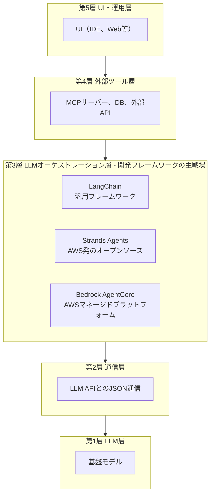
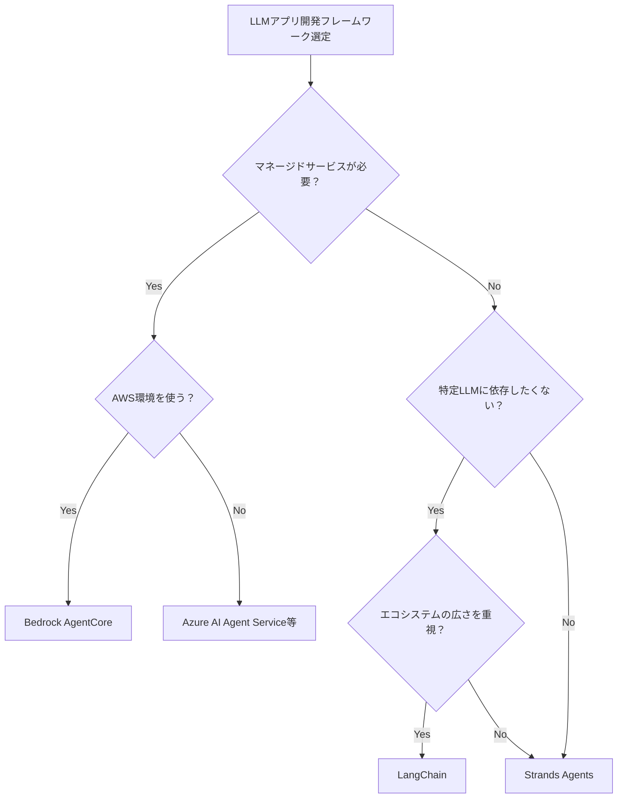
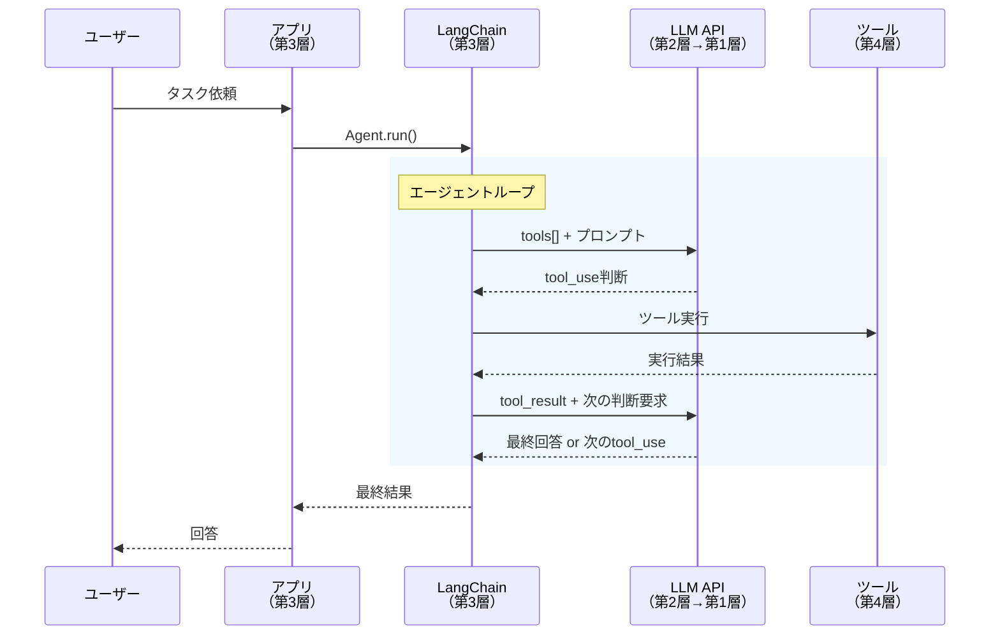
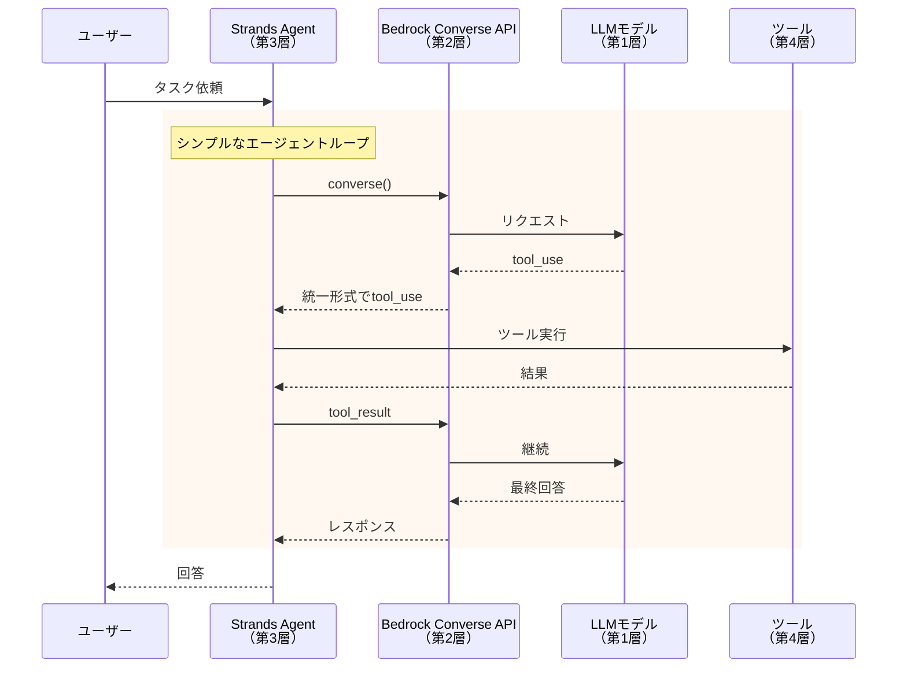
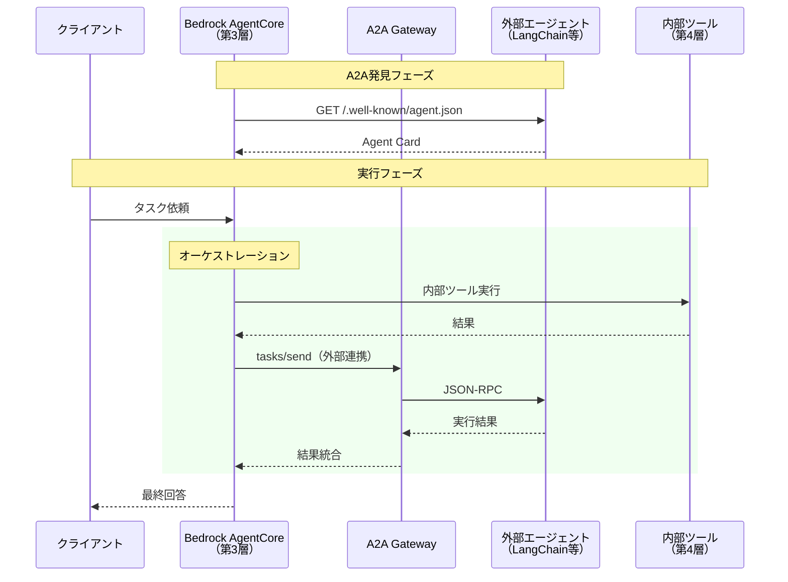
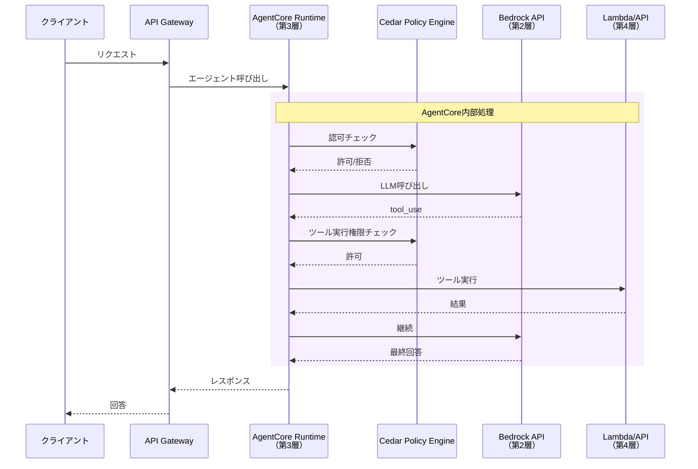
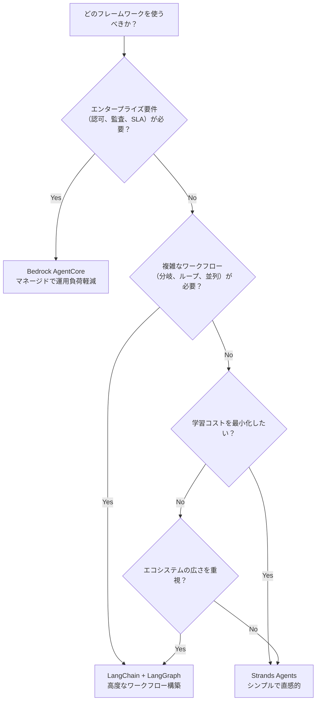

# 開発フレームワーク詳細解説：LangChain / Strands Agents / Bedrock AgentCore

> **シリーズ**: AIエージェント概念マップ詳細解説
> **対象層**: 主に第3層（LLMオーケストレーション層）
> **一言**: LLMアプリケーション開発を効率化するフレームワーク。それぞれ異なる強みと設計思想を持つ。

---

## 1. 概要：LLMアプリ開発フレームワークとは

**一言**: LLMアプリ開発フレームワークは、LLM APIの呼び出し、ツール連携、ワークフロー構築を抽象化し、開発者がビジネスロジックに集中できるようにするライブラリ・プラットフォーム。

### 1-1. フレームワークが解決する課題

| 課題 | 解決方法 |
|------|----------|
| LLM API形式の差異 | 統一インターフェースで各社APIを呼び出し |
| ツール連携の煩雑さ | デコレータやスキーマ定義で簡略化 |
| ワークフロー構築 | Chain、Graph、Agentパターンの提供 |
| 状態管理 | メモリ、チェックポイント機能の提供 |
| 本番運用 | 認証、認可、ロギング、監視の統合 |

### 1-2. 5層モデルにおける位置



---

## 2. 製品比較表

| 製品 | 主な層 | 特徴 | A2A対応 | ライセンス | 対応LLM |
|------|--------|------|---------|------------|---------|
| **LangChain** | 第3層 | 汎用、エコシステムが広大、Chain/Agent/Tool抽象化 | 実装進行中 | MIT | 全社対応 |
| **Strands Agents** | 第3層 | モデル非依存、シンプルなエージェントループ、AWSオープンソース | 対応予定 | Apache 2.0 | Bedrock全モデル、その他 |
| **Amazon Bedrock AgentCore** | 第3層〜第4層 | マネージド実行環境、Cedar認可、エンタープライズ向け | **対応** | AWS商用サービス | Bedrock全モデル |

### 2-1. 選択の目安



---

## 3. LangChain

### 3-1. 5層での位置づけ

| 層 | LangChainの役割 |
|----|--------------------|
| 第5層 | - |
| 第4層 | 🔧 ツール実行先として利用 |
| 第3層 | **✅ 主体：Chain、Agent、Toolの構築** |
| 第2層 | 🔧 LLM APIへのリクエスト組み立て |
| 第1層 | 🔧 各社LLMモデルを呼び出し |

**特徴**:
- **汎用性**: 全主要LLM（Claude、GPT、Gemini、Llama等）に対応
- **エコシステム**: LangGraph、LangSmith、膨大なコミュニティツール
- **抽象化レベル**: 高度な抽象化でコード量を削減
- **学習曲線**: 概念が多く、初学者には複雑

### 3-2. 通信フロー図



### 3-3. 主要コンポーネント

#### Chains（チェーン）

処理を順次つなげる基本パターン。

```python
from langchain_core.prompts import ChatPromptTemplate
from langchain_anthropic import ChatAnthropic

# シンプルなチェーン
prompt = ChatPromptTemplate.from_template("Translate to Japanese: {text}")
model = ChatAnthropic(model="claude-sonnet-4-6")
chain = prompt | model

result = chain.invoke({"text": "Hello, world!"})
```

#### Agents（エージェント）

LLMが自律的にツールを選択・実行。

```python
from langchain_anthropic import ChatAnthropic
from langchain_core.tools import tool
from langgraph.prebuilt import create_react_agent

@tool
def get_weather(city: str) -> str:
    """指定した都市の天気を取得する"""
    return f"{city}の天気は晴れです"

model = ChatAnthropic(model="claude-sonnet-4-6")
agent = create_react_agent(model, [get_weather])

result = agent.invoke({"messages": [("user", "東京の天気は？")]})
```

#### Tools（ツール）

エージェントが使用できる関数。

```python
from langchain_core.tools import tool

@tool
def search_database(query: str) -> str:
    """データベースを検索する

    Args:
        query: 検索クエリ
    """
    # 実装
    return "検索結果..."
```

### 3-4. LangGraphによるワークフロー

複雑な分岐・ループを持つワークフローを定義。

```python
from langgraph.graph import StateGraph, END
from typing import TypedDict

class State(TypedDict):
    messages: list
    next_step: str

graph = StateGraph(State)
graph.add_node("analyze", analyze_node)
graph.add_node("execute", execute_node)
graph.add_node("review", review_node)

graph.add_edge("analyze", "execute")
graph.add_conditional_edges("execute", decide_next)
graph.add_edge("review", END)

app = graph.compile()
```

### 3-5. 参考リンク

- [LangChain公式ドキュメント](https://python.langchain.com/docs/)
- [LangGraph公式ドキュメント](https://langchain-ai.github.io/langgraph/)
- [LangSmith（監視・デバッグ）](https://smith.langchain.com/)

---

## 4. Strands Agents

### 4-1. 5層での位置づけ

| 層 | Strands Agentsの役割 |
|----|------------------------|
| 第5層 | - |
| 第4層 | 🔧 ツール実行先として利用 |
| 第3層 | **✅ 主体：エージェントループの実装** |
| 第2層 | 🔧 Bedrock Converse APIで統一 |
| 第1層 | 🔧 Bedrock経由で各社モデル呼び出し |

**特徴**:
- **シンプルさ**: 最小限の抽象化で直感的
- **モデル非依存**: Bedrock Converse APIで複数モデルに対応
- **AWS統合**: Bedrockとのネイティブ連携
- **オープンソース**: Apache 2.0ライセンス

### 4-2. 通信フロー図



### 4-3. 基本的な使い方

```python
from strands import Agent
from strands.tools import tool

@tool
def get_weather(city: str) -> str:
    """指定した都市の天気を取得する"""
    return f"{city}の天気は晴れです"

# エージェント作成
agent = Agent(
    tools=[get_weather],
    system_prompt="あなたは親切なアシスタントです"
)

# 実行
response = agent("東京の天気を教えて")
print(response)
```

### 4-4. 特徴的な機能

#### モデル非依存

```python
from strands import Agent
from strands.models import BedrockModel

# Claude
agent_claude = Agent(
    model=BedrockModel("anthropic.claude-sonnet-4-6-v1:0")
)

# Llama
agent_llama = Agent(
    model=BedrockModel("meta.llama3-70b-instruct-v1:0")
)
```

#### MCPサーバー連携

```python
from strands import Agent
from strands.tools.mcp import MCPClient

# MCPサーバーからツールをロード
mcp_client = MCPClient("npx -y @anthropic/mcp-filesystem")
tools = mcp_client.get_tools()

agent = Agent(tools=tools)
```

#### マルチエージェント

```python
from strands import Agent
from strands.tools import tool

# サブエージェントを定義
researcher = Agent(
    system_prompt="あなたはリサーチ専門のエージェントです"
)

@tool
def research(topic: str) -> str:
    """トピックについて調査する"""
    return researcher(f"{topic}について調査して")

# メインエージェント
main_agent = Agent(
    tools=[research],
    system_prompt="あなたはプロジェクトマネージャーです"
)
```

### 4-5. 参考リンク

- [Strands Agents公式サイト](https://strandsagents.com/)
- [Strands Agents GitHub](https://github.com/strands-agents/strands-agents)
- [AWS Blog: Strands Agents](https://aws.amazon.com/blogs/machine-learning/introducing-strands-agents/)

---

## 5. Amazon Bedrock AgentCore

### 5-1. 5層での位置づけ

| 層 | AgentCoreの役割 |
|----|---------------------|
| 第5層 | 🔧 コンソール・API経由でアクセス |
| 第4層 | **✅ ツール実行環境の提供** |
| 第3層 | **✅ マネージドランタイム** |
| 第2層 | 🔧 Bedrock経由で通信 |
| 第1層 | 🔧 Bedrockモデルを利用 |

**特徴**:
- **マネージド**: インフラ管理不要
- **Cedar認可**: 宣言的なポリシーベース認可
- **A2A対応**: Google A2Aプロトコルをネイティブサポート
- **エンタープライズ**: 監査、ロギング、セキュリティ統合

### 5-2. A2A対応

Bedrock AgentCoreはGoogle A2Aプロトコルをネイティブサポートし、異なるフレームワーク間でのエージェント連携を実現。



### 5-3. 通信フロー図（内部）



### 5-4. Cedar認可ポリシー

宣言的なポリシー言語でエージェントの権限を制御。

```cedar
// エージェントが特定ツールを使用できるか
permit(
    principal == Agent::"data-analyst",
    action == Action::"invoke-tool",
    resource == Tool::"query-database"
) when {
    context.user.department == "analytics"
};

// 機密データへのアクセス制限
forbid(
    principal,
    action == Action::"read-data",
    resource == DataSource::"pii-database"
) unless {
    principal in Group::"compliance-approved"
};
```

### 5-5. AgentCore構成要素

| コンポーネント | 層 | 役割 |
|----------------|-----|------|
| **Agent Runtime** | 第3層 | エージェントの実行環境 |
| **Tool Registry** | 第3層↔第4層境界 | 利用可能なツールの管理 |
| **Memory Store** | 第4層 | 会話履歴・状態の永続化 |
| **Cedar Engine** | 第3層 | 認可ポリシーの評価 |
| **A2A Gateway** | 第4層 | 外部エージェントとの連携 |

### 5-6. 参考リンク

- [Amazon Bedrock AgentCore](https://aws.amazon.com/bedrock/agentcore/)
- [Bedrock AgentCore ドキュメント](https://docs.aws.amazon.com/bedrock/latest/userguide/agentcore.html)
- [Cedar Policy Language](https://www.cedarpolicy.com/)

---

## 6. フレームワーク比較：どれをいつ使うか

### 6-1. 詳細比較表

| 観点 | LangChain | Strands Agents | Bedrock AgentCore |
|------|-----------|----------------|-------------------|
| **抽象化レベル** | 高（多くの概念） | 低（シンプル） | 中（マネージド） |
| **学習曲線** | 急（概念が多い） | 緩やか | 中程度 |
| **LLM対応** | 全社対応 | Bedrock中心 | Bedrockのみ |
| **インフラ管理** | 自前 | 自前 | AWS管理 |
| **認可機能** | 自前実装 | 自前実装 | Cedar統合 |
| **A2A対応** | 実装進行中 | 対応予定 | ネイティブ対応 |
| **コスト** | OSS無料 | OSS無料 | AWS従量課金 |
| **デバッグ** | LangSmith | 標準ログ | CloudWatch統合 |
| **ユースケース** | プロトタイプ〜本番 | シンプルなAgent | エンタープライズ |

### 6-2. 選択ガイド



### 6-3. ユースケース別推奨

| ユースケース | 推奨フレームワーク | 理由 |
|--------------|-------------------|------|
| **プロトタイピング** | Strands Agents | 学習コスト低、すぐ動く |
| **RAGアプリ** | LangChain | 豊富なRetriever、VectorStore統合 |
| **複雑なワークフロー** | LangChain + LangGraph | グラフベースの柔軟な定義 |
| **マルチエージェント** | どれでも可 | 各フレームワークで実装可能 |
| **異種フレームワーク連携** | Bedrock AgentCore | A2Aネイティブ対応 |
| **エンタープライズ本番** | Bedrock AgentCore | マネージド、認可、監査 |
| **マルチLLM対応** | LangChain | 全社LLMに対応 |
| **AWS中心アーキテクチャ** | Strands or AgentCore | Bedrock最適化 |

### 6-4. 組み合わせパターン

各フレームワークは排他的ではなく、組み合わせて使用可能。

```
パターン1: LangChain + AgentCore
├── LangChainでローカル開発・プロトタイプ
└── 本番はAgentCoreにデプロイ（一部変換が必要）

パターン2: Strands + A2A + 外部エージェント
├── Strands Agentsでメインエージェント構築
└── A2A経由でLangChain製エージェントと連携

パターン3: LangChain + LangGraph + MCP
├── LangGraphで複雑なワークフロー定義
├── MCPサーバーでツール提供
└── LangSmithで監視
```

---

## 7. 参考リンク

### 公式ドキュメント

- [LangChain](https://python.langchain.com/docs/)
- [LangGraph](https://langchain-ai.github.io/langgraph/)
- [Strands Agents](https://strandsagents.com/)
- [Amazon Bedrock AgentCore](https://aws.amazon.com/bedrock/agentcore/)
- [Google A2A プロトコル](https://google.github.io/A2A/)
- [Cedar Policy Language](https://www.cedarpolicy.com/)

### 解説ブログ

- [Anthropic "Building Effective Agents"](https://www.anthropic.com/research/building-effective-agents)
- [Chip Huyen "Agents"](https://huyenchip.com/2025/01/07/agents.html)
- [AWS Blog: Introducing Strands Agents](https://aws.amazon.com/blogs/machine-learning/introducing-strands-agents/)

---

*作成日: 2026-02-22*
*シリーズ: AIエージェント概念マップ詳細解説*
*対象層: 第3層（LLMオーケストレーション層）- 開発フレームワーク*
