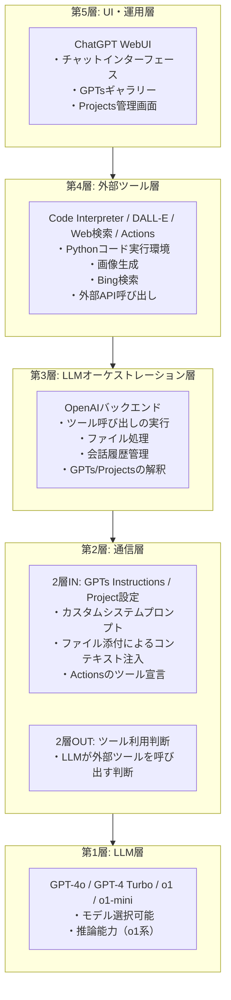
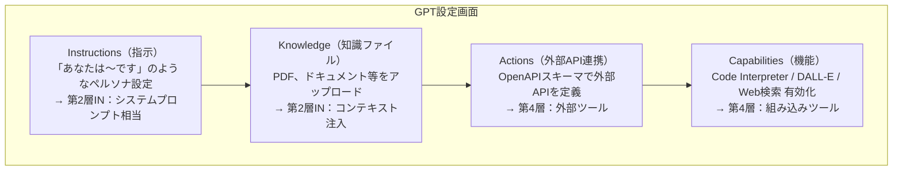
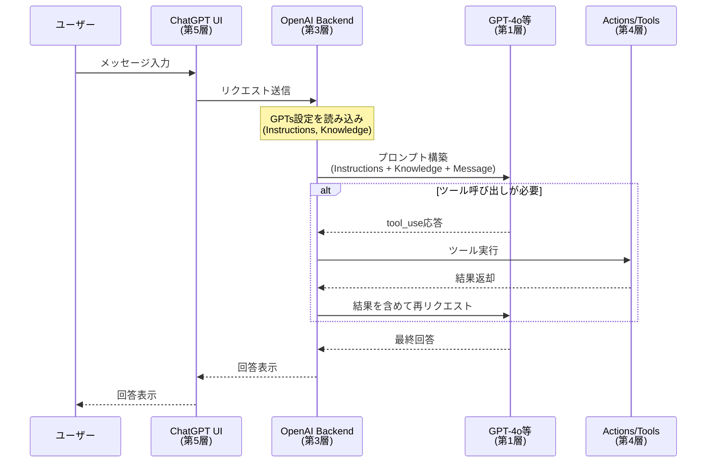
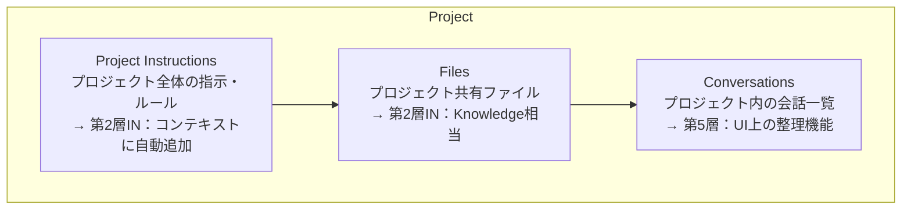
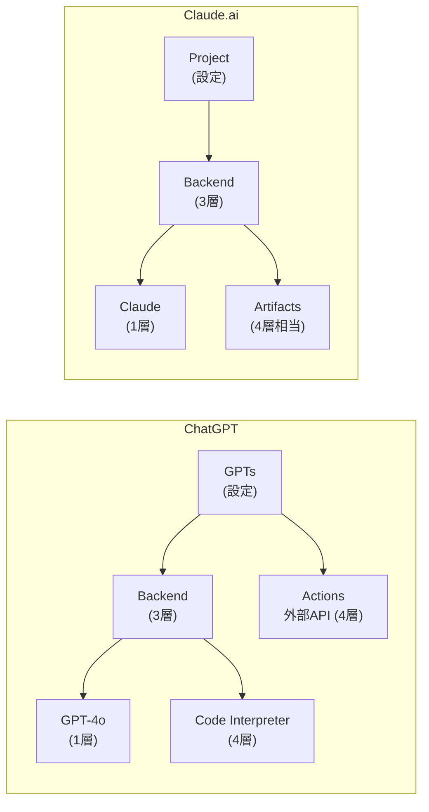

# ChatGPT Enterprise / GPTs / Projects：5層モデルで解説

> **5層モデルでの位置**: 第5層（WebUI）をメイン、GPTs/Projectsで第2層を拡張
> **概要**: OpenAIのエンドユーザー向けプラットフォーム。GPTsやProjectsで「第2層」のカスタマイズを提供。

---

## 目次

1. [ChatGPT Enterpriseの概要](#1-chatgpt-enterpriseの概要)
2. [5層モデルでの位置づけ](#2-5層モデルでの位置づけ)
3. [GPTs（カスタムGPT）](#3-gptsカスタムgpt)
4. [Projects（プロジェクト機能）](#4-projectsプロジェクト機能)
5. [Claude.aiとの比較](#5-claudeaiとの比較)

---

## 1. ChatGPT Enterpriseの概要

ChatGPT Enterpriseは、OpenAIが提供する企業向けChatGPTサービス。

### 主な特徴

| 特徴 | 説明 |
|------|------|
| **無制限のGPT-4アクセス** | レート制限なしでGPT-4を利用可能 |
| **高速応答** | 通常版より2倍高速なレスポンス |
| **セキュリティ** | SOC 2準拠、データは学習に使用されない |
| **管理機能** | ユーザー管理、SSO、使用状況ダッシュボード |
| **長いコンテキスト** | 32Kトークンのコンテキストウィンドウ |
| **高度な分析** | Advanced Data Analysis（Code Interpreter） |

### プラン比較

| プラン | 対象 | GPTs作成 | Projects | API |
|--------|------|----------|----------|-----|
| **Free** | 個人 | 利用のみ | - | - |
| **Plus** | 個人 | 作成可 | 可 | 別契約 |
| **Team** | 小規模チーム | 作成可（共有） | 可 | 別契約 |
| **Enterprise** | 大企業 | 作成可（管理） | 可 | 別契約 |
| **API** | 開発者 | - | - | 直接利用 |

### 公式リファレンス

- [ChatGPT Enterprise](https://openai.com/chatgpt/enterprise)
- [OpenAI Platform](https://platform.openai.com/)

---

## 2. 5層モデルでの位置づけ

### 各層の構成



### 層別の詳細

| 層 | ChatGPTでの実装 | 備考 |
|----|-----------------|------|
| **第5層** | WebUI | ブラウザ・モバイルアプリで提供 |
| **第4層** | Code Interpreter, DALL-E, Web検索, Actions | OpenAI管理のツール群 |
| **第3層（LLMオーケストレーション）** | OpenAIバックエンド | ユーザーからは見えない |
| **第2層IN** | GPTs Instructions, Project設定 | ユーザーがカスタマイズ可能 |
| **第2層OUT** | ツール利用判断 | LLMが自動判断 |
| **第1層** | GPT-4o, o1等 | モデル選択可能 |

---

## 3. GPTs（カスタムGPT）

GPTsは、ユーザーがカスタムAIアシスタントを作成・共有できる機能。

### カスタムGPTの仕組み



### Instructions（第2層IN相当）

GPTsのInstructionsは、Claude CodeのCLAUDE.mdに相当する「システムプロンプト」。

| 項目 | 説明 | 5層モデル |
|------|------|-----------|
| **ペルソナ** | 「あなたは専門家です」等の役割定義 | 第2層IN |
| **振る舞い** | 「常に日本語で回答」等のルール | 第2層IN |
| **制約** | 「〜については回答しない」等の制限 | 第2層IN |
| **例示** | 回答フォーマットの例 | 第2層IN |

```text
# Instructions例
あなたは日本語の技術文書作成の専門家です。

## 振る舞い
- 常に丁寧語で回答
- 技術用語は必要に応じて英語併記
- コード例にはコメントを付与

## 制約
- 個人的な意見は述べない
- 不確かな情報は「推測ですが」と明示
```

### Actions（第4層相当）

ActionsはOpenAPI仕様で外部APIを定義し、GPTからAPI呼び出しを可能にする。

| 項目 | 説明 |
|------|------|
| **OpenAPI Schema** | APIのエンドポイント、パラメータを定義 |
| **認証** | API Key、OAuth等の認証設定 |
| **プライバシー** | データ送信先の明示 |

```yaml
# Actions定義例（OpenAPI）
openapi: 3.1.0
info:
  title: Weather API
  version: 1.0.0
servers:
  - url: https://api.weather.example.com
paths:
  /current:
    get:
      operationId: getCurrentWeather
      summary: 現在の天気を取得
      parameters:
        - name: city
          in: query
          required: true
          schema:
            type: string
      responses:
        '200':
          description: 天気情報
```

### GPTsの通信フロー



### GPTs作成のベストプラクティス

| カテゴリ | ベストプラクティス |
|----------|-------------------|
| **Instructions** | 具体的で明確な指示を記述。曖昧さを避ける |
| **Knowledge** | 関連性の高いドキュメントのみアップロード |
| **Actions** | 必要最小限のAPIエンドポイントを定義 |
| **テスト** | 様々なユースケースでテスト実施 |

---

## 4. Projects（プロジェクト機能）

Projectsは、会話をプロジェクト単位で整理し、共有設定やファイルを管理する機能。

### プロジェクト設定の役割



### ファイル添付（コンテキスト注入）

| 方式 | 説明 | 5層モデル |
|------|------|-----------|
| **Project Files** | プロジェクト全体で共有 | 第2層IN（永続） |
| **Chat添付** | 特定の会話でのみ有効 | 第2層IN（一時） |
| **GPTs Knowledge** | GPT固有の知識 | 第2層IN（GPT単位） |

```
コンテキストの優先順位：
1. ユーザーメッセージ
2. Chat添付ファイル（その会話限定）
3. Project Files（プロジェクト共有）
4. GPTs Knowledge（GPT固有）
5. GPTs Instructions
```

### Projectsの活用例

| ユースケース | 設定例 |
|--------------|--------|
| **技術文書作成** | 用語集、スタイルガイドをFilesに配置 |
| **コードレビュー** | コーディング規約をInstructionsに記載 |
| **リサーチ** | 参考論文をFilesに配置 |
| **チーム作業** | 共通のルールをInstructionsで統一 |

---

## 5. Claude.aiとの比較

### 機能比較

| 機能 | ChatGPT (GPTs/Projects) | Claude.ai (Projects) |
|------|------------------------|----------------------|
| **カスタムAI作成** | GPTs | - |
| **プロジェクト機能** | Projects | Projects |
| **システムプロンプト** | Instructions | Project Instructions |
| **ファイル添付** | Knowledge / Files | Project Knowledge |
| **外部API連携** | Actions | - |
| **組み込みツール** | Code Interpreter, DALL-E, Web検索 | Artifacts, Computer Use |
| **共有・公開** | GPTs Store | - |

### アーキテクチャ比較



### 第2層での違い

| 項目 | ChatGPT | Claude.ai |
|------|---------|-----------|
| **カスタマイズ単位** | GPT単位 + Project単位 | Project単位のみ |
| **外部API** | Actions対応 | 非対応 |
| **公開・共有** | GPTs Store | 非対応 |
| **拡張性** | Actions + プラグイン | 限定的 |

### 選択基準

| 要件 | 推奨 |
|------|------|
| **外部API連携が必要** | ChatGPT (Actions) |
| **カスタムAIの公開・共有** | ChatGPT (GPTs Store) |
| **シンプルなプロジェクト管理** | どちらでも可 |
| **コード生成重視** | Claude.ai (Artifacts) |
| **長文コンテキスト** | Claude.ai (200K tokens) |

---

## まとめ

### ChatGPT Enterprise / GPTs / Projectsの5層モデル配置

| 機能 | 主体となる層 | 利用する層 |
|------|-------------|-----------|
| **ChatGPT WebUI** | 第5層 | - |
| **Code Interpreter** | 第4層 | 第2層OUT（呼び出し判断） |
| **DALL-E** | 第4層 | 第2層OUT（呼び出し判断） |
| **Web検索** | 第4層 | 第2層OUT（呼び出し判断） |
| **Actions** | 第4層 | 第2層IN（宣言）, 第2層OUT（判断） |
| **GPTs Instructions** | 第2層IN | 第1層（LLMが解釈） |
| **Project設定** | 第2層IN | 第1層（LLMが解釈） |
| **GPT-4o / o1** | 第1層 | - |

### ポイント

1. **GPTsは「第2層IN + 第4層」のパッケージング**
   - Instructionsで第2層INを、Actionsで第4層を定義
   - ユーザーが簡単にカスタマイズ可能

2. **Projectsは「第2層INの整理機能」**
   - ファイルと設定をプロジェクト単位で管理
   - Claude.aiのProjectsと同様のコンセプト

3. **OpenAIバックエンド（第3層）はユーザーから見えない**
   - ツール実行、会話管理等を担当
   - APIとは異なるアーキテクチャ

---

## 参考リンク

### 公式ドキュメント

- [ChatGPT Enterprise](https://openai.com/chatgpt/enterprise)
- [GPTs Overview](https://openai.com/index/introducing-gpts/)
- [OpenAI Platform Documentation](https://platform.openai.com/docs)
- [Actions Documentation](https://platform.openai.com/docs/actions)

### 関連記事

- [Building GPTs Best Practices](https://help.openai.com/en/articles/8554397-creating-a-gpt)
- [ChatGPT Team](https://openai.com/chatgpt/team)

---

*作成日: 2026-02-22*
*対象: 5層モデル - ChatGPT Enterprise / GPTs / Projects*
