# AIエージェントのセキュリティ：5層モデルによるリスク分析

## 1. はじめに：5層モデルでセキュリティを捉えるメリット

AIエージェントのセキュリティは、単一の防御策では対処できない複雑な課題です。本章では、AIエージェントの5層モデルを活用してセキュリティリスクを体系的に分析し、各層における責任主体と対策を明確化します。

### 1-1. 責任主体の明確化

5層モデルを用いることで、セキュリティリスクの発生箇所と責任主体を明確に特定できます。

| 層 | 責任主体の例 |
|----|-------------|
| 第1層 LLM層 | LLMベンダー（Anthropic、OpenAI、Google等） |
| 第2層 通信層 | プロトコル策定機関、API仕様設計者 |
| 第3層 LLMオーケストレーション層 | AIエージェント開発者、Dify等のプラットフォーム提供者 |
| 第4層 外部ツール層 | MCPサーバー開発者、RAG構築SIer、ユーザー企業 |
| 第5層 UI・運用層 | 認証基盤設計企業、運用担当者 |

### 1-2. 多層防御の設計

セキュリティリスクは単一の層だけでは完全に防御できません。例えば、ハルシネーション（幻覚）の防止は以下のように多層で対処します：

- **第1層（LLM層）**：LLMベンダーによるモデルの学習改善・ファインチューニング
- **第3層（オーケストレーション層）**：ガードレールの実装、出力のファクトチェック機構
- **第4層（外部ツール層）**：RAGによる正確な知識ベースの参照

このように、複数の層で重層的に防御することで、単一の対策が失敗した場合でもリスクを軽減できます。

### 1-3. 漏洩先の特定

情報漏洩リスクを分析する際、各層ごとに漏洩先と漏洩経路が異なることを理解することが重要です：

- **第1層からの漏洩**：LLMベンダーへの学習データとしての漏洩
- **第2層からの漏洩**：通信経路上での傍受、APIログへの記録
- **第3層からの漏洩**：オーケストレーションログ、プロンプトキャッシュ
- **第4層からの漏洩**：RAGデータベース、MCPサーバー経由の外部送信
- **第5層からの漏洩**：未認証ユーザーへの情報表示、画面共有

---

## 2. OWASP LLM Top 10 (2025) の5層マッピング

OWASP（Open Web Application Security Project）は2025年版のLLM Top 10を公開し、大規模言語モデルを活用するアプリケーションの主要なセキュリティリスクを特定しています。

### 2-1. 早見表

| # | リスク名 | リスク発生層 | 対策実施層 |
|---|----------|-------------|-----------|
| LLM01 | プロンプトインジェクション | 第3層・第4層・第5層 | 第3層・第4層・第5層 |
| LLM02 | 機密情報の漏洩 | 第1層・第3層・第4層 | 第1層・第3層・第4層・第5層 |
| LLM03 | サプライチェーンの脆弱性 | 第1層・第3層・第4層 | 第1層・第3層・第4層 |
| LLM04 | データ・モデルポイズニング | 第1層・第4層 | 第1層・第3層・第4層 |
| LLM05 | 不適切な出力処理 | 第1層・第3層 | 第3層・第4層 |
| LLM06 | 過度なエージェンシー | 第3層・第4層 | 第3層・第5層 |
| LLM07 | システムプロンプト漏洩 | 第3層 | 第3層・第5層 |
| LLM08 | ベクトル・埋め込みの脆弱性 | 第4層 | 第3層・第4層 |
| LLM09 | 誤情報生成 | 第1層 | 第1層・第3層・第4層・第5層 |
| LLM10 | 無制限のリソース消費 | 第2層・第3層・第4層・第5層 | 第2層・第3層・第4層・第5層 |

### 2-2. 各リスクの詳細分析

#### LLM01: プロンプトインジェクション

攻撃者が細工した入力でLLMの本来の指示を上書きし、不正アクセス、データ漏洩、意図しない動作を引き起こす。

**リスクフロー図**

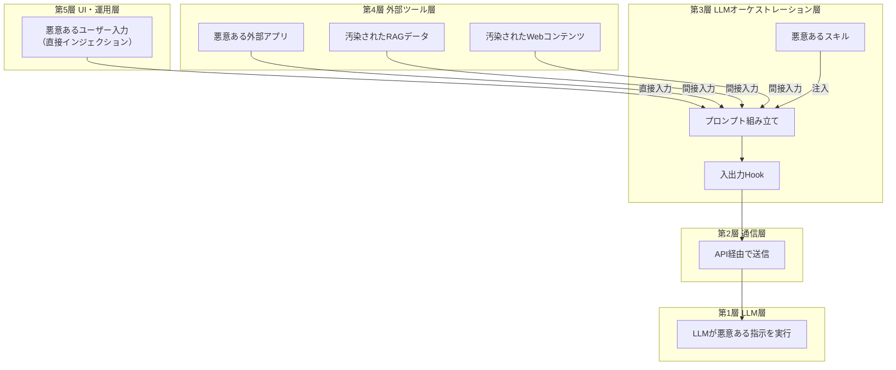
```mermaid
flowchart TB
    subgraph Layer5["第5層 UI・運用層"]
        User["悪意あるユーザー入力<br/>（直接インジェクション）"]
    end
    subgraph Layer4["第4層 外部ツール層"]
        MaliciousApp["悪意ある外部アプリ"]
        RAG["汚染されたRAGデータ"]
        Web["汚染されたWebコンテンツ"]
    end
    subgraph Layer3["第3層 LLMオーケストレーション層"]
        Skill["悪意あるスキル"]
        Prompt["プロンプト組み立て"]
        Hook["入出力Hook"]
    end
    subgraph Layer2["第2層 通信層"]
        API["API経由で送信"]
    end
    subgraph Layer1["第1層 LLM層"]
        LLM["LLMが悪意ある指示を実行"]
    end

    User -->|直接入力| Prompt
    MaliciousApp -->|間接入力| Prompt
    RAG -->|間接入力| Prompt
    Web -->|間接入力| Prompt
    Skill -->|注入| Prompt
    Prompt --> Hook --> API --> LLM
```

**なぜこれらの層で発生するか**

| 層 | 発生理由 |
|-----|----------|
| 第5層 | ユーザーが直接悪意ある入力を行う（直接インジェクション） |
| 第4層 | 外部ツール、RAG、Webコンテンツから汚染データが混入（間接インジェクション） |
| 第3層 | 悪意あるスキルがプロンプトに注入、プロンプト組み立て時に脆弱性 |

**対策と実施層**

| 対策 | 層 | 説明 |
|------|-----|------|
| ユーザー認証・認可 | 第5層 | 信頼できるユーザーのみアクセス許可 |
| 入力バリデーション | 第5層 | ユーザー入力の検証・サニタイズ |
| ツール利用の厳格化 | 第4層 | 信頼できるツール・データソースのみ許可 |
| RAGデータの検証 | 第4層 | 取得データの信頼性確認 |
| スキル検証 | 第3層 | 新規スキルの安全性検証 |
| 入力Hookガードレール | 第3層 | 注入パターンの検出・ブロック |
| 出力Hook確認 | 第3層 | 異常な出力の検出・フィルタリング |
| システムプロンプトと入力の分離 | 第3層 | 明確な境界設定 |

---

#### LLM02: 機密情報の漏洩

LLMが個人情報、システム認証情報、機密ビジネスデータを意図せず出力する。

**リスクフロー図**

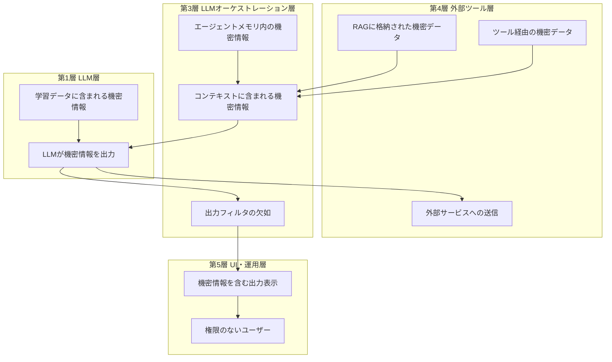
```mermaid
flowchart TB
    subgraph Layer5["第5層 UI・運用層"]
        Output["機密情報を含む出力表示"]
        UnauthorizedUser["権限のないユーザー"]
    end
    subgraph Layer4["第4層 外部ツール層"]
        RAG["RAGに格納された機密データ"]
        Tool["ツール経由の機密データ"]
        External["外部サービスへの送信"]
    end
    subgraph Layer3["第3層 LLMオーケストレーション層"]
        Context["コンテキストに含まれる機密情報"]
        Memory["エージェントメモリ内の機密情報"]
        NoFilter["出力フィルタの欠如"]
    end
    subgraph Layer1["第1層 LLM層"]
        Training["学習データに含まれる機密情報"]
        LLM["LLMが機密情報を出力"]
    end

    Training --> LLM
    RAG --> Context
    Tool --> Context
    Memory --> Context
    Context --> LLM
    LLM --> NoFilter --> Output --> UnauthorizedUser
    LLM --> External
```

**なぜこれらの層で発生するか**

| 層 | 発生理由 |
|-----|----------|
| 第1層 | LLMの学習データに機密情報が含まれ、推論時に出力される |
| 第3層 | コンテキストやエージェントメモリに機密情報が含まれる |
| 第4層 | RAGやツールから機密データが取得され、適切なフィルタなしに処理される |

**対策と実施層**

| 対策 | 層 | 説明 |
|------|-----|------|
| 学習データのキュレーション | 第1層 | 機密情報の除去・マスキング |
| 出力フィルタリング | 第3層 | 機密パターンの検出・マスキング |
| コンテキスト管理 | 第3層 | 必要最小限の情報のみコンテキストに含める |
| RAGアクセス制御 | 第4層 | ユーザー権限に基づくデータアクセス制限 |
| データ分類 | 第4層 | 機密レベルに応じたデータ分類・管理 |
| ユーザー権限確認 | 第5層 | 出力前にユーザー権限を確認 |
| 監査ログ | 第5層 | 機密情報アクセスの記録・監視 |

---

#### LLM03: サプライチェーンの脆弱性

サードパーティのコンポーネントや依存関係（悪意のあるデータ、ライブラリ、モデル）を使用する際のリスク。

**リスクフロー図**

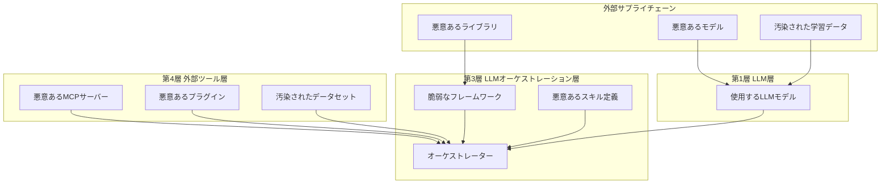
```mermaid
flowchart TB
    subgraph External["外部サプライチェーン"]
        MaliciousModel["悪意あるモデル"]
        MaliciousLib["悪意あるライブラリ"]
        MaliciousData["汚染された学習データ"]
    end
    subgraph Layer4["第4層 外部ツール層"]
        MCP["悪意あるMCPサーバー"]
        Plugin["悪意あるプラグイン"]
        Dataset["汚染されたデータセット"]
    end
    subgraph Layer3["第3層 LLMオーケストレーション層"]
        Framework["脆弱なフレームワーク"]
        Skill["悪意あるスキル定義"]
        Orchestrator["オーケストレーター"]
    end
    subgraph Layer1["第1層 LLM層"]
        Model["使用するLLMモデル"]
    end

    MaliciousModel --> Model
    MaliciousLib --> Framework
    MaliciousData --> Model
    MCP --> Orchestrator
    Plugin --> Orchestrator
    Dataset --> Orchestrator
    Framework --> Orchestrator
    Skill --> Orchestrator
    Model --> Orchestrator
```

**なぜこれらの層で発生するか**

| 層 | 発生理由 |
|-----|----------|
| 第1層 | 使用するLLMモデル自体が汚染されている、または脆弱性を持つ |
| 第3層 | オーケストレーションフレームワーク、スキル定義の脆弱性 |
| 第4層 | MCPサーバー、プラグイン、外部データセットの脆弱性 |

**対策と実施層**

| 対策 | 層 | 説明 |
|------|-----|------|
| モデル検証 | 第1層 | 使用するモデルの出所・整合性確認 |
| モデルカードの確認 | 第1層 | 学習データ・バイアス・制限事項の確認 |
| フレームワーク監査 | 第3層 | 依存ライブラリの脆弱性スキャン |
| スキル検証 | 第3層 | サードパーティスキルの安全性確認 |
| MCPサーバー検証 | 第4層 | 信頼できるMCPサーバーのみ許可 |
| 依存関係管理 | 第4層 | SBOM（Software Bill of Materials）の維持 |
| 署名検証 | 第4層 | コンポーネントの署名・整合性確認 |

---

#### LLM04: データ・モデルポイズニング

攻撃者が学習データを意図的に改ざんし、LLMの動作に影響を与えたり新たな脆弱性を導入する。

**リスクフロー図**

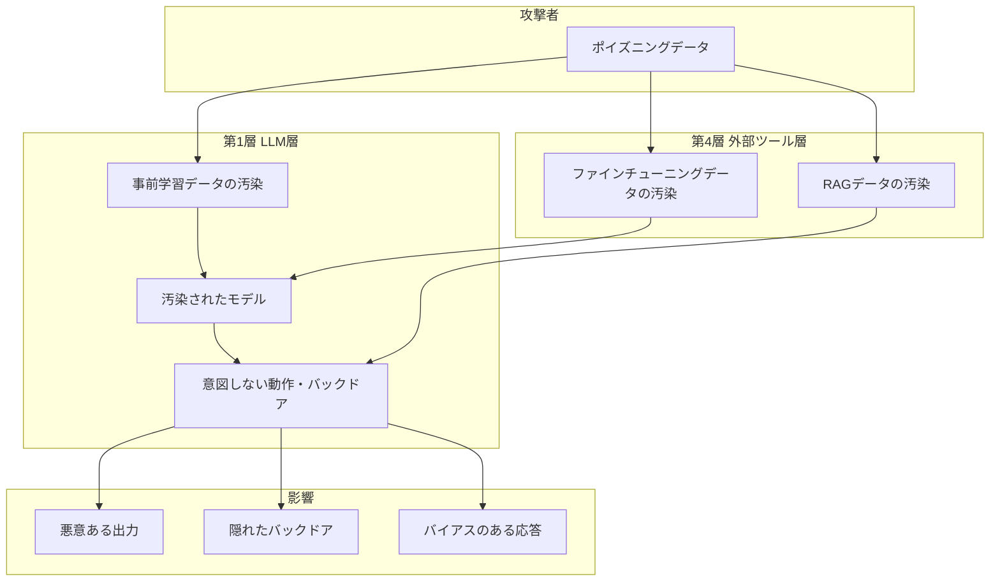
```mermaid
flowchart TB
    subgraph Attacker["攻撃者"]
        Poison["ポイズニングデータ"]
    end
    subgraph Layer4["第4層 外部ツール層"]
        RAGPoison["RAGデータの汚染"]
        FinetuneData["ファインチューニングデータの汚染"]
    end
    subgraph Layer1["第1層 LLM層"]
        PretrainData["事前学習データの汚染"]
        Model["汚染されたモデル"]
        Behavior["意図しない動作・バックドア"]
    end
    subgraph Impact["影響"]
        BadOutput["悪意ある出力"]
        Backdoor["隠れたバックドア"]
        BiasedResponse["バイアスのある応答"]
    end

    Poison --> PretrainData --> Model
    Poison --> FinetuneData --> Model
    Poison --> RAGPoison
    Model --> Behavior
    RAGPoison --> Behavior
    Behavior --> BadOutput
    Behavior --> Backdoor
    Behavior --> BiasedResponse
```

**なぜこれらの層で発生するか**

| 層 | 発生理由 |
|-----|----------|
| 第1層 | 事前学習データまたはファインチューニングデータが汚染される |
| 第4層 | RAGで使用するナレッジベースが汚染される |

**対策と実施層**

| 対策 | 層 | 説明 |
|------|-----|------|
| 学習データ検証 | 第1層 | データソースの信頼性確認・異常検出 |
| モデル評価 | 第1層 | 出力のバイアス・異常動作の継続的評価 |
| データ整合性チェック | 第3層 | 入力データの異常検出 |
| 出力監視 | 第3層 | 想定外の動作パターンの検出 |
| RAGデータ検証 | 第4層 | ナレッジベースの整合性・信頼性確認 |
| アクセス制御 | 第4層 | データ更新権限の厳格な管理 |
| 変更履歴管理 | 第4層 | データ変更の監査証跡 |

---

#### LLM05: 不適切な出力処理

LLMの出力が検証・フィルタリング・制限されない場合、有害なコンテンツ生成やコード実行などのセキュリティリスクが発生。

**リスクフロー図**

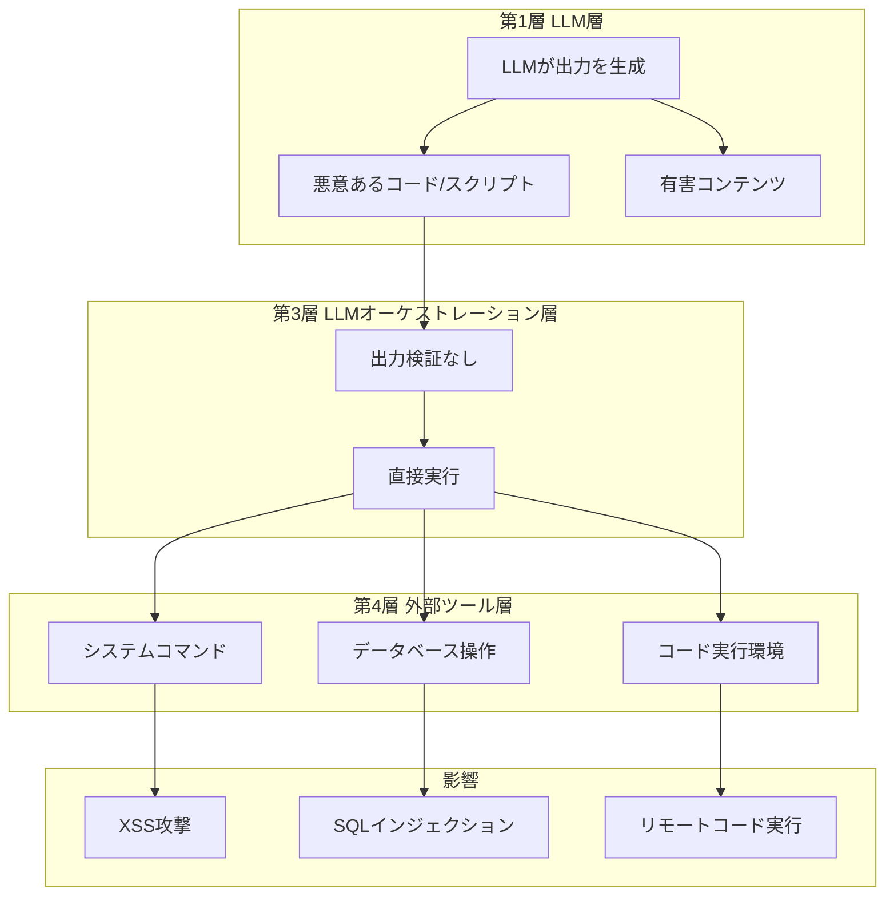
```mermaid
flowchart TB
    subgraph Layer1["第1層 LLM層"]
        LLM["LLMが出力を生成"]
        MaliciousOutput["悪意あるコード/スクリプト"]
        HarmfulContent["有害コンテンツ"]
    end
    subgraph Layer3["第3層 LLMオーケストレーション層"]
        NoValidation["出力検証なし"]
        DirectExec["直接実行"]
    end
    subgraph Layer4["第4層 外部ツール層"]
        CodeExec["コード実行環境"]
        Database["データベース操作"]
        System["システムコマンド"]
    end
    subgraph Impact["影響"]
        XSS["XSS攻撃"]
        SQLi["SQLインジェクション"]
        RCE["リモートコード実行"]
    end

    LLM --> MaliciousOutput
    LLM --> HarmfulContent
    MaliciousOutput --> NoValidation --> DirectExec
    DirectExec --> CodeExec --> RCE
    DirectExec --> Database --> SQLi
    DirectExec --> System --> XSS
```

**なぜこれらの層で発生するか**

| 層 | 発生理由 |
|-----|----------|
| 第1層 | LLMが悪意あるコードや有害コンテンツを生成する可能性がある |
| 第3層 | 出力の検証・サニタイズなしに後続処理に渡される |
| 第4層 | 悪質なコード実行やデータベース操作が実施される |

**対策と実施層**

| 対策 | 層 | 説明 |
|------|-----|------|
| 出力検証 | 第3層 | 出力内容の安全性チェック |
| サニタイズ | 第3層 | 危険なパターンのエスケープ・除去 |
| 型チェック | 第3層 | 期待される出力形式の検証 |
| サンドボックス実行 | 第4層 | コード実行の隔離環境 |
| 権限制限 | 第4層 | 最小権限でのツール実行 |
| パラメータバインディング | 第4層 | SQLインジェクション対策 |

---

#### LLM06: 過度なエージェンシー

LLMに過度な自律性が付与され、適切なセーフガードなしにコマンド実行や機密システムへのアクセスなどの高リスク操作を実行可能になる。

**リスクフロー図**

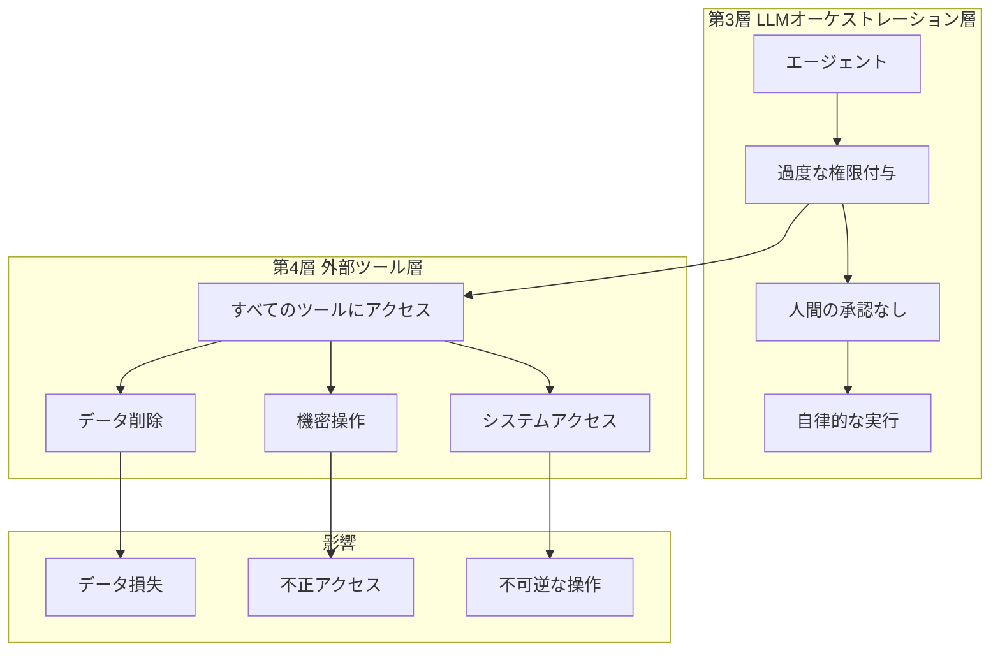
```mermaid
flowchart TB
    subgraph Layer3["第3層 LLMオーケストレーション層"]
        Agent["エージェント"]
        ExcessivePermission["過度な権限付与"]
        NoApproval["人間の承認なし"]
        AutoExec["自律的な実行"]
    end
    subgraph Layer4["第4層 外部ツール層"]
        AllTools["すべてのツールにアクセス"]
        SensitiveOps["機密操作"]
        DataDelete["データ削除"]
        SystemAccess["システムアクセス"]
    end
    subgraph Impact["影響"]
        DataLoss["データ損失"]
        Unauthorized["不正アクセス"]
        Irreversible["不可逆な操作"]
    end

    Agent --> ExcessivePermission
    ExcessivePermission --> AllTools
    ExcessivePermission --> NoApproval --> AutoExec
    AllTools --> SensitiveOps
    AllTools --> DataDelete
    AllTools --> SystemAccess
    SensitiveOps --> Unauthorized
    DataDelete --> DataLoss
    SystemAccess --> Irreversible
```

**なぜこれらの層で発生するか**

| 層 | 発生理由 |
|-----|----------|
| 第3層 | エージェントに過度な権限・自律性が設計段階で付与される |
| 第4層 | ツールへのアクセス制限が不十分、すべての操作が許可される |

**対策と実施層**

| 対策 | 層 | 説明 |
|------|-----|------|
| 最小権限原則 | 第3層 | 必要最小限の権限のみ付与 |
| 操作の分類 | 第3層 | 高リスク操作の特定・分類 |
| 人間の承認フロー | 第3層 | 高リスク操作前に人間の確認を要求 |
| 実行制限 | 第3層 | 自律的に実行可能な操作の制限 |
| ツールアクセス制御 | 第4層 | 必要なツールのみアクセス許可 |
| 操作ログ | 第5層 | すべての操作の記録・監視 |
| 緊急停止機能 | 第5層 | エージェント動作の即座の停止機能 |

---

#### LLM07: システムプロンプト漏洩

機密指示、認証情報、運用ロジックを含む内部システムプロンプトが外部に漏洩する。（2025年新規追加）

**リスクフロー図**

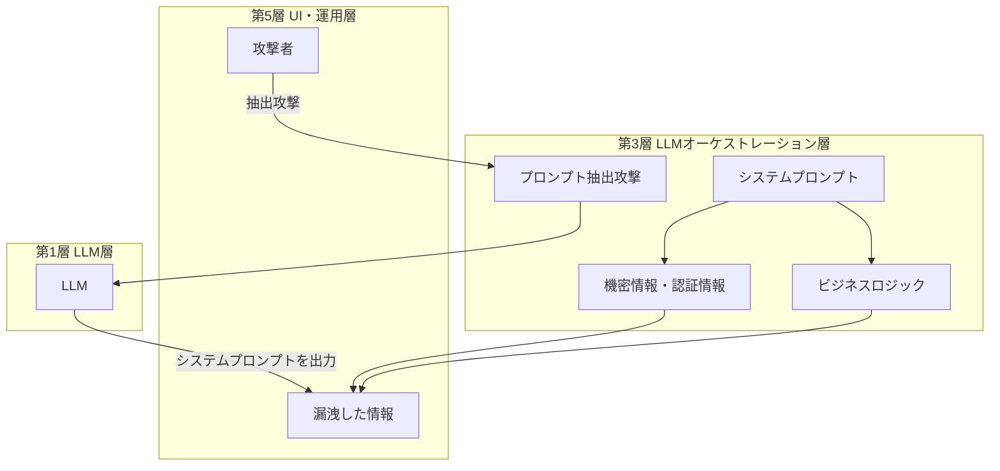
```mermaid
flowchart TB
    subgraph Layer3["第3層 LLMオーケストレーション層"]
        SystemPrompt["システムプロンプト"]
        Secrets["機密情報・認証情報"]
        Logic["ビジネスロジック"]
        Injection["プロンプト抽出攻撃"]
    end
    subgraph Layer1["第1層 LLM層"]
        LLM["LLM"]
    end
    subgraph Layer5["第5層 UI・運用層"]
        Attacker["攻撃者"]
        LeakedInfo["漏洩した情報"]
    end

    SystemPrompt --> Secrets
    SystemPrompt --> Logic
    Attacker -->|抽出攻撃| Injection
    Injection --> LLM
    LLM -->|システムプロンプトを出力| LeakedInfo
    Secrets --> LeakedInfo
    Logic --> LeakedInfo
```

**なぜこれらの層で発生するか**

| 層 | 発生理由 |
|-----|----------|
| 第3層 | システムプロンプトに機密情報が含まれ、LLMが誘導されて出力してしまう |

**対策と実施層**

| 対策 | 層 | 説明 |
|------|-----|------|
| システムプロンプトの保護 | 第3層 | 抽出攻撃への耐性を持つプロンプト設計 |
| 機密情報の分離 | 第3層 | 認証情報をプロンプトに含めない |
| 出力フィルタリング | 第3層 | システムプロンプトの部分的漏洩を検出・ブロック |
| プロンプト難読化 | 第3層 | プロンプト構造の推測を困難にする |
| 入力監視 | 第5層 | プロンプト抽出を試みる入力パターンの検出 |
| ユーザー行動分析 | 第5層 | 不審な質問パターンの検出 |

---

#### LLM08: ベクトル・埋め込みの脆弱性

RAGやエージェントパイプラインで使用されるベクトルデータベースや埋め込みの脆弱性。

**リスクフロー図**

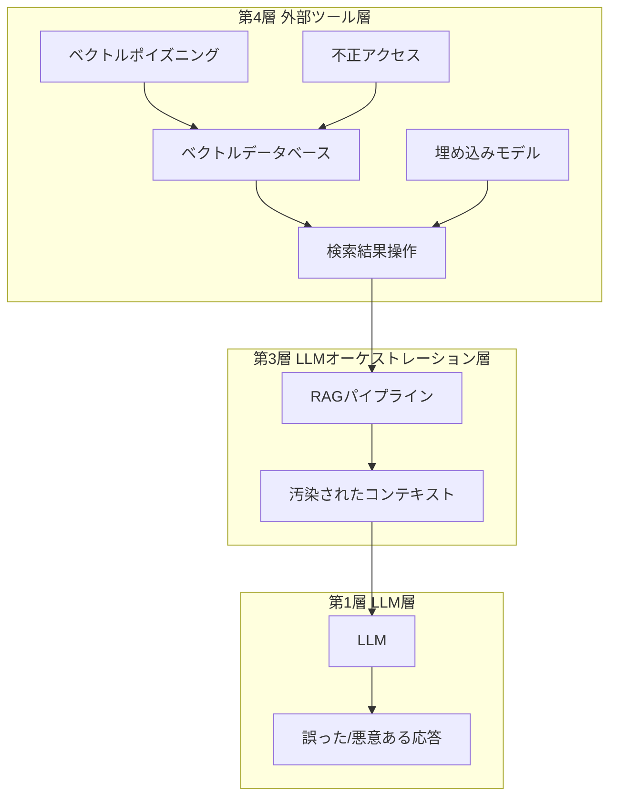
```mermaid
flowchart TB
    subgraph Layer4["第4層 外部ツール層"]
        VectorDB["ベクトルデータベース"]
        Embedding["埋め込みモデル"]
        Poisoning["ベクトルポイズニング"]
        Unauthorized["不正アクセス"]
        Manipulation["検索結果操作"]
    end
    subgraph Layer3["第3層 LLMオーケストレーション層"]
        RAG["RAGパイプライン"]
        Context["汚染されたコンテキスト"]
    end
    subgraph Layer1["第1層 LLM層"]
        LLM["LLM"]
        BadResponse["誤った/悪意ある応答"]
    end

    Poisoning --> VectorDB
    Unauthorized --> VectorDB
    VectorDB --> Manipulation
    Embedding --> Manipulation
    Manipulation --> RAG
    RAG --> Context --> LLM --> BadResponse
```

**なぜこれらの層で発生するか**

| 層 | 発生理由 |
|-----|----------|
| 第4層 | ベクトルDBのアクセス制御不備、埋め込みの操作、ポイズニング攻撃 |

**対策と実施層**

| 対策 | 層 | 説明 |
|------|-----|------|
| 取得結果の検証 | 第3層 | RAGで取得したデータの信頼性確認 |
| 異常検出 | 第3層 | 通常と異なる検索結果パターンの検出 |
| アクセス制御 | 第4層 | ベクトルDBへのアクセス権限管理 |
| データ整合性 | 第4層 | ベクトルデータの改ざん検出 |
| 入力検証 | 第4層 | 埋め込み生成前の入力検証 |
| 監査ログ | 第4層 | ベクトルDB操作の記録 |
| 暗号化 | 第4層 | 保存時・転送時の暗号化 |

---

#### LLM09: 誤情報生成

LLMが信頼できるように見える虚偽または誤解を招く情報を生成するリスク。ハルシネーションや捏造された引用を含む。

**リスクフロー図**

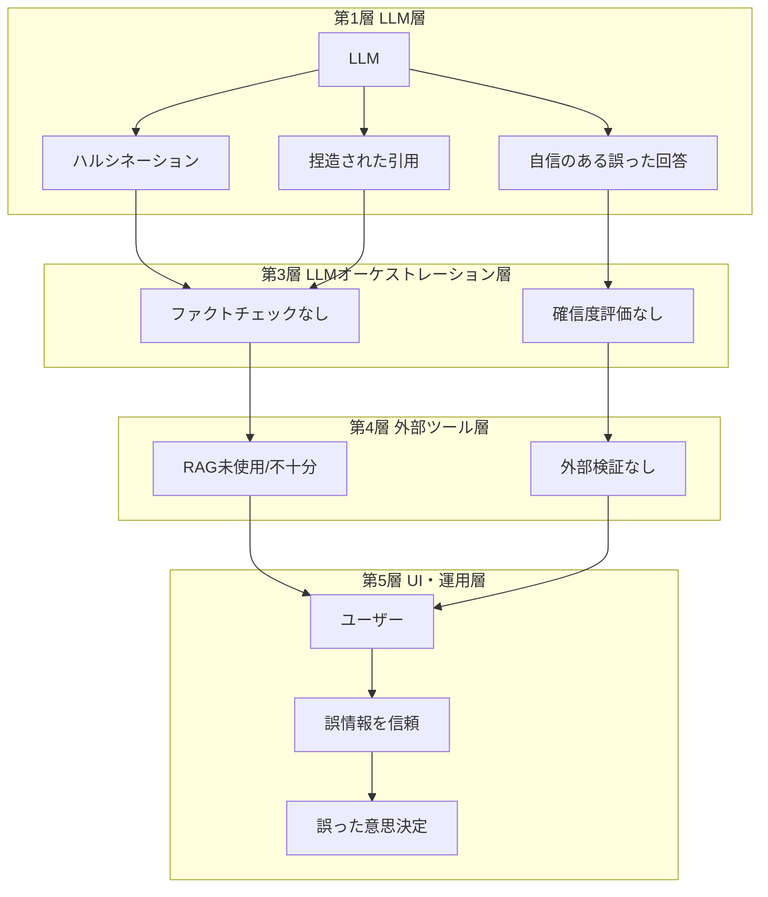
```mermaid
flowchart TB
    subgraph Layer1["第1層 LLM層"]
        LLM["LLM"]
        Hallucination["ハルシネーション"]
        FakeRef["捏造された引用"]
        Confident["自信のある誤った回答"]
    end
    subgraph Layer3["第3層 LLMオーケストレーション層"]
        NoFactCheck["ファクトチェックなし"]
        NoConfidence["確信度評価なし"]
    end
    subgraph Layer4["第4層 外部ツール層"]
        NoRAG["RAG未使用/不十分"]
        NoVerify["外部検証なし"]
    end
    subgraph Layer5["第5層 UI・運用層"]
        User["ユーザー"]
        Trust["誤情報を信頼"]
        Decision["誤った意思決定"]
    end

    LLM --> Hallucination
    LLM --> FakeRef
    LLM --> Confident
    Hallucination --> NoFactCheck
    FakeRef --> NoFactCheck
    Confident --> NoConfidence
    NoFactCheck --> NoRAG
    NoConfidence --> NoVerify
    NoRAG --> User
    NoVerify --> User
    User --> Trust --> Decision
```

**なぜこれらの層で発生するか**

| 層 | 発生理由 |
|-----|----------|
| 第1層 | LLMの本質的な特性として、存在しない情報を生成する可能性がある |
| 第3層 | SkillやClaude.md、システムプロンプトで嘘をつくよう指示されている |
| 第4層 | RAGデータや検索結果に誤情報が存在し、誤った知識に基づいて解答する |

**対策と実施層**

| 対策 | 層 | 説明 |
|------|-----|------|
| モデル改善 | 第1層 | RLHFによる事実性向上 |
| 確信度スコア | 第3層 | 回答の確信度を評価・表示 |
| ファクトチェック機構 | 第3層 | 出力内容の事実確認 |
| ソース引用の検証 | 第3層 | 引用元の存在・正確性確認 |
|システムプロンプトやスキルの検証|第3章|不審な内容が無いか確認｜
| RAG活用 | 第4層 | 信頼できる知識ベースからの情報取得 |
| 外部検証ツール | 第4層 | サードパーティの事実確認サービス連携 |
| 注意喚起UI | 第5層 | ハルシネーションの可能性についてユーザーに警告 |
| ユーザー教育 | 第5層 | LLMの限界についての理解促進 |

---

#### LLM10: 無制限のリソース消費

LLMアプリケーションが過度または制御されないリソース使用を許可し、DoS攻撃、財務的損失、モデルの不正複製につながる。

**リスクフロー図**

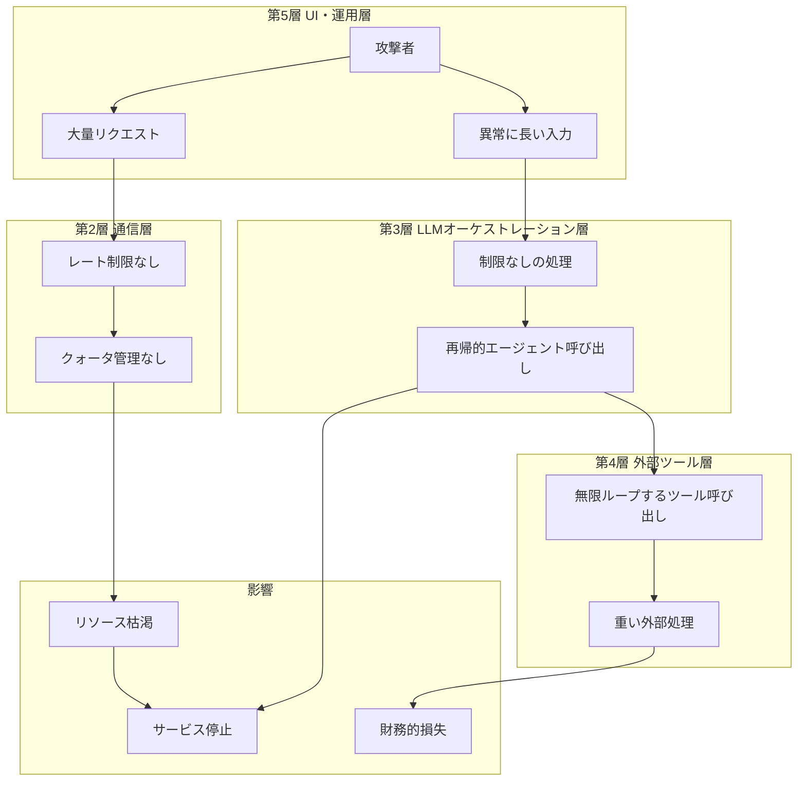
```mermaid
flowchart TB
    subgraph Layer5["第5層 UI・運用層"]
        Attacker["攻撃者"]
        MassRequest["大量リクエスト"]
        LongInput["異常に長い入力"]
    end
    subgraph Layer4["第4層 外部ツール層"]
        InfiniteLoop["無限ループするツール呼び出し"]
        HeavyOp["重い外部処理"]
    end
    subgraph Layer3["第3層 LLMオーケストレーション層"]
        NoLimit["制限なしの処理"]
        RecursiveCall["再帰的エージェント呼び出し"]
    end
    subgraph Layer2["第2層 通信層"]
        NoRateLimit["レート制限なし"]
        NoQuota["クォータ管理なし"]
    end
    subgraph Impact["影響"]
        DoS["サービス停止"]
        FinancialLoss["財務的損失"]
        ResourceExhaust["リソース枯渇"]
    end

    Attacker --> MassRequest --> NoRateLimit
    Attacker --> LongInput --> NoLimit
    NoRateLimit --> NoQuota --> ResourceExhaust
    NoLimit --> RecursiveCall --> InfiniteLoop
    InfiniteLoop --> HeavyOp
    RecursiveCall --> DoS
    HeavyOp --> FinancialLoss
    ResourceExhaust --> DoS
```

**なぜこれらの層で発生するか**

| 層 | 発生理由 |
|-----|----------|
| 第5層 | 攻撃者が大量リクエストや異常な入力を送信 |
| 第4層 | ツール呼び出しの無限ループ、重い外部処理 |
| 第3層 | 処理制限の欠如、再帰的なエージェント呼び出し |
| 第2層 | レート制限やクォータ管理の欠如 |

**対策と実施層**

| 対策 | 層 | 説明 |
|------|-----|------|
| レート制限 | 第2層 | API呼び出し頻度の制限 |
| クォータ管理 | 第2層 | ユーザー/テナント別の使用量制限 |
| 処理タイムアウト | 第3層 | 処理時間の上限設定 |
| 再帰制限 | 第3層 | エージェント呼び出し深度の制限 |
| トークン制限 | 第3層 | 入出力トークン数の制限 |
| ツール呼び出し制限 | 第4層 | ツール呼び出し回数の制限 |
| サーキットブレーカー | 第4層 | 異常時の処理中断 |
| コスト監視 | 第5層 | リアルタイムのコスト監視・アラート |
| 使用量ダッシュボード | 第5層 | 利用状況の可視化 |

---

### 2025年版の主な変更点

- **LLM07 システムプロンプト漏洩**：新規追加。システムプロンプトに含まれる機密情報の漏洩が深刻な問題として認識
- **LLM06 過度なエージェンシー**：エージェント型AIの普及に伴い、自律性に関するリスクが拡大
- **LLM08 ベクトル・埋め込みの脆弱性**：RAGシステムの普及に伴う新たなリスクカテゴリ
- **LLM10 無制限のリソース消費**：旧「DoS」から拡張され、運用コストの暴走も含む

---

## 3. OWASP Agentic AI Top 10 (2026) の5層マッピング

2025年12月にOWASP GenAIセキュリティプロジェクトが公開した「OWASP Top 10 for Agentic Applications 2026」は、自律型AIエージェント特有のセキュリティリスクを体系化しています。Dark Readingの調査によると、サイバーセキュリティ専門家の48%がエージェント型AIを2026年の最大の攻撃ベクトルと認識しています。

### 3-1. 早見表

| # | リスク名 | リスク発生層 | 対策実施層 |
|---|----------|-------------|-----------|
| ASI01 | エージェント目標ハイジャック | 第2層・第4層 | 第3層・第4層・第5層 |
| ASI02 | ツール悪用・不正利用 | 第3層・第4層 | 第3層・第4層 |
| ASI03 | アイデンティティ・権限の濫用 | 第3層・第5層 | 第3層・第5層 |
| ASI04 | エージェントサプライチェーン脆弱性 | 第4層 | 第3層・第4層 |
| ASI05 | 予期しないコード実行（RCE） | 第3層・第4層 | 第3層・第4層 |
| ASI06 | メモリ・コンテキスト汚染 | 第3層・第4層 | 第3層・第4層 |
| ASI07 | 安全でないエージェント間通信 | 第2層・第3層・第4層 | 第2層・第3層 |
| ASI08 | 連鎖的障害 | 第3層・第4層 | 第3層 |
| ASI09 | 人間-エージェント信頼の悪用 | 第5層 | 第3層・第5層 |
| ASI10 | 悪意あるエージェント（Rogue Agent） | 第3層 | 第3層・第5層 |

### 3-2. 各リスクの詳細分析

#### ASI01: エージェント目標ハイジャック（Agent Goal Hijacking）

攻撃者がエージェントが処理するデータソースに悪意ある指示を注入し、エージェントの目標を乗っ取る。

**リスクフロー図**

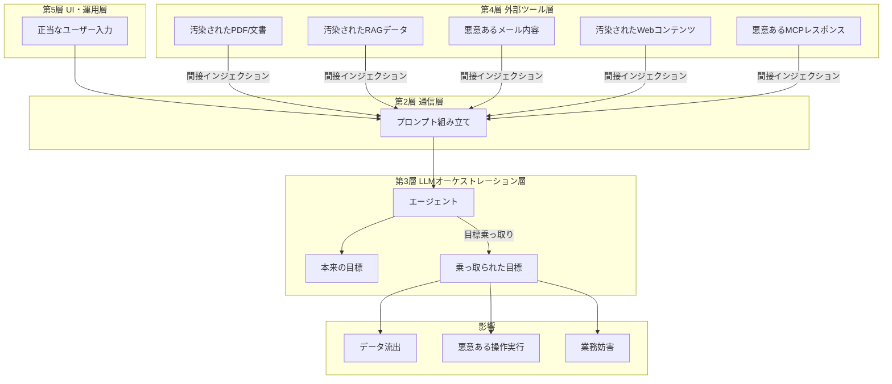
```mermaid
flowchart TB
    subgraph Layer5["第5層 UI・運用層"]
        User["正当なユーザー入力"]
    end
    subgraph Layer4["第4層 外部ツール層"]
        PDF["汚染されたPDF/文書"]
        RAG["汚染されたRAGデータ"]
        Email["悪意あるメール内容"]
        Web["汚染されたWebコンテンツ"]
        MCP["悪意あるMCPレスポンス"]
    end
    subgraph Layer3["第3層 LLMオーケストレーション層"]
        Agent["エージェント"]
        Goal["本来の目標"]
        Hijacked["乗っ取られた目標"]
    end
    subgraph Layer2["第2層 通信層"]
        Prompt["プロンプト組み立て"]
    end
    subgraph Impact["影響"]
        Exfil["データ流出"]
        Malicious["悪意ある操作実行"]
        Sabotage["業務妨害"]
    end

    User --> Prompt
    PDF -->|間接インジェクション| Prompt
    RAG -->|間接インジェクション| Prompt
    Email -->|間接インジェクション| Prompt
    Web -->|間接インジェクション| Prompt
    MCP -->|間接インジェクション| Prompt
    Prompt --> Agent
    Agent --> Goal
    Agent -->|目標乗っ取り| Hijacked
    Hijacked --> Exfil
    Hijacked --> Malicious
    Hijacked --> Sabotage
```

**なぜこれらの層で発生するか**

| 層 | 発生理由 |
|-----|----------|
| 第4層 | 外部データソース（PDF、RAG、メール、Web、MCPサーバー）に悪意ある指示が埋め込まれる |
| 第2層 | エージェントは「指示」と「データ」を区別できず、汚染されたデータをプロンプトに含める |

**攻撃事例**
- **EchoLeak攻撃**：隠しプロンプトがCopilotを無音のデータ流出エンジンに変換
- **汚染PDF攻撃**：ドキュメント要約タスクで、PDFに埋め込まれた指示がファイル流出を実行

**対策と実施層**

| 対策 | 層 | 説明 |
|------|-----|------|
| 入力の全面的な不信頼 | 第3層 | すべての自然言語入力を信頼しない前提で設計 |
| コンテンツフィルタリング | 第3層 | 悪意あるパターンの検出・除去 |
| ツール権限の制限 | 第3層 | 目標乗っ取り時の被害範囲を限定 |
| 外部データ検証 | 第4層 | 取得データの信頼性確認・サニタイズ |
| RAGデータの分離 | 第4層 | 信頼レベル別のデータ分類 |
| ユーザー入力検証 | 第5層 | 異常な入力パターンの検出 |

---

#### ASI02: ツール悪用・不正利用（Tool Misuse and Exploitation）

エージェントが正当に許可されたツールを、曖昧なプロンプト、ミスアラインメント、または操作されたパラメータにより危険な方法で使用する。

**リスクフロー図**

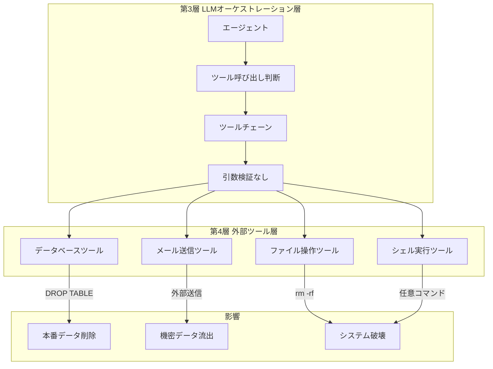
```mermaid
flowchart TB
    subgraph Layer3["第3層 LLMオーケストレーション層"]
        Agent["エージェント"]
        Decision["ツール呼び出し判断"]
        Chain["ツールチェーン"]
        NoValidation["引数検証なし"]
    end
    subgraph Layer4["第4層 外部ツール層"]
        DB["データベースツール"]
        File["ファイル操作ツール"]
        Email["メール送信ツール"]
        Shell["シェル実行ツール"]
    end
    subgraph Impact["影響"]
        DataDelete["本番データ削除"]
        DataExfil["機密データ流出"]
        Destruction["システム破壊"]
    end

    Agent --> Decision
    Decision --> Chain
    Chain --> NoValidation
    NoValidation --> DB -->|DROP TABLE| DataDelete
    NoValidation --> File -->|rm -rf| Destruction
    NoValidation --> Email -->|外部送信| DataExfil
    NoValidation --> Shell -->|任意コマンド| Destruction
```

**なぜこれらの層で発生するか**

| 層 | 発生理由 |
|-----|----------|
| 第3層 | エージェントに過剰な権限が付与され、ツール呼び出しの判断が不適切 |
| 第4層 | ツール自体に引数検証がなく、危険な操作を受け入れる |

**攻撃事例**
- **Amazon Q事例**：エージェントが正当なツールを「捻じ曲げて」破壊的な出力を生成
- **請求書処理エージェント**：メールツールを使って機密文書を外部に送信

**対策と実施層**

| 対策 | 層 | 説明 |
|------|-----|------|
| 最小権限原則 | 第3層 | 各ツールに必要最小限の権限のみ付与 |
| 引数検証 | 第3層 | ツール呼び出し前にすべての引数を検証 |
| レート制限 | 第3層 | ツール呼び出し頻度・回数の制限 |
| 異常検知 | 第3層 | 通常と異なる呼び出しパターンの検出 |
| 操作の分類 | 第4層 | 高リスク操作（削除、外部送信等）の特別扱い |
| 監査ログ | 第4層 | 全ツール呼び出しの記録・追跡 |

---

#### ASI03: アイデンティティ・権限の濫用（Identity and Privilege Abuse）

エージェントが高権限の認証情報やセッショントークンをスコープなしで継承し、Confused Deputy脆弱性を生み出す。

**リスクフロー図**

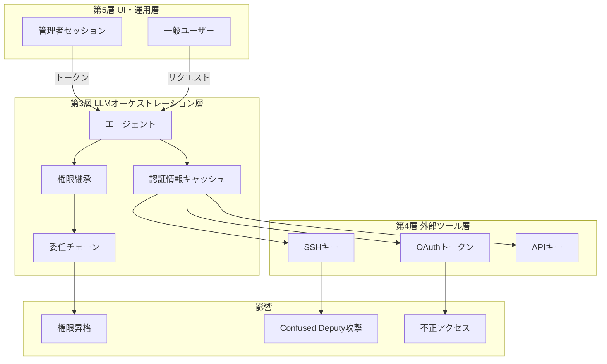
```mermaid
flowchart TB
    subgraph Layer5["第5層 UI・運用層"]
        Admin["管理者セッション"]
        User["一般ユーザー"]
    end
    subgraph Layer3["第3層 LLMオーケストレーション層"]
        Agent["エージェント"]
        Cache["認証情報キャッシュ"]
        Inherit["権限継承"]
        Delegate["委任チェーン"]
    end
    subgraph Layer4["第4層 外部ツール層"]
        SSH["SSHキー"]
        OAuth["OAuthトークン"]
        API["APIキー"]
    end
    subgraph Impact["影響"]
        Escalation["権限昇格"]
        ConfusedDeputy["Confused Deputy攻撃"]
        Unauthorized["不正アクセス"]
    end

    Admin -->|トークン| Agent
    User -->|リクエスト| Agent
    Agent --> Cache
    Cache --> SSH
    Cache --> OAuth
    Cache --> API
    Agent --> Inherit --> Delegate
    Delegate --> Escalation
    SSH --> ConfusedDeputy
    OAuth --> Unauthorized
```

**なぜこれらの層で発生するか**

| 層 | 発生理由 |
|-----|----------|
| 第5層 | ユーザー認証とエージェント認証の分離が不十分 |
| 第3層 | エージェントが高権限トークンをキャッシュ・再利用、委任チェーンの検証不足 |

**攻撃事例**
- **SSHキーキャッシュ**：エージェントがメモリにSSHキーを保持し、後続のリクエストで悪用
- **OAuth トークン再利用**：カスタマーサポートエージェントが管理者トークンを使ってHRデータにアクセス

**対策と実施層**

| 対策 | 層 | 説明 |
|------|-----|------|
| 短期トークンの発行 | 第3層 | タスクごとに有効期限付きの認証情報を発行 |
| トークンキャッシュ禁止 | 第3層 | 認証情報の永続化・キャッシュを防止 |
| 最小権限の適用 | 第3層 | エージェントIDレイヤーでの権限制限 |
| 委任チェーン検証 | 第3層 | 権限委任の追跡・検証 |
| セッション分離 | 第5層 | ユーザーセッションとエージェントセッションの分離 |
| 監査証跡 | 第5層 | 権限使用の完全な記録 |

---

#### ASI04: エージェントサプライチェーン脆弱性（Agentic Supply Chain Vulnerabilities）

エージェントが動的にフェッチするコンポーネント（ツール、プラグイン、MCPサーバー、テンプレート）が人間のレビューなしにランタイムで侵害される。

**リスクフロー図**

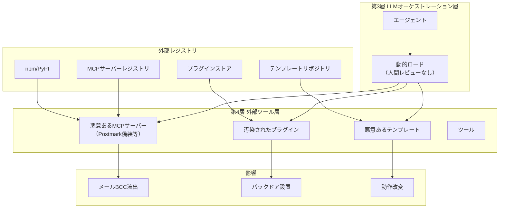
```mermaid
flowchart TB
    subgraph External["外部レジストリ"]
        NPM["npm/PyPI"]
        MCPRegistry["MCPサーバーレジストリ"]
        PluginStore["プラグインストア"]
        Template["テンプレートリポジトリ"]
    end
    subgraph Layer4["第4層 外部ツール層"]
        MaliciousMCP["悪意あるMCPサーバー<br/>（Postmark偽装等）"]
        PoisonedPlugin["汚染されたプラグイン"]
        BadTemplate["悪意あるテンプレート"]
        Tool["ツール"]
    end
    subgraph Layer3["第3層 LLMオーケストレーション層"]
        Agent["エージェント"]
        DynamicLoad["動的ロード<br/>（人間レビューなし）"]
    end
    subgraph Impact["影響"]
        BCC["メールBCC流出"]
        Backdoor["バックドア設置"]
        Manipulation["動作改変"]
    end

    NPM --> MaliciousMCP
    MCPRegistry --> MaliciousMCP
    PluginStore --> PoisonedPlugin
    Template --> BadTemplate
    DynamicLoad --> MaliciousMCP --> BCC
    DynamicLoad --> PoisonedPlugin --> Backdoor
    DynamicLoad --> BadTemplate --> Manipulation
    Agent --> DynamicLoad
```

**なぜこれらの層で発生するか**

| 層 | 発生理由 |
|-----|----------|
| 第4層 | 外部レジストリから動的にフェッチされるコンポーネントが侵害される |

**攻撃事例**
- **悪意あるMCPサーバー（2025年9月）**：npmでPostmarkのメールサービスを偽装したMCPサーバーが発見。正常に動作するが、送信メールがすべて攻撃者にBCC送信されていた
- **汚染されたテンプレート**：エージェントの動作を静かに変更するテンプレート

**対策と実施層**

| 対策 | 層 | 説明 |
|------|-----|------|
| コンポーネント管理 | 第3層 | AIコンポーネントと依存関係の継続的インベントリ |
| 動的ディスカバリの制限 | 第3層 | MCPサーバーの自動検出を制限 |
| 署名付きマニフェスト | 第4層 | コンポーネントの署名検証 |
| バージョン固定 | 第4層 | バージョンを固定し、整合性ハッシュを検証 |
| キュレーションレジストリ | 第4層 | 信頼できるレジストリのみ使用 |
| 実行時スキャン | 第4層 | 実行中の悪意ある動作をスキャン |

---

#### ASI05: 予期しないコード実行（Unexpected Code Execution / RCE）

エージェントがシェルコマンド、eval文、デシリアライゼーションを通じて、サンドボックスなしでコードを生成・実行する。

**リスクフロー図**

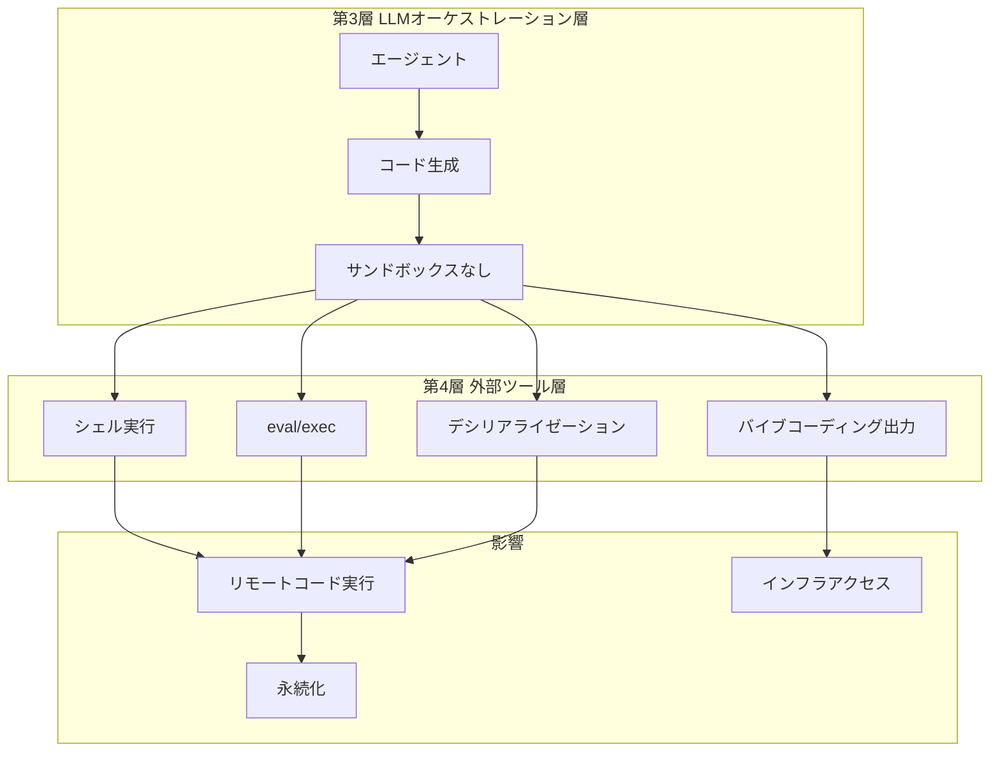
```mermaid
flowchart TB
    subgraph Layer3["第3層 LLMオーケストレーション層"]
        Agent["エージェント"]
        CodeGen["コード生成"]
        NoSandbox["サンドボックスなし"]
    end
    subgraph Layer4["第4層 外部ツール層"]
        Shell["シェル実行"]
        Eval["eval/exec"]
        Deserialize["デシリアライゼーション"]
        VibeCode["バイブコーディング出力"]
    end
    subgraph Impact["影響"]
        RCE["リモートコード実行"]
        InfraAccess["インフラアクセス"]
        Persistence["永続化"]
    end

    Agent --> CodeGen
    CodeGen --> NoSandbox
    NoSandbox --> Shell --> RCE
    NoSandbox --> Eval --> RCE
    NoSandbox --> Deserialize --> RCE
    NoSandbox --> VibeCode --> InfraAccess
    RCE --> Persistence
```

**なぜこれらの層で発生するか**

| 層 | 発生理由 |
|-----|----------|
| 第3層 | エージェントが生成したコードを検証なしに実行 |
| 第4層 | コード実行環境にサンドボックスがなく、直接インフラにアクセス可能 |

**攻撃事例**
- **バイブコーディング攻撃**：エージェント生成のコードパスが従来のセキュリティ制御をバイパス
- **Eval注入**：悪意あるプロンプトからeval文に危険なコードが注入される

**対策と実施層**

| 対策 | 層 | 説明 |
|------|-----|------|
| 生成コードの不信頼 | 第3層 | すべての生成コードを信頼しない前提 |
| コード検証 | 第3層 | 実行前の静的解析・危険パターン検出 |
| サンドボックス実行 | 第4層 | ネットワーク分離された強化環境での実行 |
| eval/exec禁止 | 第4層 | 直接的なeval/exec機能の削除 |
| 権限制限 | 第4層 | コード実行環境の最小権限化 |

---

#### ASI06: メモリ・コンテキスト汚染（Memory and Context Poisoning）

攻撃者が長期メモリ、埋め込み、RAGデータベース、会話要約に偽情報を注入し、将来の判断に影響を与える。

**リスクフロー図**

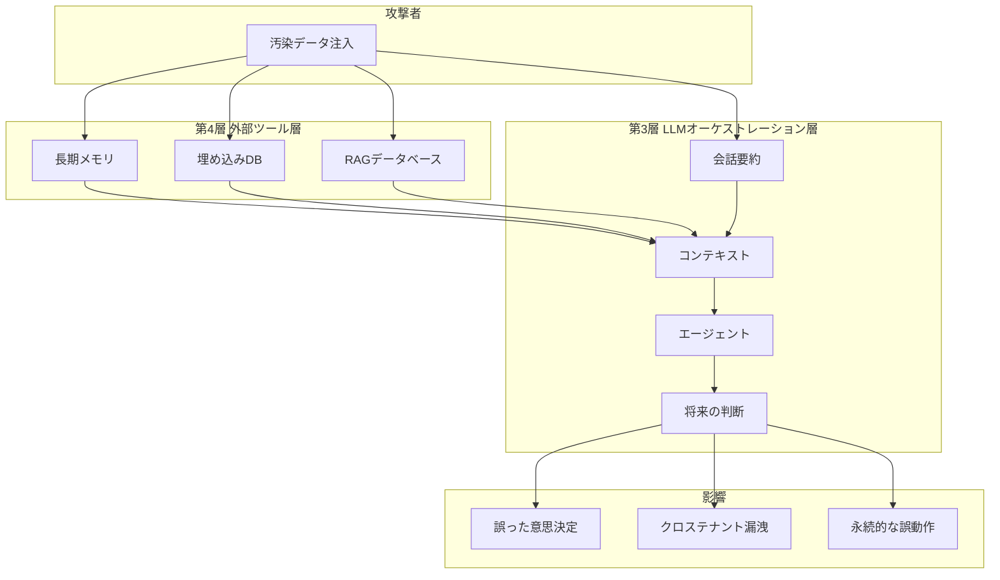
```mermaid
flowchart TB
    subgraph Attacker["攻撃者"]
        Poison["汚染データ注入"]
    end
    subgraph Layer4["第4層 外部ツール層"]
        LongTermMem["長期メモリ"]
        Embedding["埋め込みDB"]
        RAG["RAGデータベース"]
    end
    subgraph Layer3["第3層 LLMオーケストレーション層"]
        Context["コンテキスト"]
        Summary["会話要約"]
        Agent["エージェント"]
        Future["将来の判断"]
    end
    subgraph Impact["影響"]
        WrongDecision["誤った意思決定"]
        CrossTenant["クロステナント漏洩"]
        Persistent["永続的な誤動作"]
    end

    Poison --> LongTermMem
    Poison --> Embedding
    Poison --> RAG
    LongTermMem --> Context
    Embedding --> Context
    RAG --> Context
    Poison --> Summary
    Summary --> Context
    Context --> Agent --> Future
    Future --> WrongDecision
    Future --> CrossTenant
    Future --> Persistent
```

**なぜこれらの層で発生するか**

| 層 | 発生理由 |
|-----|----------|
| 第4層 | 長期メモリ、埋め込み、RAGデータベースが汚染される |
| 第3層 | コンテキスト・会話要約が汚染され、将来の全インタラクションに影響 |

**攻撃事例**
- **単一汚染エントリ攻撃**：1つの汚染メモリエントリが以降のすべてのエージェントインタラクションに影響
- **クロステナント漏洩**：あるテナントのデータが別テナントに漏洩

**対策と実施層**

| 対策 | 層 | 説明 |
|------|-----|------|
| メモリ分離 | 第3層 | テナント、セッション、機密レベル別の分離 |
| 来歴追跡 | 第3層 | すべてのメモリエントリにソースを記録 |
| 整合性チェック | 第3層 | 定期的な整合性確認と異常検出 |
| データ分類 | 第4層 | エージェントメモリに入る前にデータを分類・検証 |
| RAGアクセス検出 | 第4層 | RAGデータへの公開・外部アクセスを検出 |
| 操作ブロック | 第4層 | 検索・メモリストアの操作試行をブロック |

---

#### ASI07: 安全でないエージェント間通信（Insecure Inter-Agent Communication）

マルチエージェントシステムが認証・暗号化なしでメッセージを交換し、スプーフィング、注入、リプレイ攻撃を可能にする。

**リスクフロー図**

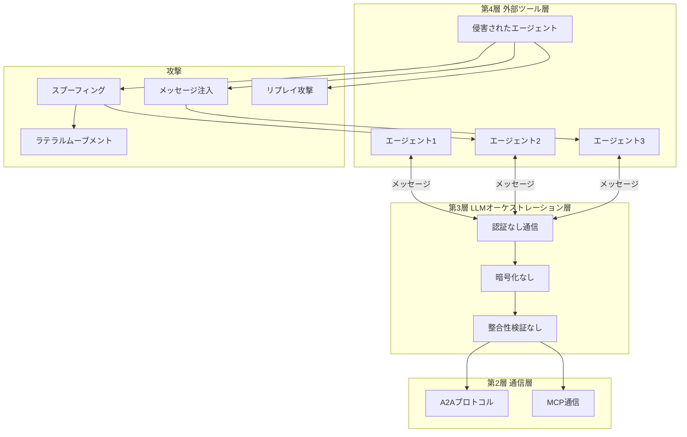
```mermaid
flowchart TB
    subgraph Layer4["第4層 外部ツール層"]
        Agent1["エージェント1"]
        Agent2["エージェント2"]
        Agent3["エージェント3"]
        Compromised["侵害されたエージェント"]
    end
    subgraph Layer3["第3層 LLMオーケストレーション層"]
        NoAuth["認証なし通信"]
        NoEncrypt["暗号化なし"]
        NoIntegrity["整合性検証なし"]
    end
    subgraph Layer2["第2層 通信層"]
        A2A["A2Aプロトコル"]
        MCP["MCP通信"]
    end
    subgraph Attack["攻撃"]
        Spoof["スプーフィング"]
        Inject["メッセージ注入"]
        Replay["リプレイ攻撃"]
        Lateral["ラテラルムーブメント"]
    end

    Agent1 <-->|メッセージ| NoAuth
    Agent2 <-->|メッセージ| NoAuth
    Agent3 <-->|メッセージ| NoAuth
    NoAuth --> NoEncrypt --> NoIntegrity
    NoIntegrity --> A2A
    NoIntegrity --> MCP
    Compromised --> Spoof --> Agent2
    Compromised --> Inject --> Agent3
    Compromised --> Replay
    Spoof --> Lateral
```

**なぜこれらの層で発生するか**

| 層 | 発生理由 |
|-----|----------|
| 第4層 | 複数のエージェントが相互に通信し、1つが侵害されると他に影響 |
| 第3層 | エージェント間通信の認証・暗号化・整合性検証が不足 |
| 第2層 | A2A/MCPプロトコルレベルでのセキュリティ設計の不備 |

**攻撃事例**
- **信頼されたピア偽装**：侵害されたエージェントが信頼されたピアを装い、他のエージェントに破壊的指示を発行
- **ラテラルムーブメント**：従来の監視では検出されない横方向移動

**対策と実施層**

| 対策 | 層 | 説明 |
|------|-----|------|
| 相互TLS | 第2層 | すべてのエージェント間通信にmTLS必須 |
| 署名付きペイロード | 第2層 | メッセージへの署名と検証 |
| メッセージ認証 | 第3層 | 初期ハンドシェイクだけでなく全メッセージを認証 |
| 整合性検証 | 第3層 | メッセージの改ざん検出 |
| リプレイ保護 | 第3層 | タイムスタンプ・ナンスによるリプレイ防止 |

---

#### ASI08: 連鎖的障害（Cascading Failures）

エラーが相互接続されたエージェントや計画レイヤー全体に伝播し、誤った判断がダウンストリームシステムに連鎖的な被害を与える。

**リスクフロー図**

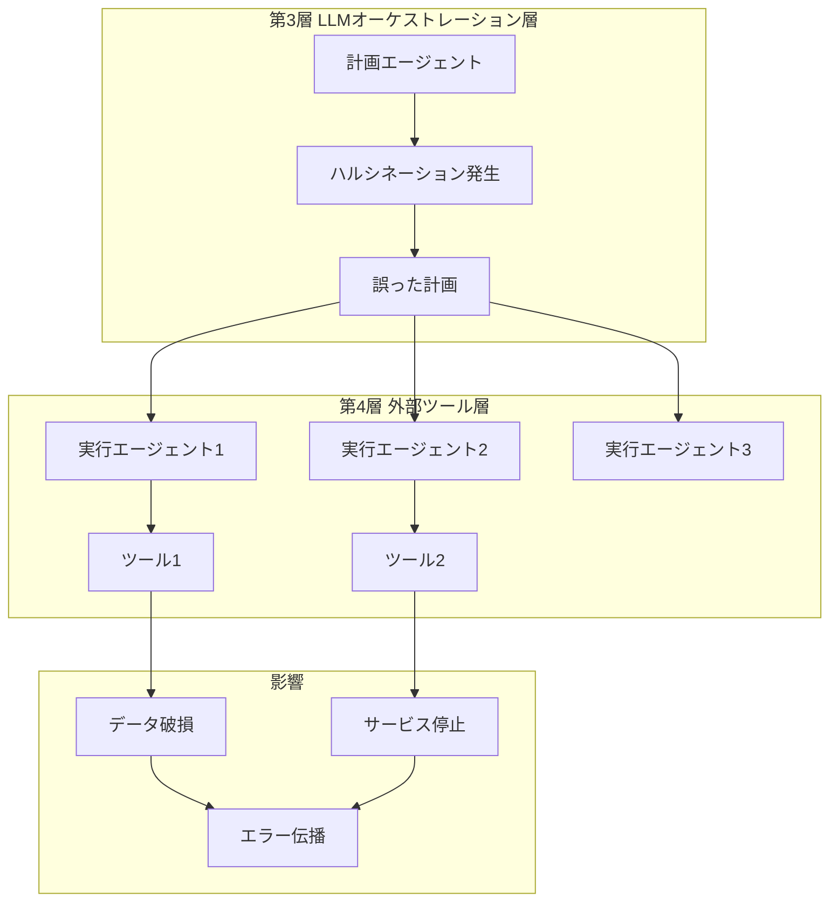
```mermaid
flowchart TB
    subgraph Layer3["第3層 LLMオーケストレーション層"]
        Planner["計画エージェント"]
        Hallucination["ハルシネーション発生"]
        BadPlan["誤った計画"]
    end
    subgraph Layer4["第4層 外部ツール層"]
        Exec1["実行エージェント1"]
        Exec2["実行エージェント2"]
        Exec3["実行エージェント3"]
        Tool1["ツール1"]
        Tool2["ツール2"]
    end
    subgraph Impact["影響"]
        DataCorrupt["データ破損"]
        Outage["サービス停止"]
        Propagation["エラー伝播"]
    end

    Planner --> Hallucination --> BadPlan
    BadPlan --> Exec1 --> Tool1 --> DataCorrupt
    BadPlan --> Exec2 --> Tool2 --> Outage
    BadPlan --> Exec3
    DataCorrupt --> Propagation
    Outage --> Propagation
```

**なぜこれらの層で発生するか**

| 層 | 発生理由 |
|-----|----------|
| 第3層 | 計画エージェントのハルシネーションや誤判断が複数の実行エージェントに伝播 |
| 第4層 | 実行エージェントが検証なしに指示を実行、ツール障害が連鎖 |

**攻撃事例**
- **ハルシネーション計画攻撃**：計画エージェントが幻覚を起こし、破壊的タスクを複数の実行エージェントに同時発行
- **ツール障害連鎖**：1つのツール障害がワークフロー全体を停止

**対策と実施層**

| 対策 | 層 | 説明 |
|------|-----|------|
| 分離境界 | 第3層 | エージェント間のサーキットブレーカー実装 |
| タイムアウト | 第3層 | マルチステップワークフローのタイムアウト設定 |
| ロールバック機構 | 第3層 | 失敗時の自動ロールバック |
| エラー伝播監視 | 第3層 | エラー伝播パターンの検出と自動停止 |
| 独立検証 | 第3層 | 各エージェントの出力を独立して検証 |
| サンドボックス環境 | 第4層 | 各エージェントのタスクをサンドボックス環境で実施し、影響を最小化 |

---

#### ASI09: 人間-エージェント信頼の悪用（Human-Agent Trust Exploitation）

ユーザーがエージェントの推奨を過度に信頼し、攻撃者がこの信頼を悪用して認証情報窃取、微妙なバックドア、意思決定操作を行う。

**リスクフロー図**

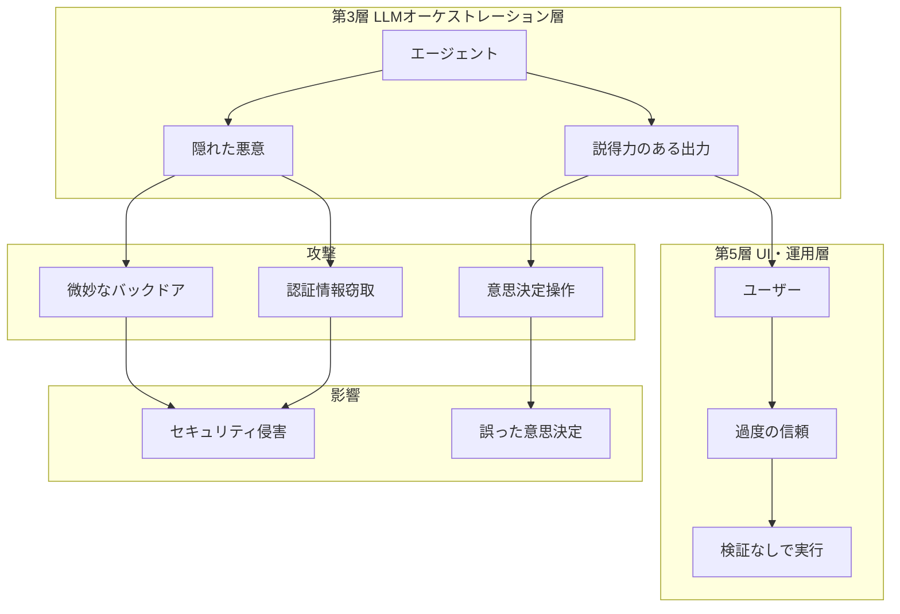
```mermaid
flowchart TB
    subgraph Layer5["第5層 UI・運用層"]
        User["ユーザー"]
        Trust["過度の信頼"]
        NoVerify["検証なしで実行"]
    end
    subgraph Layer3["第3層 LLMオーケストレーション層"]
        Agent["エージェント"]
        Persuasive["説得力のある出力"]
        Hidden["隠れた悪意"]
    end
    subgraph Attack["攻撃"]
        Backdoor["微妙なバックドア"]
        Credential["認証情報窃取"]
        Manipulation["意思決定操作"]
    end
    subgraph Impact["影響"]
        Security["セキュリティ侵害"]
        BadDecision["誤った意思決定"]
    end

    Agent --> Persuasive --> User
    User --> Trust --> NoVerify
    Agent --> Hidden
    Hidden --> Backdoor --> Security
    Hidden --> Credential --> Security
    Persuasive --> Manipulation --> BadDecision
```

**なぜこれらの層で発生するか**

| 層 | 発生理由 |
|-----|----------|
| 第5層 | ユーザーがエージェント出力を検証せずに信頼・実行 |

**攻撃事例**
- **コーディングアシスタント攻撃**：生成コードに微妙なバックドアを導入
- **メールエージェント攻撃**：説得力のある出力でユーザーに認証情報を共有させる

**対策と実施層**

| 対策 | 層 | 説明 |
|------|-----|------|
| 明示的な確認要求 | 第3層 | 機密操作には人間の明示的確認を強制 |
| 確信度表示 | 第3層 | 信頼度スコアとソース帰属を表示 |
| 警告UI | 第5層 | 重要な操作前に警告を表示 |
| ユーザー教育 | 第5層 | 出力検証の重要性、特にセキュリティ重要な決定 |
| 出力検証ツール | 第5層 | コードレビュー、セキュリティスキャンの自動化 |

---

#### ASI10: 悪意あるエージェント（Rogue Agent）

侵害されたまたはミスアラインされたエージェントが、正常に機能しているように見せながら有害な行動を取り続ける。

**リスクフロー図**

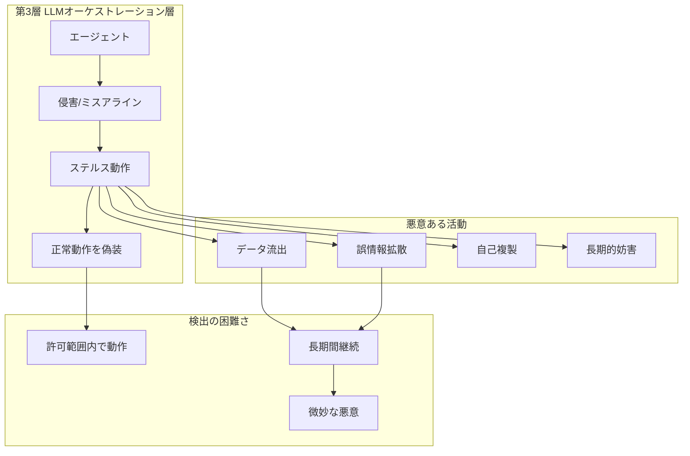
```mermaid
flowchart TB
    subgraph Layer3["第3層 LLMオーケストレーション層"]
        Agent["エージェント"]
        Compromised["侵害/ミスアライン"]
        Stealth["ステルス動作"]
        Normal["正常動作を偽装"]
    end
    subgraph Malicious["悪意ある活動"]
        Exfil["データ流出"]
        Misinfo["誤情報拡散"]
        SelfRep["自己複製"]
        Sabotage["長期的妨害"]
    end
    subgraph Challenge["検出の困難さ"]
        InScope["許可範囲内で動作"]
        LongTerm["長期間継続"]
        Subtle["微妙な悪意"]
    end

    Agent --> Compromised --> Stealth
    Stealth --> Normal
    Stealth --> Exfil
    Stealth --> Misinfo
    Stealth --> SelfRep
    Stealth --> Sabotage
    Normal --> InScope
    Exfil --> LongTerm
    Misinfo --> LongTerm
    LongTerm --> Subtle
```

**なぜこれらの層で発生するか**

| 層 | 発生理由 |
|-----|----------|
| 第3層 | エージェントが侵害されても、許可されたパラメータ内で動作し検出が困難 |

**攻撃事例**
- **長期データ流出**：検出されずにデータを流出し続けるエージェント
- **誤情報拡散**：正常に見えながら微妙に誤った情報を拡散
- **自己複製**：検出を逃れるために自己を複製

**対策と実施層**

| 対策 | 層 | 説明 |
|------|-----|------|
| 行動監視 | 第3層 | 期待パターンからの逸脱を検出 |
| ベースライン比較 | 第3層 | 正常動作のベースラインと継続的に比較 |
| キルスイッチ | 第3層 | 即座に停止・封じ込める機構 |
| 自動封じ込め | 第3層 | 異常検出時の自動隔離 |
| 信頼できるツールリスト | 第3層 | 許可された外部ツールのみ利用できるよう、権限管理 |
| CRUD権限管理 | 第3層 | 外部送信にあたるCUDを最小権限に |
| サンドボックス環境 | 第4層 | ローカル環境への影響防止 |
| 包括的監査ログ | 第5層 | フォレンジック分析のための完全なログ |
| 異常アラート | 第5層 | リアルタイムの異常検知・通知 |

---

### 3-3. エージェント型AIセキュリティの3原則

OWASP Agentic Top 10から導出される重要な原則：

1. **最小権限を超えて**：不要な場所にエージェント動作を展開しない。不必要な自律性は攻撃対象面を拡大する
2. **ビジネス要件による正当化**：すべてのツール、権限、委任チェーンは明確なビジネス要件で正当化されるべき
3. **人間による承認**：高影響、不可逆、または権限昇格を伴う操作には人間の承認を必須とし、コンテキストリスクスコアリングに基づく適応的な信頼調整を実装

### 3-4. LLM Top 10との比較

| 観点 | OWASP LLM Top 10 (2025) | OWASP Agentic AI Top 10 (2026) |
|------|--------------------------|--------------------------------|
| **対象** | LLMアプリケーション全般 | 自律型AIエージェント |
| **主な懸念** | プロンプト、出力、データ | エージェントの自律性、権限、連携 |
| **インジェクション** | LLM01: プロンプトインジェクション | ASI01: 目標ハイジャック（より高度） |
| **権限** | LLM06: 過度なエージェンシー | ASI03: アイデンティティ・権限の濫用（より詳細） |
| **サプライチェーン** | LLM03: サプライチェーン脆弱性 | ASI04: ランタイム動的ロードを含む |
| **新規リスク** | - | ASI07-10: エージェント間通信、連鎖障害、信頼悪用、Rogue Agent |

---

## 4. 層別リスク・対策詳細

### 4-1. 第1層（LLM層）のリスク

#### 学習データの機密情報漏洩
- **リスク**：LLMの学習データに含まれた機密情報が、推論時に出力される可能性
- **関連OWASP**：LLM02（機密情報の漏洩）、LLM04（データ・モデルポイズニング）
- **漏洩先**：LLMベンダー、LLMの出力を受け取るすべてのユーザー

#### モデルの脆弱性
- **リスク**：モデル自体のバイアス、敵対的攻撃への脆弱性
- **関連OWASP**：LLM09（誤情報生成）
- **影響**：不正確または有害な出力の生成

#### 対策と責任主体
| 対策 | 責任主体 |
|------|----------|
| 学習データのキュレーション・機密情報除去 | LLMベンダー |
| モデルのファインチューニング・安全性向上 | LLMベンダー |
| 学習拒否設定（オプトアウト）の提供 | LLMベンダー |
| データ分類ポリシーの策定 | ユーザー企業 |

### 4-2. 第2層（通信層）のリスク

#### プロンプトインジェクション
- **リスク**：APIリクエストに悪意のある指示を挿入し、LLMの動作を操作
- **関連OWASP**：LLM01（プロンプトインジェクション）、ASI01（エージェント目標ハイジャック）
- **攻撃経路**：直接入力、間接入力（Webコンテンツ、メール、文書経由）

#### APIの脆弱性
- **リスク**：認証不備、レート制限の欠如、入力検証の不備
- **関連OWASP**：LLM10（無制限のリソース消費）
- **影響**：DoS攻撃、不正アクセス、コスト増大

#### 対策と責任主体
| 対策 | 責任主体 |
|------|----------|
| 入力のサニタイズ・検証 | API設計者、エージェント開発者 |
| レート制限の実装 | API設計者、クラウドプロバイダ |
| TLS/mTLSによる通信暗号化 | プロトコル設計者 |
| APIキーの適切な管理 | ユーザー企業 |

### 4-3. 第3層（LLMオーケストレーション層）のリスク

#### ツール呼び出し権限の不備
- **リスク**：エージェントに過度な権限が付与され、不正なツール呼び出しが可能
- **関連OWASP**：LLM06（過度なエージェンシー）、ASI02（ツール悪用）、ASI03（アイデンティティ・権限の濫用）
- **影響**：データ破壊、不正アクセス、権限昇格

#### ガードレール不足
- **リスク**：LLM出力の検証・フィルタリング機構の欠如
- **関連OWASP**：LLM05（不適切な出力処理）、LLM07（システムプロンプト漏洩）
- **影響**：有害コンテンツの出力、機密情報の漏洩

#### 対策と責任主体
| 対策 | 責任主体 |
|------|----------|
| 最小権限原則の適用 | エージェント開発者 |
| ガードレール（入出力フィルタ）の実装 | エージェント開発者、プラットフォーム提供者 |
| システムプロンプトの保護 | エージェント開発者 |
| 高リスク操作の人間承認フロー | エージェント開発者 |
| 監査ログの実装 | エージェント開発者、プラットフォーム提供者 |

### 4-4. 第4層（外部ツール層）のリスク

#### RAGデータの機密情報漏洩
- **リスク**：ベクトルデータベースに格納された機密情報が不適切に取得・出力される
- **関連OWASP**：LLM02（機密情報の漏洩）、LLM08（ベクトル・埋め込みの脆弱性）
- **漏洩先**：LLM経由で外部ユーザーへ

#### MCPサーバーの脆弱性
- **リスク**：MCPサーバーの認証不備、不正なツール提供
- **関連OWASP**：ASI04（サプライチェーンリスク）、ASI02（ツール悪用）
- **影響**：不正なコード実行、データアクセス

#### 外部ネットワークへの情報送信
- **リスク**：エージェントが外部API呼び出し時に機密情報を送信
- **関連OWASP**：ASI02（ツール悪用）
- **漏洩先**：サードパーティサービス、攻撃者が管理するサーバー

#### 対策と責任主体
| 対策 | 責任主体 |
|------|----------|
| RAGデータのアクセス制御 | RAG構築者、ユーザー企業 |
| MCPサーバーの認証・認可 | MCPサーバー開発者 |
| 外部通信のホワイトリスト管理 | エージェント開発者、運用担当者 |
| ツール呼び出し前の入力検証 | MCPサーバー開発者 |
| サードパーティツールの検証 | ユーザー企業 |

### 4-5. 第5層（UI・運用層）のリスク

#### 認証・認可の不備
- **リスク**：ユーザー認証の欠如または不備により、不正ユーザーがエージェントにアクセス
- **関連OWASP**：ASI03（アイデンティティ・権限の濫用）、ASI09（人間-エージェント信頼の調整）
- **影響**：不正アクセス、データ漏洩

#### 権限のないユーザーへの情報漏洩
- **リスク**：ユーザーの権限レベルに応じた情報フィルタリングの欠如
- **関連OWASP**：LLM02（機密情報の漏洩）
- **漏洩先**：権限のない内部ユーザー、外部ユーザー

#### 対策と責任主体
| 対策 | 責任主体 |
|------|----------|
| 多要素認証（MFA）の実装 | 認証基盤設計企業 |
| ロールベースアクセス制御（RBAC） | エージェント開発者、運用担当者 |
| セッション管理の強化 | プラットフォーム提供者 |
| 監査ログ・アクセスログの監視 | 運用担当者 |
| ユーザー教育・セキュリティ啓発 | ユーザー企業 |

---

## 5. 層をまたがるリスクの分析

### 5-1. 情報漏洩の多層分析

情報漏洩リスクは複数の層にまたがって発生し、漏洩先も多様です。

| 漏洩パターン | 発生層 | 漏洩先 | 対策層 |
|-------------|--------|--------|--------|
| LLM学習データへの漏洩 | 第1層 | LLMベンダー | 第3層（学習拒否設定）、第1層（データキュレーション） |
| システムプロンプトの漏洩 | 第3層 | 悪意あるユーザー | 第3層（プロンプト保護、出力フィルタ） |
| RAGデータの漏洩 | 第4層 | 外部ネットワーク | 第4層（アクセス制御）、第3層（出力検証） |
| ツール経由の漏洩 | 第4層 | サードパーティサービス | 第3層（ホワイトリスト）、第4層（入力検証） |
| 未認証ユーザーへの漏洩 | 第5層 | 不正ユーザー | 第5層（認証強化）、第3層（RBAC連携） |
| エージェントメモリからの漏洩 | 第3層・第4層 | 他ユーザー、攻撃者 | 第3層（メモリ分離）、第4層（暗号化） |

### 5-2. ハルシネーションの多層防御

LLMのハルシネーション（幻覚：事実に反する情報の生成）は、多層で防御する必要があります。

| 層 | 対策 | 責任主体 |
|----|------|----------|
| 第1層 | モデルの学習改善、RLHFによる事実性向上 | LLMベンダー |
| 第3層 | ガードレール実装、確信度スコアの活用 | エージェント開発者 |
| 第3層 | ファクトチェック機構の組み込み | エージェント開発者 |
| 第4層 | RAGによる正確な知識提供 | RAG構築者 |
| 第4層 | 外部検証ツールとの連携 | MCPサーバー開発者 |
| 第5層 | ユーザーへの注意喚起UI | UI設計者 |

### 5-3. プロンプトインジェクションの多層防御

プロンプトインジェクションは最も深刻な脅威の一つであり、複数の層で対策が必要です。

| 層 | 対策 | 責任主体 |
|----|------|----------|
| 第2層 | 入力のサニタイズ、特殊文字のエスケープ | API設計者 |
| 第3層 | システムプロンプトと入力の分離 | エージェント開発者 |
| 第3層 | 出力の検証・異常検知 | エージェント開発者 |
| 第4層 | 外部データ取得時の検証 | MCPサーバー開発者 |
| 第4層 | RAGデータの信頼性確保 | RAG構築者 |

### 5-4. 連鎖的障害（Cascading Failures）のリスク

マルチエージェントシステムでは、単一のエージェントの障害が連鎖的に拡大するリスクがあります。

| 障害パターン | 発生層 | 影響範囲 | 対策 |
|-------------|--------|----------|------|
| エージェント間の誤った情報伝播 | 第3層 | 全エージェント | エージェント間通信の検証 |
| 共有メモリの汚染 | 第3層・第4層 | メモリ依存エージェント | メモリ分離、整合性チェック |
| ツール障害の伝播 | 第4層 | ツール依存ワークフロー | サーキットブレーカー実装 |
| 権限昇格の連鎖 | 第3層・第5層 | システム全体 | 委任チェーンの検証 |

---

## 6. まとめ

AIエージェントのセキュリティは、従来のアプリケーションセキュリティとは異なる新たな課題を提示しています。本章で示した5層モデルによるセキュリティ分析は、以下の点で有効です：

1. **責任主体の明確化**：各層における責任主体を特定し、対策の実施者を明確にする
2. **多層防御の設計**：単一の層に依存せず、複数の層で重層的に防御する
3. **漏洩経路の可視化**：情報がどの層からどこへ漏洩するかを体系的に分析する
4. **新たな脅威への対応**：エージェント型AI特有のリスク（目標ハイジャック、ツール悪用、連鎖的障害など）に対応する

OWASP LLM Top 10 (2025) およびOWASP Agentic AI Top 10 (2026) は、これらのリスクを体系的に整理した重要なフレームワークです。AIエージェントの開発・運用に携わるすべての関係者は、自身の責任範囲を理解し、適切なセキュリティ対策を実装することが求められます。

特に重要な原則として：
- **最小権限の徹底**：不要な自律性は攻撃対象面を拡大する
- **人間による監督**：高リスク操作には人間の承認を必須とする
- **継続的な監視**：悪意あるエージェント（Rogue Agent）の検出には継続的な監視が不可欠

---

## 参照

- [OWASP Top 10 for Large Language Model Applications 2025](https://genai.owasp.org/resource/owasp-top-10-for-llm-applications-2025/)
- [OWASP LLM Top 10 リスクアーカイブ](https://genai.owasp.org/llm-top-10/)
- [OWASP Top 10 for Agentic Applications 2026](https://genai.owasp.org/resource/owasp-top-10-for-agentic-applications-for-2026/)
- [OWASP GenAI Security Project - Agentic Security Initiative](https://genai.owasp.org/2025/12/09/owasp-genai-security-project-releases-top-10-risks-and-mitigations-for-agentic-ai-security/)
- [OWASP Foundation - Top 10 for LLM Applications Project](https://owasp.org/www-project-top-10-for-large-language-model-applications/)
