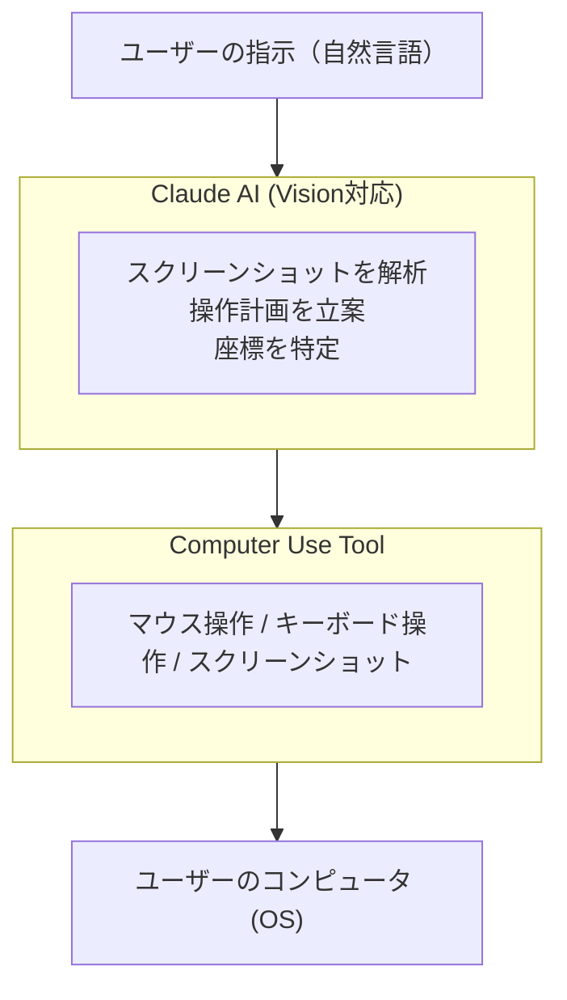
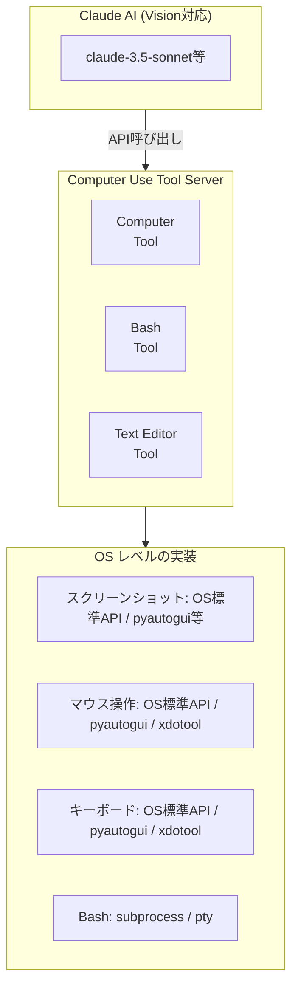
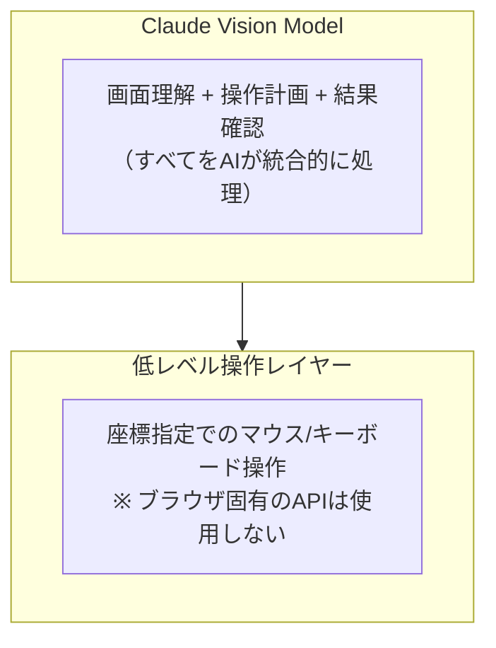
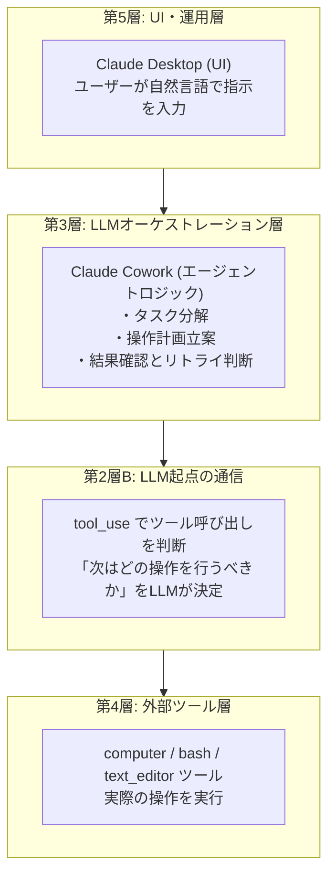

# Claude Cowork：Vision + 座標操作によるコンピュータ制御

> **5層モデルでの位置**: 第3層（LLMオーケストレーション層）から第4層（外部ツール層）を呼び出す
> **一言**: Visionでスクリーンショットを解析し、座標指定でマウス/キーボード操作。事前スクリプト不要で任意のアプリを操作。

---

## 目次

1. [Claude Coworkの概要](#1-claude-coworkの概要)
2. [デスクトップ操作の仕組み](#2-デスクトップ操作の仕組み)
3. [Webブラウザ操作の仕組み](#3-webブラウザ操作の仕組み)
4. [5層モデルでの位置づけ](#4-5層モデルでの位置づけ)
5. [革新点と限界](#5-革新点と限界)

---

## 1. Claude Coworkの概要

Claude Coworkは、Anthropicが提供するClaude Desktop上の機能で、AIがユーザーのコンピュータを直接操作できる「Computer Use」機能を活用したエージェント。

### 何ができるのか

- **デスクトップアプリケーションの操作**: 任意のアプリを視覚認識で操作
- **Webブラウザの操作**: PlayWright等を使わず、Visionで画面を認識して操作
- **CLIコマンドの実行**: bashツールでターミナル操作も可能
- **ファイル編集**: text_editorツールでテキストファイルを編集

### 基本的なアーキテクチャ



### 公式リファレンス

- [Anthropic Computer Use Documentation](https://docs.anthropic.com/en/docs/agents-and-tools/computer-use)
- [Computer Use Demo (GitHub)](https://github.com/anthropics/anthropic-quickstarts/tree/main/computer-use-demo)

---

## 2. デスクトップ操作の仕組み

### 2-1. 座標ベース操作（RPAに類似）

Claude Coworkの中核は**座標ベースの操作**。これは従来のRPAツールと同様のアプローチ。

#### 操作フロー

```
1. スクリーンショット取得
   ↓
2. Vision（画像認識）で画面内容を理解
   ↓
3. 操作対象の座標を特定
   ↓
4. マウス/キーボード操作を実行
   ↓
5. 結果確認のためスクリーンショット再取得
   ↓
6. 次のアクションを決定（ループ）
```

### 2-2. 操作タイプ一覧

| 操作タイプ | 説明 |
|-----------|------|
| **mouse_move** | 指定座標 (x, y) にマウスカーソルを移動 |
| **left_click** | 指定座標で左クリック |
| **right_click** | 指定座標で右クリック |
| **double_click** | 指定座標でダブルクリック |
| **left_click_drag** | ドラッグ操作（開始座標 → 終了座標） |
| **type** | キーボード入力（テキスト入力） |
| **key** | 特殊キー押下（Enter, Ctrl+C など） |
| **screenshot** | 現在の画面をキャプチャ |
| **cursor_position** | 現在のカーソル位置を取得 |
| **scroll** | 画面スクロール |

### 2-3. 利用可能なツール

```python
# Computer Use で利用可能なツール
tools = [
    "computer",      # GUI操作（座標ベース）
    "bash",          # シェルコマンド実行
    "text_editor"    # テキストファイル編集
]
```

#### 各ツールの役割

| ツール | 役割 | 用途例 |
|--------|------|--------|
| **computer** | 座標ベースのGUI操作 | アプリのボタンクリック、フォーム入力 |
| **bash** | シェルコマンド実行 | ファイル操作、プロセス管理、git操作 |
| **text_editor** | テキストファイル編集 | コード編集、設定ファイル変更 |

### 2-4. ツール実装の技術スタック



### 2-5. APIレスポンス例

LLMが`tool_use`で返す操作指示の例：

```json
{
  "type": "tool_use",
  "id": "toolu_01ABC123",
  "name": "computer",
  "input": {
    "action": "left_click",
    "coordinate": [500, 300]
  }
}
```

---

## 3. Webブラウザ操作の仕組み

### 3-1. PlayWright/Seleniumを使わない理由

**結論: Claude Coworkはブラウザ自動化ライブラリを使用していない**

従来のブラウザ自動化：
- PlayWright、Selenium → DOMセレクタで要素を特定
- 事前にセレクタを調査・記述する必要

Claude Cowork：
- 画面のスクリーンショットをVisionで解析
- 「ここにボタンがある」を視覚的に認識
- 座標を指定してクリック

### 3-2. 従来のRPA/ブラウザ自動化との違い

| 項目 | 従来のRPA/自動化 | Claude Computer Use |
|------|-----------------|---------------------|
| 要素特定 | DOM/セレクタ/ID | 視覚認識（Vision） |
| 座標取得 | 要素位置計算 | 画像解析で推定 |
| 適応性 | UI変更に弱い | 柔軟に対応可能 |
| 設定方法 | 事前スクリプト必要 | 自然言語で指示 |
| 対象範囲 | 特定アプリ | 任意のアプリ |

### 3-3. ブラウザ操作の実際の流れ

```
1. ユーザー: 「Google検索でAnthropicを検索して」

2. Claude:
   - スクリーンショット取得
   - ブラウザが開いているか確認
   - 開いていなければアプリ起動操作

3. Claude:
   - アドレスバーの座標を視覚認識
   - クリック操作を実行
   - "google.com" とタイプ
   - Enterキーを送信

4. Claude:
   - 結果画面のスクリーンショット取得
   - 検索ボックスの座標を認識
   - クリック + 入力 + Enter

5. 以下、目的達成まで繰り返し
```

### 3-4. アーキテクチャの特徴



---

## 4. 5層モデルでの位置づけ

### 4-1. Claude Coworkの各層への関与



### 4-2. エージェントループの実装

```python
# 疑似コード: Claude Coworkのエージェントループ
while not task_completed:
    # 1. スクリーンショット取得（第4層: computerツール）
    screenshot = computer_tool.screenshot()

    # 2. LLMに送信（第2層B: tool_use判断）
    response = claude.messages.create(
        model="claude-3.5-sonnet",
        messages=[
            {"role": "user", "content": [
                {"type": "text", "text": user_task},
                {"type": "image", "source": screenshot}
            ]}
        ],
        tools=[computer_tool, bash_tool, text_editor_tool]
    )

    # 3. ツール呼び出しの実行（第4層）
    if response.stop_reason == "tool_use":
        tool_result = execute_tool(response.content)
        # 結果をmessagesに追加して次のループへ
```

### 4-3. 各層の責務

| 層 | Claude Coworkでの役割 |
|-----|----------------------|
| 第5層（UI・運用層） | Claude Desktop UI - ユーザーとの対話 |
| 第3層（LLMオーケストレーション層） | エージェントロジック - タスク管理、状態管理 |
| 第2層B（LLM起点） | tool_use判断 - 次のアクションを決定 |
| 第4層（外部ツール層） | computer/bash/text_editor - 実際の操作実行 |
| 第1層（LLM層） | Claude 3.5 Sonnet等 - Vision + 推論 |

---

## 5. 革新点と限界

### 5-1. 技術的な革新点

| 革新点 | 説明 |
|--------|------|
| **事前スクリプト不要** | 自然言語で指示するだけ、セレクタ調査不要 |
| **任意のアプリを操作可能** | 特定のAPIやセレクタに依存しない |
| **UIの変更に柔軟に対応** | 視覚認識なので、ボタン位置が変わっても適応 |
| **人間と同じ操作方法** | 人が操作できる画面なら、AIも操作可能 |
| **マルチモーダル統合** | 画面理解・操作計画・実行をAIが統合処理 |

### 5-2. 現時点での限界

| 限界 | 説明 |
|------|------|
| **処理速度** | スクリーンショット取得・解析のオーバーヘッド |
| **精度** | 座標の推定ミスによる誤操作の可能性 |
| **複雑なUI** | 動的なアニメーション、ポップアップへの対応 |
| **セキュリティ** | コンピュータ全体へのアクセス権限が必要 |
| **コスト** | 画像解析を伴うため、APIコストが高い |

### 5-3. セキュリティ考慮事項

Claude Desktopでの実装では以下の対策が推奨される：

1. **確認ダイアログ**: 重要な操作前にユーザー確認
2. **操作履歴**: すべての操作をログ記録
3. **サンドボックス**: 仮想マシンやコンテナでの実行
4. **アクセス制限**: 機密情報へのアクセスを制限

### 5-4. 従来技術との比較まとめ

| 項目 | 従来のRPA | PlayWright/Selenium | Claude Computer Use |
|------|----------|---------------------|---------------------|
| 要素特定方法 | 画像認識 or 座標 | DOMセレクタ | Vision + 座標 |
| 設定難易度 | 高（GUIで録画） | 高（コード記述） | 低（自然言語） |
| UI変更耐性 | 低 | 低 | 高 |
| 対象範囲 | デスクトップ全般 | ブラウザのみ | 全アプリ |
| 判断能力 | なし | なし | AIが状況判断 |

---

## Computer Use API の仕様

### ツール定義

```json
{
  "type": "computer_20241022",
  "name": "computer",
  "display_width_px": 1920,
  "display_height_px": 1080,
  "display_number": 1
}
```

### 操作アクション一覧

```python
actions = {
    "key": "キーボードショートカット（例: ctrl+c, Return）",
    "type": "テキスト入力",
    "mouse_move": "マウス移動 [x, y]",
    "left_click": "左クリック",
    "left_click_drag": "ドラッグ [start_x, start_y, end_x, end_y]",
    "right_click": "右クリック",
    "middle_click": "中クリック",
    "double_click": "ダブルクリック",
    "screenshot": "スクリーンショット取得",
    "cursor_position": "カーソル位置取得",
    "scroll": "スクロール [direction, amount]"
}
```

---

## 参考リンク

### 公式ドキュメント

- [Anthropic Computer Use Documentation](https://docs.anthropic.com/en/docs/agents-and-tools/computer-use)
- [Computer Use Demo (GitHub)](https://github.com/anthropics/anthropic-quickstarts/tree/main/computer-use-demo)
- [Anthropic Messages API](https://docs.anthropic.com/en/api/messages)

### 関連技術

- [pyautogui (Python GUI自動化)](https://pyautogui.readthedocs.io/)
- [xdotool (Linux GUI自動化)](https://github.com/jordansissel/xdotool)

---

*作成日: 2026-02-22*
*対象: 5層モデル 第3層（LLMオーケストレーション層）- Claude Cowork*
