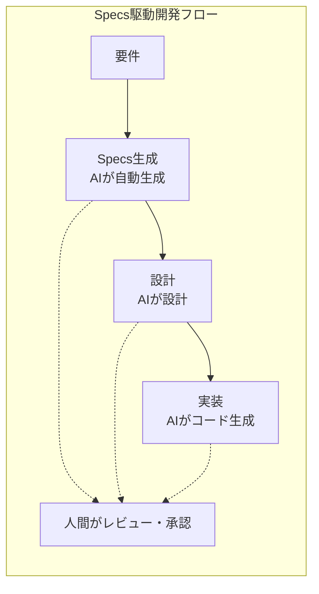
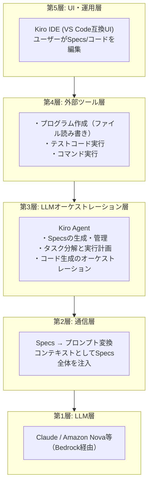
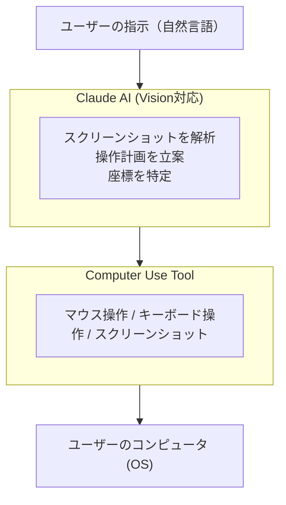
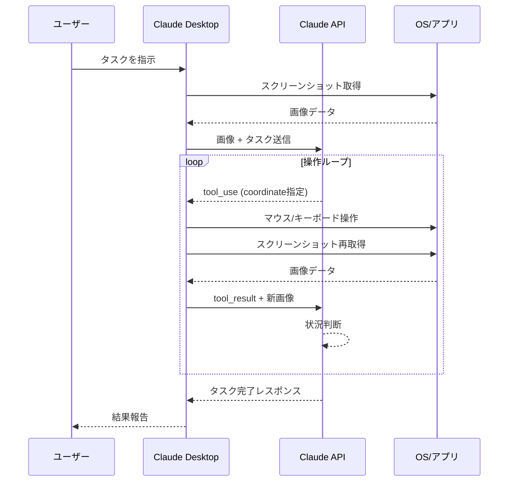
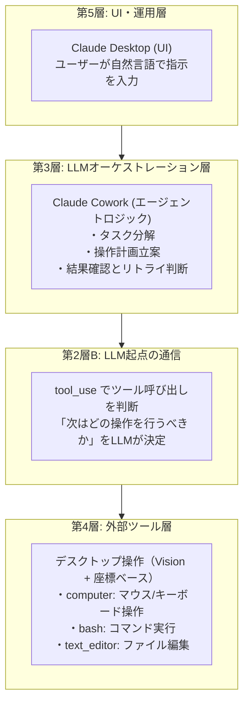
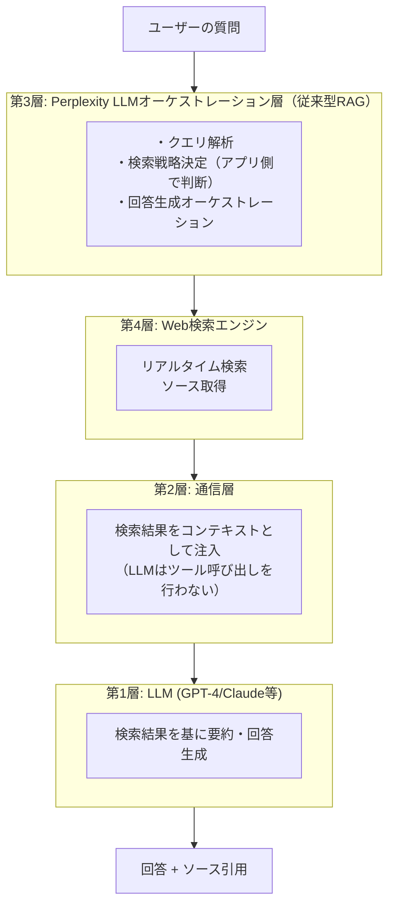
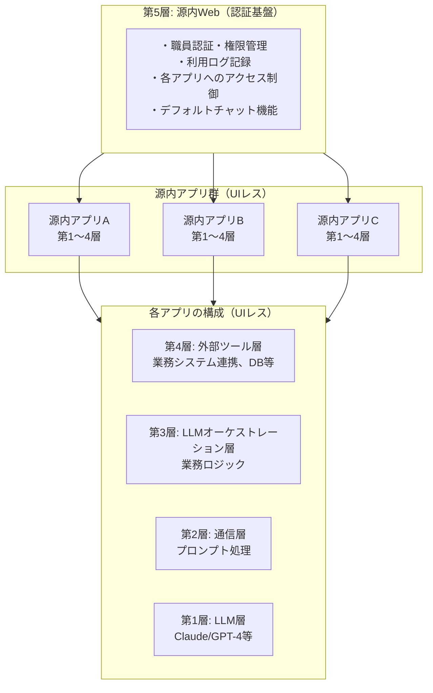
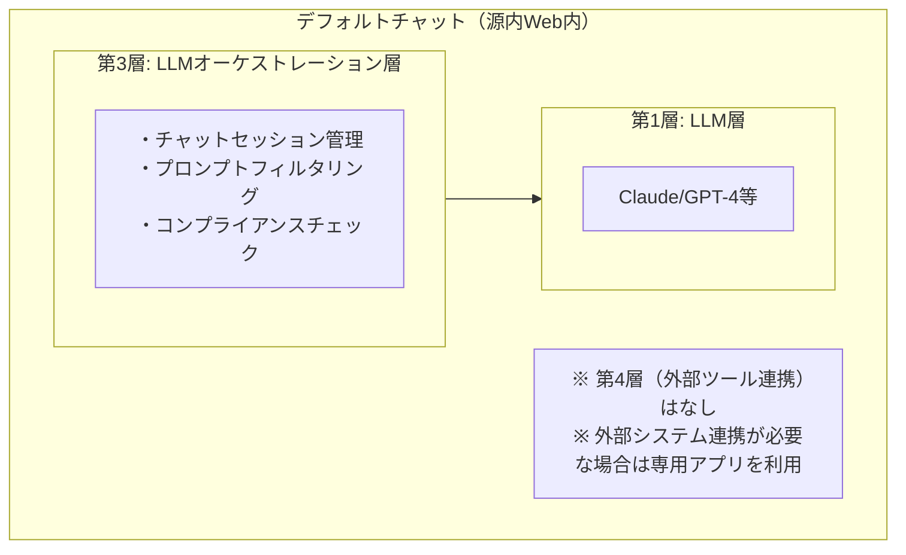
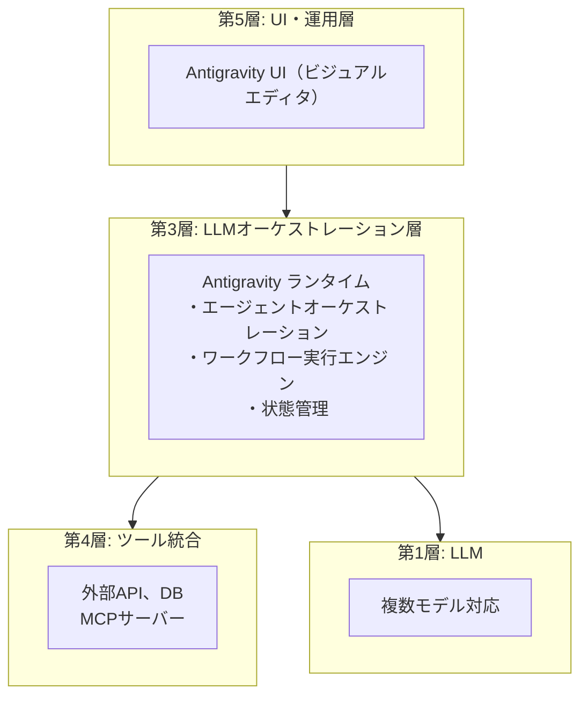
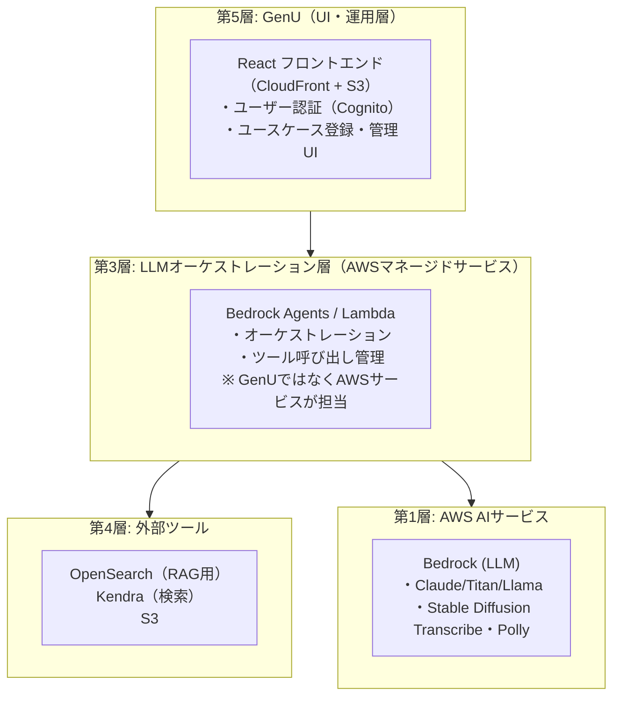

# その他製品：5層モデルで解説

> **概要**: Kiro、Claude Cowork、Perplexity、源内、Antigravity、GenUなど、主要カテゴリに収まりきらない注目製品を5層モデルで解説。

---

## 目次

1. [Kiro（AWS）](#1-kiroaws)
2. [Claude Cowork](#2-claude-cowork)
3. [Perplexity](#3-perplexity)
4. [源内（デジタル庁）](#4-源内デジタル庁)
5. [Antigravity](#5-antigravity)
6. [GenU（AWS）](#6-genuaws)
7. [5層モデルでの比較](#7-5層モデルでの比較)

---

## 1. Kiro（AWS）

> **5層モデルでの位置**: 第5層（UI・運用層）+ 第4層（外部ツール層）+ 第3層（LLMオーケストレーション層）
> **概要**: AWSが開発したAI IDE。Specs駆動開発により、仕様から実装への変換を自動化。

### 1-1. Kiroとは

Kiro（キロ）は、AWSが2025年に発表したAIネイティブIDE。VS Code互換の環境で動作し、「Specs駆動開発」という新しいアプローチを提唱。

### 1-2. Specs駆動開発

KiroはVibe Coding（雰囲気でコーディング）への対抗軸として、**Specs（仕様書）を中心とした開発フロー**を提供。



#### Specsの構成要素（3ファイル構成）

| ファイル | 説明 |
|------|------|
| **requirements.md** | ユーザーストーリー、機能要件、受け入れ基準（EARS形式） |
| **design.md** | 設計ドキュメント（API、データモデル） |
| **tasks.md** | 実装タスクのブレークダウン |

※ テストは別ファイルではなく、requirements.mdの受け入れ基準（EARS形式）に含まれる

### 1-3. 5層モデルでの位置づけ



### 1-4. 特徴と利点

| 特徴 | 説明 |
|------|------|
| **仕様の明示化** | AIが生成するコードの根拠が明確 |
| **変更追跡** | Specsの変更とコードの対応が追跡可能 |
| **品質保証** | 仕様からテストを自動生成 |
| **AWS統合** | Bedrock、CodeCatalyst等との連携 |

### 1-5. Vibe CodingとSpecs駆動の比較

| 項目 | Vibe Coding | Specs駆動開発 |
|------|-------------|---------------|
| **入力** | 自然言語のみ | 構造化されたSpecs |
| **変更管理** | 困難 | Specsベースで追跡 |
| **再現性** | 低い | 高い |
| **適用範囲** | プロトタイプ | 本番開発 |
| **チーム開発** | 難しい | Specs共有で容易 |

### 1-6. 参考リンク

- [Kiro公式サイト](https://kiro.dev/)
- [AWS発表（YouTube）](https://www.youtube.com/watch?v=kiro-aws)

---

## 2. Claude Cowork

> **5層モデルでの位置**: 第3層（LLMオーケストレーション層）から第4層（外部ツール層）を呼び出す
> **概要**: Visionでスクリーンショットを解析し、座標指定でマウス/キーボード操作。事前スクリプト不要で任意のアプリを操作。

### 2-1. Claude Coworkの概要

Claude Coworkは、Anthropicが提供するClaude Desktop上の機能で、AIがユーザーのコンピュータを直接操作できる「Computer Use」機能を活用したエージェント。

#### 何ができるのか

- **デスクトップアプリケーションの操作**: 任意のアプリを視覚認識で操作
- **Webブラウザの操作**: PlayWright等を使わず、Visionで画面を認識して操作
- **CLIコマンドの実行**: bashツールでターミナル操作も可能
- **ファイル編集**: text_editorツールでテキストファイルを編集

### 2-2. 基本アーキテクチャ



### 2-3. 通信フロー図



### 2-4. 操作タイプ一覧

| 操作タイプ | 説明 |
|-----------|------|
| **mouse_move** | 指定座標 (x, y) にマウスカーソルを移動 |
| **left_click** | 指定座標で左クリック |
| **right_click** | 指定座標で右クリック |
| **double_click** | 指定座標でダブルクリック |
| **left_click_drag** | ドラッグ操作（開始座標 → 終了座標） |
| **type** | キーボード入力（テキスト入力） |
| **key** | 特殊キー押下（Enter, Ctrl+C など） |
| **screenshot** | 現在の画面をキャプチャ |
| **cursor_position** | 現在のカーソル位置を取得 |
| **scroll** | 画面スクロール |

### 2-5. 5層モデルでの位置づけ



### 2-6. 従来技術との比較

| 項目 | 従来のRPA | PlayWright/Selenium | Claude Computer Use |
|------|----------|---------------------|---------------------|
| 要素特定方法 | 画像認識 or 座標 | DOMセレクタ | Vision + 座標 |
| 設定難易度 | 高（GUIで録画） | 高（コード記述） | 低（自然言語） |
| UI変更耐性 | 低 | 低 | 高 |
| 対象範囲 | デスクトップ全般 | ブラウザのみ | 全アプリ |
| 判断能力 | なし | なし | AIが状況判断 |

### 2-7. 参考リンク

- [Anthropic Computer Use Documentation](https://docs.anthropic.com/en/docs/agents-and-tools/computer-use)
- [Computer Use Demo (GitHub)](https://github.com/anthropics/anthropic-quickstarts/tree/main/computer-use-demo)

---

## 3. Perplexity

> **5層モデルでの位置**: 従来型RAGアプリ（第3層 + 第4層：Web検索）
> **概要**: AI検索エンジン。リアルタイムWeb検索とLLM回答生成を統合。LLMがツールを呼び出すのではなく、アプリ側で検索を実行する従来型RAG方式。
> **調査日**: 2026-02-22（ツール利用型検索（Tool型RAG）の採用は確認できず）

### 3-1. Perplexityとは

Perplexityは、従来の検索エンジンとLLMを融合したAI検索サービス。検索クエリに対してリアルタイムでWebを検索し、LLMが情報を要約・統合して回答を生成。

**注**: Perplexityは「従来型RAGアプリ」に分類される。LLMがtool_useでWeb検索を呼び出すのではなく、アプリケーション層が検索を実行し、その結果をコンテキストとしてLLMに渡す方式を採用している。

### 3-2. アーキテクチャ（従来型RAG）



### 3-3. 5層モデルでの位置づけ

| 層 | Perplexityでの役割 |
|-----|----------------------|
| 第5層（UI・運用層） | Web UI / モバイルアプリ |
| 第3層（LLMオーケストレーション層） | 検索・回答生成のオーケストレーション（検索判断はここで行う） |
| 第4層（外部ツール層） | Web検索エンジン、インデックス（アプリ層から呼び出し） |
| 第2層（通信層） | 検索結果をコンテキストとして注入 |
| 第1層（LLM層） | 複数のLLM（GPT-4, Claude等）- ツール呼び出し機能は使用せず |

### 3-4. 従来型RAG vs Tool型RAG

| 項目 | 従来型RAG（Perplexity） | Tool型RAG |
|------|------------------------|-----------|
| **検索判断** | アプリ層が決定 | LLMがtool_useで判断 |
| **検索タイミング** | 固定フロー | LLMが動的に決定 |
| **複数回検索** | アプリ側で制御 | LLMが必要に応じて実行 |
| **メリット** | 予測可能、コスト管理容易 | 柔軟、文脈に応じた検索 |

### 3-5. 従来の検索エンジンとの違い

| 項目 | Google等の検索エンジン | Perplexity |
|------|----------------------|------------|
| **出力形式** | リンクリスト | 自然言語の回答 |
| **情報統合** | ユーザーが手動 | AIが自動統合 |
| **ソース引用** | リンクのみ | 文中に引用マーク |
| **フォローアップ** | 新規検索 | 会話継続可能 |
| **パーソナライズ** | 検索履歴ベース | 会話コンテキスト |

### 3-6. 特徴

| 特徴 | 説明 |
|------|------|
| **リアルタイム検索** | 最新情報をWeb検索で取得 |
| **ソース透明性** | すべての回答にソース引用 |
| **会話継続** | フォローアップ質問が可能 |
| **複数モデル** | Pro版では複数のLLMを選択可能 |
| **Focus機能** | 検索対象を限定（学術、YouTube等） |

### 3-7. 参考リンク

- [Perplexity](https://www.perplexity.ai/)
- [Perplexity API](https://docs.perplexity.ai/)

---

## 4. 源内（デジタル庁）

> **5層モデルでの位置**: 源内Web（第5層：認証基盤）+ 源内アプリ群（第1〜4層：UIレス）
> **概要**: デジタル庁が開発した政府職員向けAIプラットフォーム。源内Webが認証基盤として複数の源内アプリを束ねる構成。

### 4-1. 源内とは

源内（げんない）は、デジタル庁が開発した政府職員向けの生成AIプラットフォーム。名称は江戸時代の発明家・平賀源内に由来。政府業務の効率化を目的として、セキュリティとコンプライアンスを確保しながらLLMを活用。

### 4-2. 源内の構成

源内は単一のアプリケーションではなく、以下の構成を持つ。

| コンポーネント | 役割 |
|---------------|------|
| **源内Web** | 認証基盤（第5層）。職員認証を行い、各アプリへのアクセスを制御 |
| **源内アプリ群** | UIレスの業務特化アプリ（複数）。第1〜4層を持つ |
| **デフォルトチャット** | 源内Web上の汎用チャット機能。第3層と第1層を持つが、第4層連携なし |

### 4-3. アーキテクチャ



### 4-4. 5層モデルでの位置づけ

| コンポーネント | 層構成 | 説明 |
|---------------|--------|------|
| **源内Web** | 第5層のみ | 認証基盤。アプリを束ねる役割 |
| **源内アプリ群** | 第1〜4層 | UIレス。業務特化。源内Webから呼び出される |
| **デフォルトチャット** | 第3層+第1層 | 源内Web上の汎用機能。第4層連携なし |

### 4-5. デフォルトチャットの特徴

源内Web上のデフォルトチャットは、シンプルな構成を持つ。



### 4-6. 特徴と設計方針

| 特徴 | 説明 |
|------|------|
| **セキュリティ** | ガバメントクラウド内で運用 |
| **コンプライアンス** | 機密情報の外部送信防止/推論は日本国内に限定 |
| **利用ログ** | すべての利用を記録・監査可能 |
| **段階的展開** | 2026年5月に第1版を全省展開予定。2027年に第2版リリース |
| **アプリ分離** | 業務ごとに専用アプリを用意し、権限を分離 |

### 4-7. 政府向けAIの課題と対応

| 課題 | 源内での対応 |
|------|-------------|
| **機密情報漏洩** | プロンプトフィルタリング、ログ監査 |
| **誤情報リスク** | 業務特化アプリでのナレッジ連携 |
| **コンプライアンス** | 日本国内での推論に限定 |
| **アクセス制御** | 源内Webでの職員認証、利用できるアプリを制御 |

### 4-8. 参考リンク

- [デジタル庁 源内紹介記事](https://digital-gov.note.jp/n/ndc07326b7491)
- [デジタル庁 公式サイト](https://www.digital.go.jp/)

---

## 5. Antigravity

> **5層モデルでの位置**: 第3層（LLMオーケストレーション層）+ 第4層（外部ツール層）
> **概要**: AIエージェント開発プラットフォーム。複雑なエージェントワークフローの構築・運用を支援。

### 5-1. Antigravityとは

Antigravityは、AIエージェントの開発・デプロイ・運用を支援するプラットフォーム。複数のエージェントを組み合わせた複雑なワークフローを、視覚的に構築・管理できる。

### 5-2. 主な機能

| 機能 | 説明 |
|------|------|
| **Agent Builder** | ビジュアルエディタでエージェント構築 |
| **Workflow Designer** | マルチエージェントワークフロー設計 |
| **Tool Integration** | 各種ツール・APIとの連携 |
| **Monitoring** | 実行状況の監視・デバッグ |
| **Deployment** | ワンクリックデプロイ |

### 5-3. 5層モデルでの位置づけ



### 5-4. Dify/n8nとの比較

| 項目 | Antigravity | Dify | n8n |
|------|-------------|------|-----|
| **フォーカス** | エージェント特化 | LLMアプリ全般 | ワークフロー全般 |
| **マルチエージェント** | ネイティブ対応 | 限定的 | プラグインで対応 |
| **開発者向け** | 高い | 中程度 | 高い |
| **ノーコード度** | 中程度 | 高い | 中程度 |

---

## 6. GenU（AWS）

> **5層モデルでの位置**: 第5層中心 + 第3層の一部機能（RAG Chat、Agent機能、Use Case Builder等）
> **概要**: AWSが提供する生成AIアプリケーションの基盤。第5層のUI・認証に加え、第3層のRAGやAgent機能も内包。

### 6-1. GenUとは

GenU（Generative AI Use Cases）は、AWSが提供する生成AIアプリケーションの基盤。GenU自体は第5層（ユーザー認証、ユースケース登録UI）を中心としつつ、第3層の一部機能（RAG Chat、Agent機能、Use Case Builder等）も内包している。

### 6-2. GenUの役割

GenUは第5層のUI・認証に加え、第3層の一部機能も提供している。

| 機能 | 層 | 説明 |
|------|-----|------|
| **ユーザー認証** | 第5層 | Cognitoによる認証・認可 |
| **UI提供** | 第5層 | React フロントエンド |
| **RAG Chat** | 第3層 | Kendra / Knowledge Base連携による検索拡張チャット |
| **Agent機能** | 第3層 | Web Search Agent、Code Interpreter Agent |
| **Use Case Builder** | 第3層 | プロンプトテンプレート管理 |
| **Voice Chat** | 第3層 | 音声対話機能 |
| **MCP Chat** | 第3層 | MCP（Model Context Protocol）対応チャット |

### 6-3. 主なユースケース

| ユースケース | 説明 |
|-------------|------|
| **RAGチャットボット** | 社内文書検索付きチャット |
| **ドキュメント要約** | 長文ドキュメントの要約 |
| **コード生成** | コーディング支援 |
| **画像生成** | Stable Diffusion統合 |
| **翻訳** | 多言語翻訳 |

### 6-4. アーキテクチャ



### 6-5. 第1層: Bedrock以外のAWSサービス

GenUは第1層としてBedrock以外のAWS AIサービスも活用可能。

| サービス | 機能 |
|----------|------|
| **Amazon Comprehend** | 感情分析、エンティティ抽出、キーフレーズ抽出 |
| **Amazon Lex** | 会話AI、チャットボット構築 |
| **Amazon Translate** | 多言語翻訳 |
| **Amazon Polly** | テキスト読み上げ |
| **Amazon Rekognition** | 画像・動画分析 |
| **Amazon Transcribe** | 音声文字起こし |

### 6-6. 5層モデルでの位置づけ

| 層 | 担当 | 説明 |
|-----|------|------|
| 第5層 | **GenU** | ユーザー認証、ユースケース登録、UI |
| 第3層（LLMオーケストレーション） | **GenU** + AWSサービス | RAG Chat、Agent機能、Use Case Builder、Voice Chat、MCP Chat（GenU）/ Bedrock Agents（AWS） |
| 第4層 | AWSサービス | OpenSearch、Kendra、S3等 |
| 第2層 | AWSサービス | Bedrock API |
| 第1層 | AWSサービス | Bedrock + Comprehend/Lex/Translate等 |

### 6-7. 活用シナリオ

| シナリオ | GenUの活用方法 |
|----------|---------------|
| **PoC構築** | サンプルをそのままデプロイ |
| **本番開発** | リファレンスとして参考 |
| **学習** | AWSでの生成AI実装を学習 |
| **評価** | 各モデルの比較検証 |

### 6-8. 参考リンク

- [GenU GitHub](https://github.com/aws-samples/generative-ai-use-cases-jp)
- [AWS Bedrock ドキュメント](https://docs.aws.amazon.com/bedrock/)

---

## 7. 5層モデルでの比較

### 7-1. 各製品の層分布

```
製品            第1層  第2層  第3層  第4層  第5層  備考
────────────────────────────────────────────────────────────
Kiro             -      -      ✅     ✅     ✅    プログラム作成/テスト実行
Claude Cowork    -      ✅     ✅     ✅     ✅    デスクトップ操作(Vision+座標)
Perplexity       -      -      ✅     ✅     ✅    従来型RAG（Tool型ではない）
源内Web          -      -      -      -      ✅    認証基盤のみ
源内アプリ群     ✅     ✅     ✅     ✅     -     UIレス、業務特化
Antigravity      -      -      ✅     ✅     ✅    マルチエージェント対応
GenU             -      -      ✅     -      ✅    第5層中心 + 第3層の一部機能

✅ = その製品が主に関与する層
```

### 7-2. カテゴリ別整理

| カテゴリ | 製品 | 特徴 |
|----------|------|------|
| **AI IDE** | Kiro | Specs駆動開発 + ツール利用（第4層） |
| **デスクトップ自動化** | Claude Cowork | Vision + 座標ベースのデスクトップ操作 |
| **AI検索** | Perplexity | 従来型RAG（Tool型RAGではない） |
| **政府向け** | 源内 | 源内Web（認証）+ 源内アプリ群（UIレス） |
| **エージェント基盤** | Antigravity | マルチエージェント対応 |
| **生成AI基盤** | GenU | 第5層中心 + 第3層の一部機能（RAG、Agent等） |

### 7-3. 選定ガイド

| ユースケース | 推奨製品 |
|--------------|----------|
| 仕様ベースの開発 | Kiro |
| デスクトップ/ブラウザ自動化 | Claude Cowork |
| リアルタイム情報検索 | Perplexity |
| 政府・公共機関向け | 源内 |
| 複雑なエージェント構築 | Antigravity |
| AWS上での生成AI構築 | GenU |

---

## まとめ

本章で解説した製品は、それぞれ異なるアプローチでAIエージェント/LLMアプリケーションの課題を解決している。

| 製品 | 主な革新点 |
|------|-----------|
| **Kiro** | Specs駆動 + 第4層ツール利用（プログラム作成、テスト実行） |
| **Claude Cowork** | Vision + 座標ベースで汎用的なデスクトップ自動化を実現 |
| **Perplexity** | 従来型RAGで検索とLLMの統合（Tool型RAGではない） |
| **源内** | 源内Web（認証基盤）+ 源内アプリ群（UIレス）の分離構成 |
| **Antigravity** | マルチエージェントの構築・運用を簡素化 |
| **GenU** | 第5層中心 + 第3層の一部機能（RAG Chat、Agent機能、Use Case Builder、Voice Chat、MCP Chat） |

5層モデルの観点では、いずれも第3層（LLMオーケストレーション層）を中心としながら、それぞれ異なる層との連携で独自の価値を提供している。

---

## 参考リンク

### 公式ドキュメント

- [Kiro公式サイト](https://kiro.dev/)
- [Anthropic Computer Use Documentation](https://docs.anthropic.com/en/docs/agents-and-tools/computer-use)
- [Perplexity](https://www.perplexity.ai/)
- [デジタル庁 源内記事](https://digital-gov.note.jp/n/ndc07326b7491)
- [GenU GitHub](https://github.com/aws-samples/generative-ai-use-cases-jp)

### 関連記事

- [Anthropic "Building Effective Agents"](https://www.anthropic.com/research/building-effective-agents)

---

*作成日: 2026-02-22*
*シリーズ: AIエージェント概念マップ 詳細解説*
