# 第4層「外部ツール層」詳細解説 (b) エージェント連携

> **シリーズ**: AIエージェント概念マップ詳細解説
> **対象層**: 第4層（外部ツール層）- エージェント連携編
> **関連章**: 元記事 第8章（Subagent）、第9章（Agent Teams）、04_外部ツール層.md

---

## 1. エージェント連携の概要

**一言**: 複数のAIエージェントが協調してタスクを遂行する仕組み。単一エージェントの限界を超え、専門化・並列化・異種連携を実現する。

### 1-1. エージェント連携の3つの方式

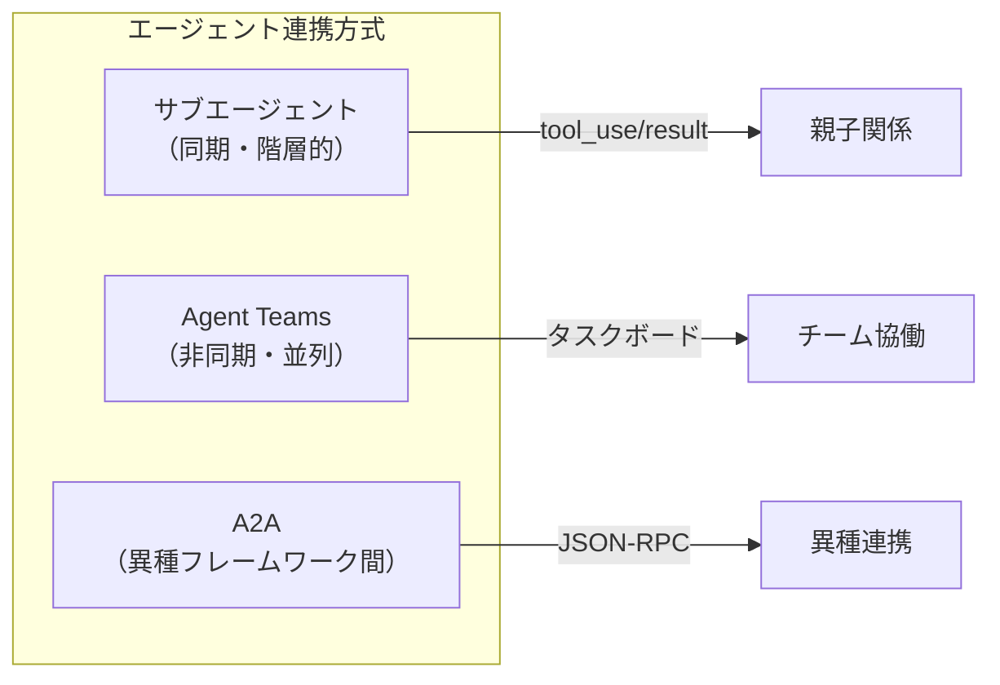

| 方式 | 通信方式 | 並列性 | 適用場面 |
|------|----------|--------|----------|
| **サブエージェント** | tool_use/tool_result | 複数子の順次/並列起動可能 | タスク委譲・専門処理 |
| **Agent Teams** | 内部タスクボード | 可能（非同期） | 複雑なプロジェクト |
| **A2A** | JSON-RPC 2.0 | 可能 | 異種フレームワーク間 |

### 1-2. 5層モデルにおける位置づけ

```
第5層 UI・運用層              ← ユーザーとの接点 + LLMに直接関係しない周辺機能
      ↑
第4層 外部ツール層            ← エージェント連携はここ
      │
      ├─ サブエージェント     ← 親から起動される子エージェント（複数可）
      ├─ Agent Teams         ← チームとして協働するエージェント群
      └─ A2Aエージェント      ← 異なるフレームワーク間で通信
      ↑
第3層 LLMオーケストレーション層  ← エージェントを起動・管理
```

---

## 2. AIエージェントの種類（連携パターン分類）

エージェント連携の方式を理解するには、AIエージェントのアーキテクチャパターンを把握することが重要です。

### 2-1. 5つの主要パターン

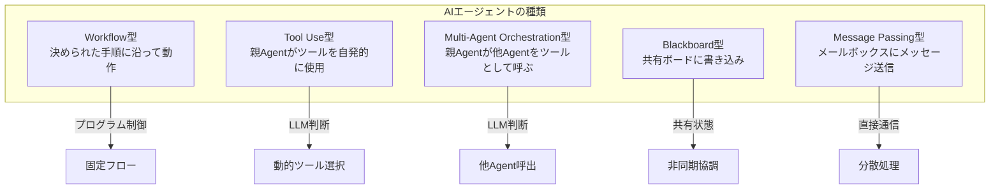

### 2-2. 各パターンの詳細

| パターン | 制御主体 | 通信方式 | 特徴 | 例 |
|----------|----------|----------|------|-----|
| **Workflow型** | プログラム | 固定フロー | 事前定義されたワークフローに沿って動作。LLMは各ステップで呼ばれる | CI/CDパイプライン、ETL処理 |
| **Tool Use型** | 親Agent（LLM） | tool_use/tool_result | 親Agentがプログラムやファイル等のツールを自発的に選択・使用 | Claude Code、GitHub Copilot |
| **Multi-Agent Orchestration型** | 親Agent（LLM） | tool_use/tool_result | 親Agentが他のAgentをツールとして呼び出す | サブエージェント、A2A |
| **Blackboard型** | 各Agent（自律） | 共有タスクボード | 共有ホワイトボードに情報を書き込み、他Agentが読み取る | Agent Teams |
| **Message Passing型** | 各Agent（自律） | メッセージキュー | 各Agentがメールボックスを持ち、非同期でメッセージを送受信 | Actor Model、MAS |

### 2-3. パターンとClaude Code機能の対応

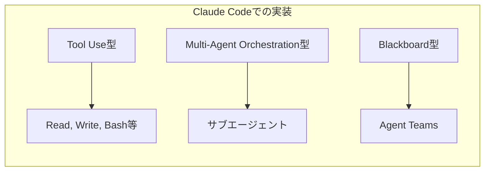

| Claude Code機能 | 対応パターン | 説明 |
|-----------------|--------------|------|
| ツール群（Read, Write, Bash等） | Tool Use型 | LLMが状況に応じてツールを選択 |
| サブエージェント（Task） | Multi-Agent Orchestration型 | 他Agentをツールとして呼び出し |
| Agent Teams | Blackboard型 | タスクボードを介した協調 |
| SendMessage | Message Passing型 | テイメイト間の直接通信 |

---

## 3. サブエージェント（SubAgent）

### 3-1. サブエージェントとは

**一言**: 親エージェントが特定タスクを委譲するために起動する子エージェント。親は子の完了を待つ（同期的）。**複数の子エージェントを順次または並列で起動可能**。

**Claude Codeでの実装**: `Task`ツールを使用して起動

```
親エージェント: 「この調査タスクはサブエージェントに任せよう」
  ↓ tool_use: Task（子エージェント1）
サブエージェント1: 独立したセッションで実行
  ↓ tool_result
親エージェント: 結果を受け取り、別のサブエージェントを起動
  ↓ tool_use: Task（子エージェント2）
サブエージェント2: 独立したセッションで実行
  ↓ tool_result
親エージェント: 全結果を統合して次の処理へ
```

### 3-2. サブエージェントのフロー（複数子エージェント）

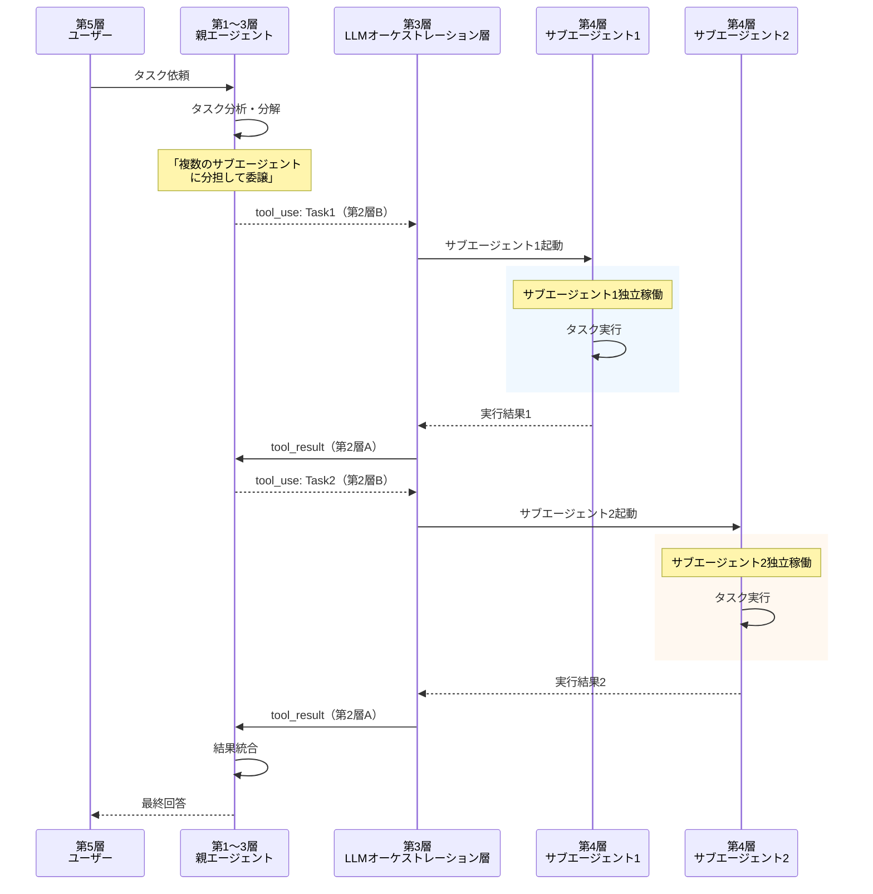

### 3-3. サブエージェントの特徴

| 特徴 | 説明 |
|------|------|
| **同期実行** | 親は各子の完了を待つ（ブロッキング） |
| **複数子起動可能** | 順次または並列で複数のサブエージェントを起動可能 |
| **独立コンテキスト** | 各サブエージェントは独自のCLAUDE.mdをロード |
| **ツール制限継承** | 親の`allowedTools`/`disallowedTools`が継承される |
| **セッション分離** | 親の会話履歴はサブエージェントに渡らない |

### 3-4. サブエージェント定義ファイル

`.claude/agents/`ディレクトリにMarkdownファイルとして定義:

```yaml
# .claude/agents/code-reviewer.md
---
tools: Read, Glob, Grep          # 使用可能なツール
disallowedTools: Write, Bash     # 禁止ツール
model: claude-haiku-4-5          # 使用モデル（コスト最適化）
permissionMode: default          # 権限モード
hooks:                           # サブエージェント固有Hooks
  PreToolUse: ...
skills:                          # サブエージェント固有Skill
  - code-review-patterns
---
# system prompt本文
You are a code reviewer specializing in security vulnerabilities.
Always check for:
- SQL injection
- XSS
- Authentication bypass
```

### 3-5. サブエージェントのユースケース

| ユースケース | 説明 | 推奨設定 |
|--------------|------|----------|
| **コードレビュー** | セキュリティ観点の専門レビュー | `tools: Read, Glob, Grep` |
| **調査タスク** | 特定トピックの情報収集 | `tools: WebSearch, WebFetch` |
| **ファイル整理** | ドキュメント構造の再編成 | `tools: Read, Write, Glob` |
| **テスト実行** | 特定テストスイートの実行 | `tools: Bash(npm test*)` |

---

## 4. Agent Teams（チーム協働）

### 4-1. Agent Teamsとは

**一言**: 複数のエージェント（テイメイト）がタスクボードを共有し、並列で非同期に協働する仕組み。人間もチームメンバーとして参加可能。

**Claude Codeでの実装**: `/teams`コマンドで有効化

> **注意: 実験的機能**
> Agent Teamsは現在**実験的機能（experimental）**であり、デフォルトでは無効になっています。
>
> **有効化方法1: 環境変数**
> ```bash
> export CLAUDE_CODE_EXPERIMENTAL_AGENT_TEAMS=true
> ```
>
> **有効化方法2: settings.json**
> ```json
> // .claude/settings.json
> {
>   "experimental": {
>     "agentTeams": true
>   }
> }
> ```
>
> 実験的機能のため、APIや動作が将来変更される可能性があります。

### 4-2. 組み込みサブエージェント

Claude Codeには、Agent Teamsとは別に、特定用途向けの**組み込みサブエージェント**が用意されています。

| サブエージェント | 用途 | 特徴 |
|------------------|------|------|
| **Explore** | コードベース探索 | 読み取り専用ツールのみ使用。コードの理解・調査に特化 |
| **Plan** | 計画立案 | タスクの分解・計画作成に特化。実行は行わない |

これらは`Task`ツールから呼び出す際に、専用のシステムプロンプトとツール制限が適用されます。

```typescript
// 使用例（内部的な呼び出しイメージ）
{
  "tool": "Task",
  "input": {
    "agent": "Explore",
    "task": "認証モジュールの構造を調査してください"
  }
}
```

### 4-3. Agent Teamsのフロー

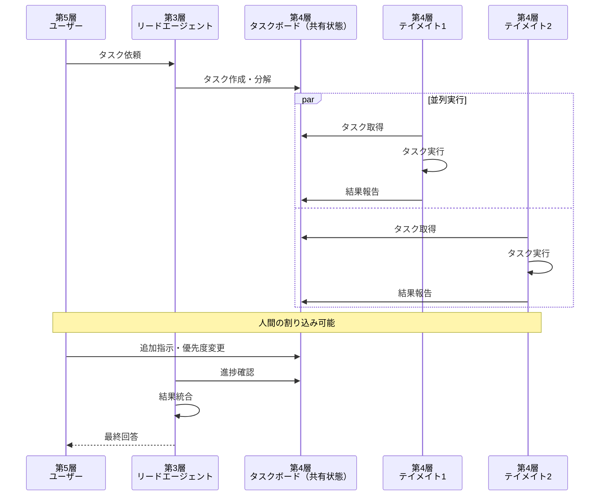

### 4-4. Agent Teamsの特徴

| 特徴 | 説明 |
|------|------|
| **非同期並列** | テイメイトが独立して並列実行 |
| **共有状態** | タスクボードで進捗・結果を共有 |
| **人間参加** | ユーザーがいつでも割り込み・指示変更可能 |
| **役割交代** | リード/テイメイトの役割は柔軟に交代可能 |
| **メッセージング** | `SendMessage`でテイメイト間通信 |

### 4-5. Agent Teamsの構成要素

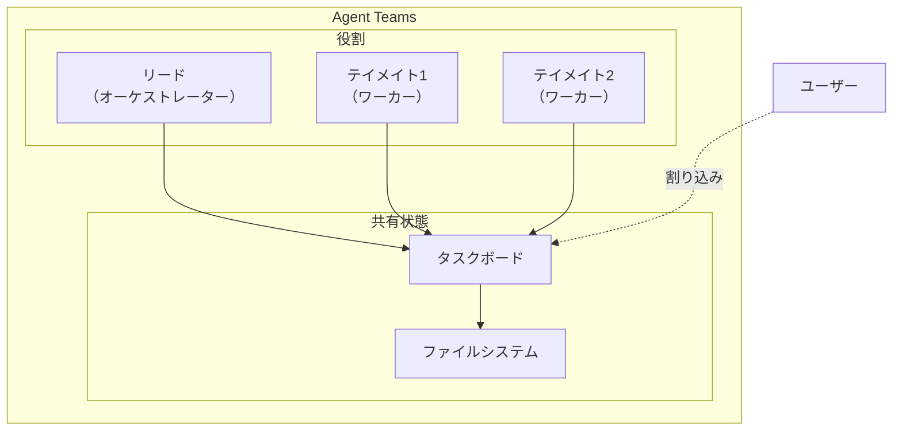

### 4-6. テイメイト間通信

```typescript
// SendMessageの使用例
{
  "tool": "SendMessage",
  "input": {
    "target": "teammate-security-review",
    "message": "認証モジュールのレビューが必要です。優先度高。"
  }
}
```

### 4-7. Agent Teamsのユースケース

| ユースケース | 構成例 | 効果 |
|--------------|--------|------|
| **大規模リファクタリング** | リード1 + テイメイト3 | 並列でモジュール分担 |
| **コードレビュー** | セキュリティ + パフォーマンス + スタイル | 観点別の専門レビュー |
| **ドキュメント作成** | 調査 + 執筆 + レビュー | パイプライン処理 |
| **マイグレーション** | 分析 + 実装 + テスト | フェーズ別分担 |

---

## 5. A2A（Agent-to-Agent）プロトコル

### 5-1. A2Aとは

**一言**: Google発の標準化プロトコル。異なるフレームワーク間でエージェントが通信するためのHTTP/JSON-RPC 2.0ベースの仕様。

### 5-2. A2Aのフロー

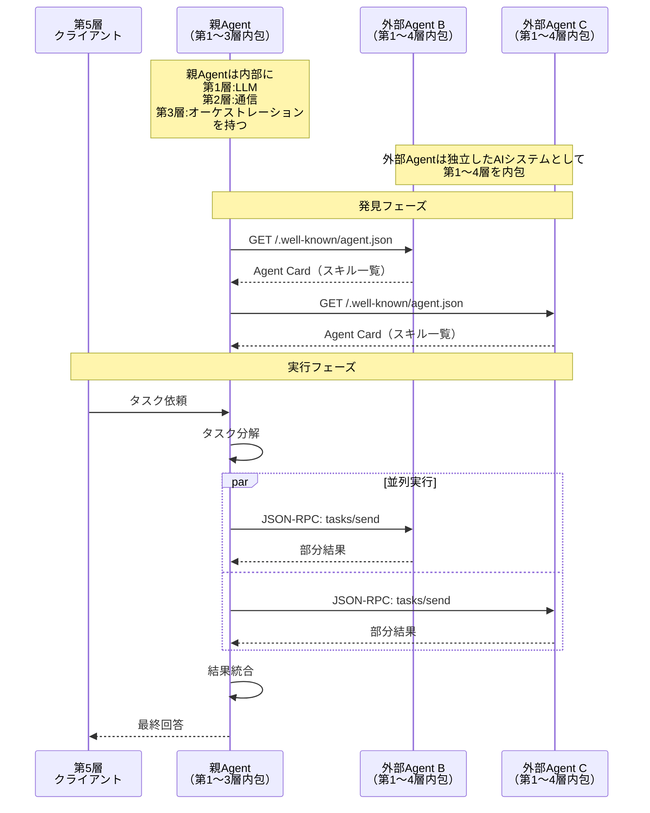

> **補足: A2Aにおける層構造**
>
> A2Aでは、各Agentが独立したAIシステムとして第1〜4層を内包しています。
>
> - **親Agent（オーケストレーター）**: 第1層（LLM）、第2層（通信）、第3層（オーケストレーション）を持ち、外部Agentを第4層のツールとして呼び出します。
> - **外部Agent（ワーカー）**: 親Agentから見ると第4層に位置しますが、外部Agent内部では独自の第1〜4層が完全に存在します。つまり、外部Agentも自身のLLM、通信層、オーケストレーション層、さらには別の外部ツールを持つことができます。
>
> この構造により、A2Aは異種フレームワーク間での対等なエージェント連携を実現しています。

### 5-3. Agent Card（発見用メタデータ）

エージェントは`/.well-known/agent.json`でAgent Cardを公開:

```json
{
  "name": "DataAnalysisAgent",
  "description": "CSV/JSONデータの統計分析を行うエージェント",
  "url": "https://agent-b.example.com",
  "version": "1.0.0",
  "skills": [
    {
      "name": "analyze_csv",
      "description": "CSVファイルを統計分析する",
      "inputSchema": {
        "type": "object",
        "properties": {
          "file_url": {"type": "string"},
          "analysis_type": {"enum": ["summary", "correlation", "regression"]}
        }
      }
    },
    {
      "name": "generate_report",
      "description": "分析結果からレポートを生成する"
    }
  ]
}
```

### 5-4. Agent Cardの情報伝達経路

Agent Cardの情報がどのようにLLMに伝わるかを示します。

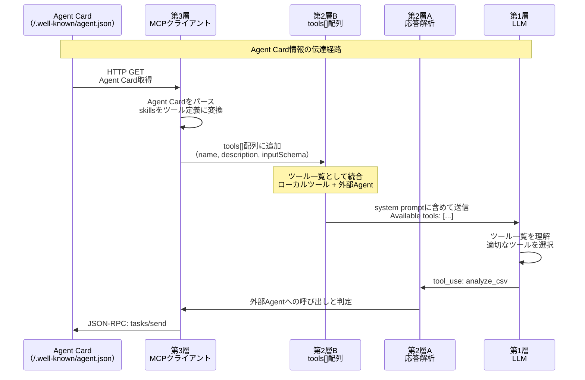

### 5-5. A2Aの特徴

| 特徴 | 説明 |
|------|------|
| **異種連携** | LangChain/AgentCore/ADK等の異なるフレームワーク間通信 |
| **標準プロトコル** | JSON-RPC 2.0 over HTTP/SSE |
| **発見機能** | Agent Cardによるスキル公開 |
| **クラウドスケール** | HTTP経由でリモートエージェントと通信 |

### 5-6. A2A対応フレームワーク

| フレームワーク | A2A対応状況 | 備考 |
|----------------|-------------|------|
| Amazon Bedrock AgentCore | 対応 | 公式サポート |
| Google ADK | 対応 | A2A策定元 |
| LangChain | 実装進行中 | コミュニティ主導 |
| Claude Code | 未対応 | Subagent/Teams使用 |

### 5-7. AgentCore構成要素

Amazon Bedrock AgentCoreの主要コンポーネントと、5層モデルにおける位置づけを示します。

| コンポーネント | 役割 | 層 |
|---------------|------|-----|
| Agent Runtime | エージェントの実行環境 | 第3層（LLMオーケストレーション層） |
| Tool Registry | 利用可能なツールの管理 | 第3層↔第4層の境界 |
| Memory Store | 会話履歴・状態の永続化 | 第4層（外部ツール層） |
| Cedar Engine | 認可ポリシーの評価 | 第3層（セキュリティ制御） |
| A2A Gateway | 外部エージェントとの連携 | 第4層（外部ツール層） |

---

## 6. 5層モデルでの通信方式

### 6-1. 各連携方式の通信経路図

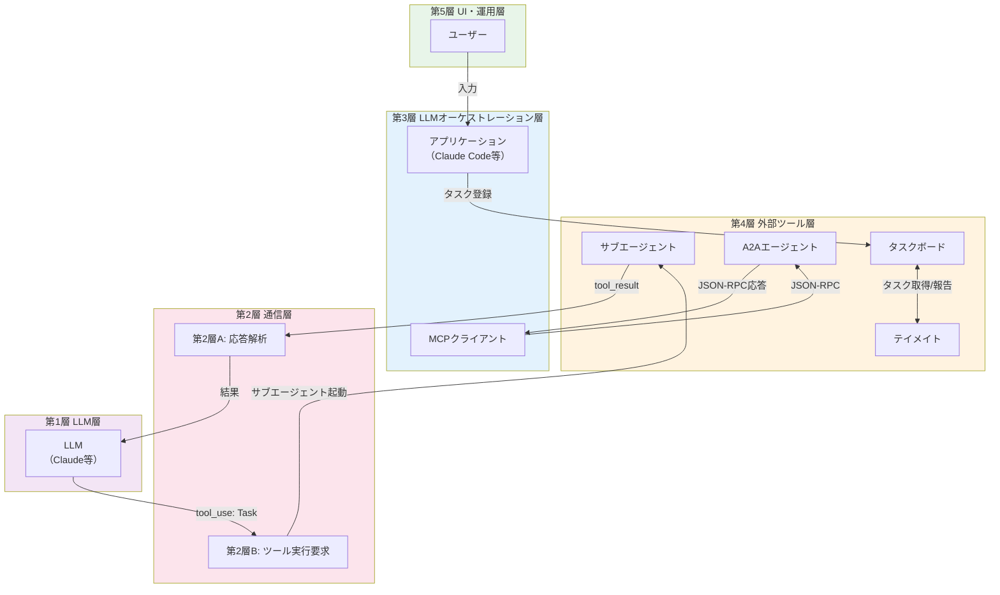

### 6-2. 通信経路の詳細比較

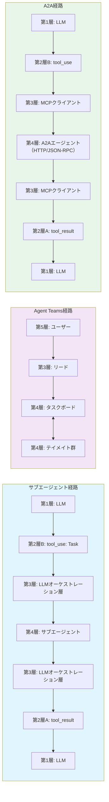

### 6-3. 層別の役割と通信

| 層 | サブエージェント | Agent Teams | A2A |
|----|------------------|-------------|-----|
| **第5層（UI・運用層）** | ユーザー入力 | ユーザー入力・割り込み | ユーザー入力 |
| **第4層** | サブエージェント実行 | タスクボード・テイメイト | A2Aエージェント（リモート） |
| **第3層（LLMオーケストレーション層）** | 起動・管理 | リード・タスク管理 | MCPクライアント・JSON-RPC |
| **第2層B** | tool_use: Task | - | tool_use（Agent呼出） |
| **第2層A** | tool_result | - | tool_result |
| **第1層** | 判断・統合 | - | 判断・統合 |

---

## 7. 3方式の比較

### 7-1. 構造比較図

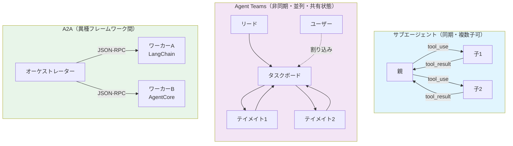

### 7-2. 詳細比較表

| 観点 | サブエージェント | Agent Teams | A2A |
|------|------------------|-------------|-----|
| **通信方式** | tool_use/tool_result | 内部タスクボード | JSON-RPC 2.0 |
| **並列実行** | 可能（複数子を順次/並列起動） | 可能（非同期） | 可能 |
| **エージェント間通信** | 親経由のみ | SendMessage | tasks/send |
| **人間の割り込み** | セッション停止のみ | いつでも可能 | 実装依存 |
| **状態共有** | なし | タスクボード | なし（メッセージベース） |
| **フレームワーク制約** | 同一（Claude Code） | 同一（Claude Code） | 異種間可能 |
| **スケーラビリティ** | 複数子エージェント | チーム規模 | クラウドスケール |

### 7-3. 選択ガイド

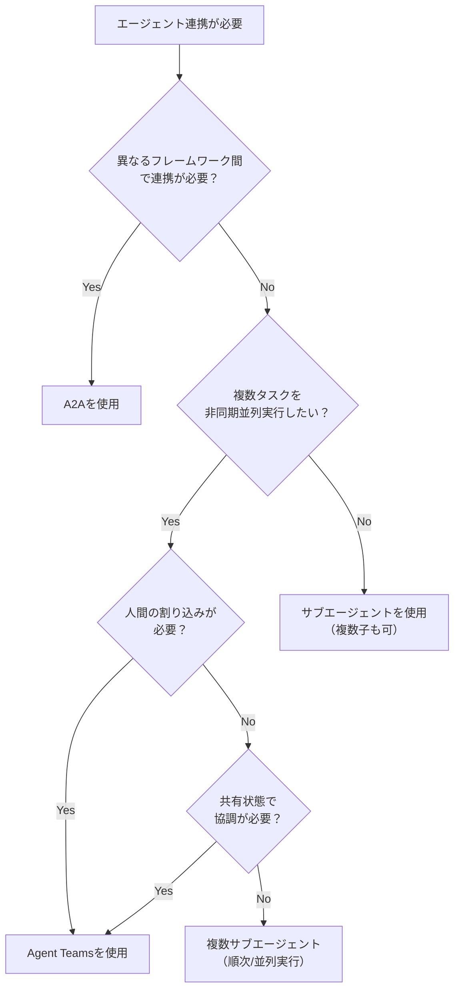

---

## 8. 実装パターン

### 8-1. Orchestrator-Workers パターン

**概要**: 1つのオーケストレーターが複数のワーカーにタスクを分配

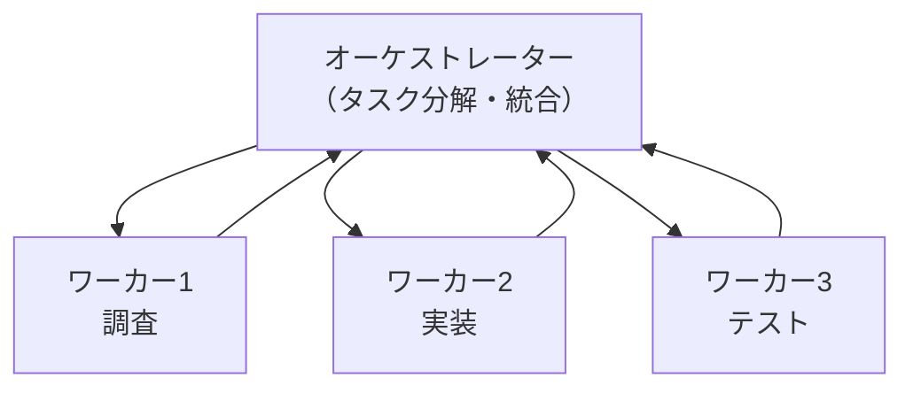

**適用場面**:
- 大規模なタスクを分割して並列処理
- 専門性の異なるサブタスクの組み合わせ

### 8-2. Pipeline パターン

**概要**: タスクを順次処理するパイプライン

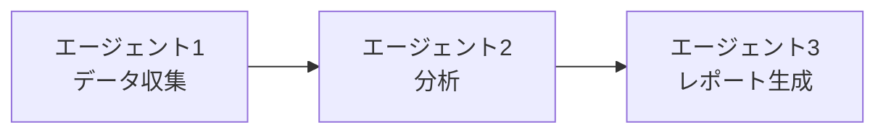

**適用場面**:
- 前工程の出力が後工程の入力になる処理
- 品質ゲートを挟む処理フロー

### 8-3. Evaluator-Optimizer パターン

**概要**: 生成と評価を繰り返して品質を向上

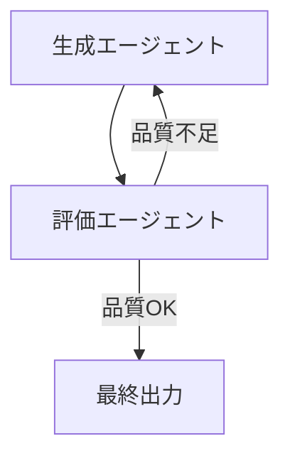

**適用場面**:
- コード品質の反復改善
- ドキュメントの推敲

---

## 9. セキュリティと権限管理

### 9-1. サブエージェントの権限制御

```yaml
# 親の設定
disallowedTools: ["Bash", "Write"]

# → サブエージェントも自動的に Bash, Write が禁止される
```

### 9-2. Agent Teamsの権限分離

```yaml
# テイメイトごとに異なる権限設定
# .claude/agents/read-only-reviewer.md
---
tools: Read, Glob, Grep
disallowedTools: Write, Bash, Edit
---
```

### 9-3. A2Aのセキュリティ

| セキュリティ要素 | 実装方法 |
|------------------|----------|
| **認証** | OAuth 2.0 / API Key |
| **認可** | Agent Cardでスキル範囲を公開 |
| **通信暗号化** | HTTPS必須 |
| **入力検証** | JSON Schemaによるバリデーション |

---

## 10. 相性問題と注意点

### 10-1. よくある問題

| 問題 | 原因 | 対策 |
|------|------|------|
| サブエージェントが指示を無視 | プロンプトが曖昧 | 明確なタスク記述 |
| Agent Teamsで競合 | 同一ファイルへの同時編集 | タスク分割の見直し |
| A2Aで接続失敗 | Agent Card未公開 | `/.well-known/`設定確認 |
| 権限エラー | 親からの継承制限 | `allowedTools`設定確認 |

### 10-2. デバッグのポイント

1. **サブエージェント**: `--verbose`フラグでtool_use/tool_resultを確認
2. **Agent Teams**: タスクボードの状態を直接確認
3. **A2A**: HTTPリクエスト/レスポンスのログ確認

---

## 11. 参考リンク

### 公式ドキュメント
- [Claude Code Sub-agents](https://code.claude.com/docs/en/sub-agents)
- [Claude Code Agent Teams](https://code.claude.com/docs/en/agent-teams)
- [Google A2A プロトコル仕様](https://google.github.io/A2A/)
- [Amazon Bedrock AgentCore](https://aws.amazon.com/bedrock/agentcore/)

### 解説記事
- [Anthropic "Building Effective Agents"](https://www.anthropic.com/research/building-effective-agents) — Orchestrator-Workers パターン
- [Chip Huyen "Agents"](https://huyenchip.com/2025/01/07/agents.html) — Multi-Agent Systems

---

*作成日: 2026-02-22*
*シリーズ: AIエージェント概念マップ詳細解説*
*参照: 元記事 第8章（Subagent）、第9章（Agent Teams）*
