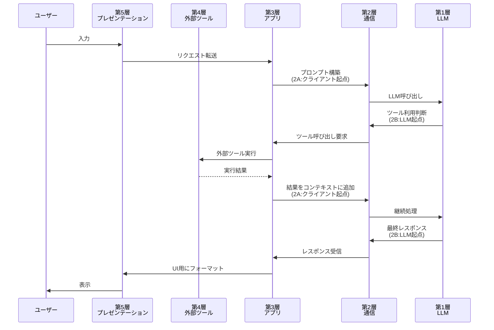
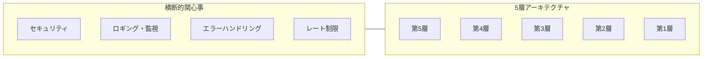

# AIエージェント 5層モデル 概念図

## 概要
AIエージェントのアーキテクチャを5層構造で表現した概念図です。

## Mermaid図

```mermaid
flowchart TB
    subgraph Layer5["第5層：プレゼンテーション層"]
        direction LR
        VSCode["VSCode"]
        UIService["UI専用サービス"]
        OtherUI["その他のUI"]
    end

    subgraph Layer4["第4層：外部ツール層"]
        direction LR
        VectorDB["ベクトルDB"]
        MCP["MCP<br/>(Model Context Protocol)"]
        SubAgent["サブエージェント"]
        ExternalAPI["外部API"]
    end

    subgraph Layer3["第3層：アプリ層"]
        direction LR
        LangChain["LangChain"]
        Dify["Dify"]
        ClaudeCode["Claude Code"]
        OtherFW["その他フレームワーク"]
    end

    subgraph Layer2["第2層：通信層"]
        subgraph Layer2A["2層A：クライアント起点"]
            direction LR
            Prompt["プロンプト"]
            ToolDecl["ツール宣言"]
            Context["コンテキスト"]
        end
        subgraph Layer2B["2層B：LLM起点"]
            direction LR
            ToolUse["ツール利用判断"]
            Response["レスポンス生成"]
            Reasoning["推論プロセス"]
        end
    end

    subgraph Layer1["第1層：LLM層"]
        direction LR
        BaseModel["ベースモデル<br/>(GPT-4, Claude, etc.)"]
        FineTuning["ファインチューニング"]
        LoRA["LoRA/QLoRA"]
        ModelFamily["モデル系列"]
    end

    %% 層間の接続
    Layer5 <--> Layer4
    Layer4 <--> Layer3
    Layer3 <--> Layer2
    Layer2 <--> Layer1

    %% スタイル定義
    classDef layer1Style fill:#FFE4E1,stroke:#DC143C,stroke-width:2px
    classDef layer2Style fill:#FFF8DC,stroke:#DAA520,stroke-width:2px
    classDef layer3Style fill:#E0FFE0,stroke:#228B22,stroke-width:2px
    classDef layer4Style fill:#E6E6FA,stroke:#4B0082,stroke-width:2px
    classDef layer5Style fill:#E0FFFF,stroke:#008B8B,stroke-width:2px

    class Layer1 layer1Style
    class Layer2,Layer2A,Layer2B layer2Style
    class Layer3 layer3Style
    class Layer4 layer4Style
    class Layer5 layer5Style
```

## 各層の説明

### 第1層：LLM層（基盤層）
AIエージェントの知能の核となる大規模言語モデルの層です。
- **ベースモデル**: GPT-4、Claude、Gemini等の基盤モデル
- **ファインチューニング**: タスク特化のためのモデル調整
- **LoRA/QLoRA**: 効率的なパラメータ調整手法
- **モデル系列**: 各ベンダーのモデルファミリー

### 第2層：通信層
LLMとアプリケーション間の通信プロトコルを定義する層です。

#### 2層A：クライアント起点
- **プロンプト**: ユーザーからの入力・指示
- **ツール宣言**: 利用可能なツールの定義
- **コンテキスト**: 会話履歴・システム情報

#### 2層B：LLM起点
- **ツール利用判断**: どのツールを使うかの決定
- **レスポンス生成**: ユーザーへの応答生成
- **推論プロセス**: 思考連鎖・reasoning

### 第3層：アプリ層（オーケストレーション層）
エージェントの動作を統合・制御するフレームワーク層です。
- **LangChain**: Pythonベースのエージェントフレームワーク
- **Dify**: ノーコード/ローコードLLMアプリ構築プラットフォーム
- **Claude Code**: Anthropic公式CLI/エージェント
- **その他フレームワーク**: AutoGPT、CrewAI等

### 第4層：外部ツール層（拡張層）
エージェントの能力を拡張する外部リソースの層です。
- **ベクトルDB**: RAGのためのベクトル検索（Pinecone、Chroma等）
- **MCP**: Model Context Protocolによる標準化されたツール連携
- **サブエージェント**: 専門タスクを担当する子エージェント
- **外部API**: Web検索、計算、データ取得等

### 第5層：プレゼンテーション層（インターフェース層）
ユーザーとエージェントの接点となるUI/UX層です。
- **VSCode**: 開発者向けIDE統合
- **UI専用サービス**: ChatGPT、Claude.ai等のWebインターフェース
- **その他のUI**: Slack Bot、Discord Bot、カスタムアプリ等

## データフロー図

## 横断的関心事

